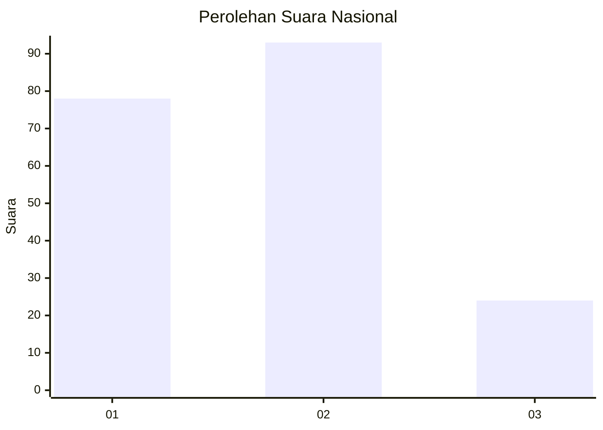
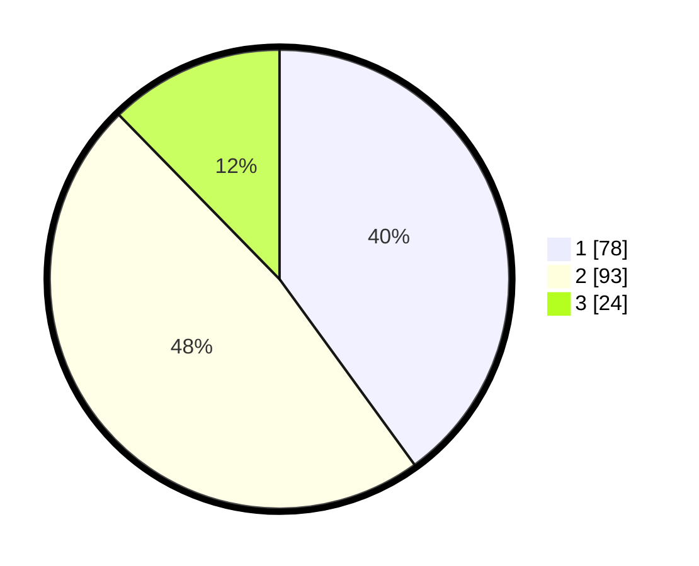

# Hasil

## Grafik

## Tabel

| No.    | Nama Paslon    | Suara | Suara (raw) | Persentase |
|:------ |:-------------- | -----:| -----------:| ----------:|
| 100025 | ANIES MUHAIMIN | 78    | [78][p-1]   | 40,00      |
| 100026 | PRABOWO GIBRAN | 93    | [93][p-2]   | 47,69      |
| 100027 | GANJAR MAHFUD  | 24    | [24][p-3]   | 12,31      |

[p-1]: https://github.com/gigit-pemilu/pemilu-2024/blob/main/pilpres/hitung-suara/sub/31-dki-jakarta/sub/71-jakarta-pusat/sub/03-kemayoran/sub/1008-utan-panjang/sub/053-tps/sub/paslon-1.txt
[p-2]: https://github.com/gigit-pemilu/pemilu-2024/blob/main/pilpres/hitung-suara/sub/31-dki-jakarta/sub/71-jakarta-pusat/sub/03-kemayoran/sub/1008-utan-panjang/sub/053-tps/sub/paslon-2.txt
[p-3]: https://github.com/gigit-pemilu/pemilu-2024/blob/main/pilpres/hitung-suara/sub/31-dki-jakarta/sub/71-jakarta-pusat/sub/03-kemayoran/sub/1008-utan-panjang/sub/053-tps/sub/paslon-3.txt

## Foto C Plano

https://sirekap-obj-formc.kpu.go.id/c79f/pemilu/ppwp/31/71/03/10/08/3171031008053-20240216-203514--f44412a5-a81f-410d-b31a-486bc973355f.jpg

https://sirekap-obj-formc.kpu.go.id/c79f/pemilu/ppwp/31/71/03/10/08/3171031008053-20240218-135845--43e4d7a4-375b-49ff-8093-ebbf4ec8cf5e.jpg

https://sirekap-obj-formc.kpu.go.id/c79f/pemilu/ppwp/31/71/03/10/08/3171031008053-20240218-132237--ff12a271-d21c-44b8-987f-858c627a8a4a.jpg

## Metadata

| Key        | Value               |
| ---------- | ------------------- |
| Time Stamp | 2024-02-19 06:16:00 |

