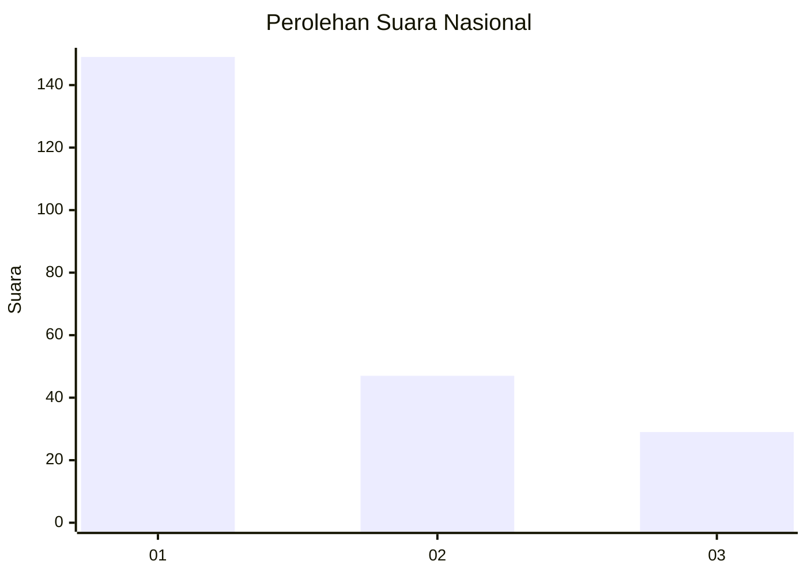
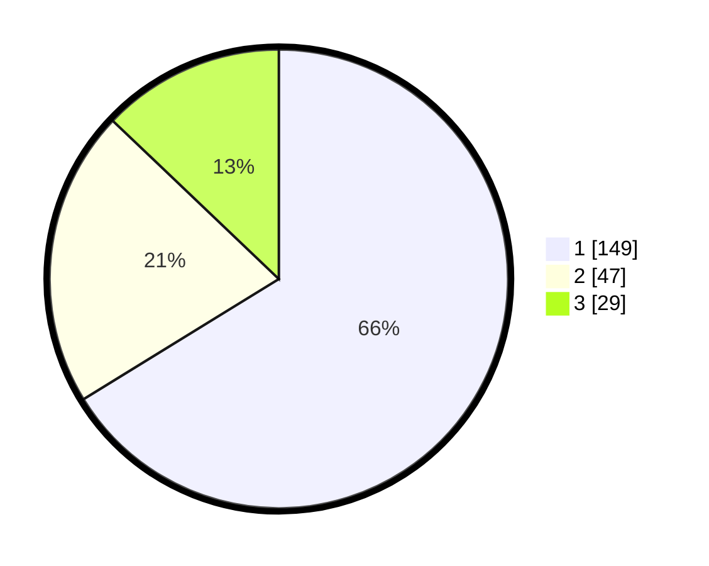

# Hasil

## Grafik

## Tabel

| No.    | Nama Paslon    | Suara | Suara (raw) | Persentase |
|:------ |:-------------- | -----:| -----------:| ----------:|
| 100025 | ANIES MUHAIMIN | 149   | [149][p-1]  | 66,22      |
| 100026 | PRABOWO GIBRAN | 47    | [47][p-2]   | 20,89      |
| 100027 | GANJAR MAHFUD  | 29    | [29][p-3]   | 12,89      |

[p-1]: https://github.com/gigit-pemilu/pemilu-2024/blob/main/pilpres/hitung-suara/sub/31-dki-jakarta/sub/71-jakarta-pusat/sub/04-senen/sub/1002-kenari/sub/009-tps/sub/paslon-1.txt
[p-2]: https://github.com/gigit-pemilu/pemilu-2024/blob/main/pilpres/hitung-suara/sub/31-dki-jakarta/sub/71-jakarta-pusat/sub/04-senen/sub/1002-kenari/sub/009-tps/sub/paslon-2.txt
[p-3]: https://github.com/gigit-pemilu/pemilu-2024/blob/main/pilpres/hitung-suara/sub/31-dki-jakarta/sub/71-jakarta-pusat/sub/04-senen/sub/1002-kenari/sub/009-tps/sub/paslon-3.txt

## Foto C Plano

https://sirekap-obj-formc.kpu.go.id/0d9a/pemilu/ppwp/31/71/04/10/02/3171041002009-20240214-214153--b5922560-bb32-40bd-8303-42cf3a614929.jpg

https://sirekap-obj-formc.kpu.go.id/0d9a/pemilu/ppwp/31/71/04/10/02/3171041002009-20240214-214104--2c788705-7d24-4195-be52-c2e04e13df18.jpg

https://sirekap-obj-formc.kpu.go.id/0d9a/pemilu/ppwp/31/71/04/10/02/3171041002009-20240218-144129--832928d3-9da1-4976-afef-d94d0c3a9d4e.jpg

## Metadata

| Key        | Value               |
| ---------- | ------------------- |
| Time Stamp | 2024-02-19 06:16:00 |

