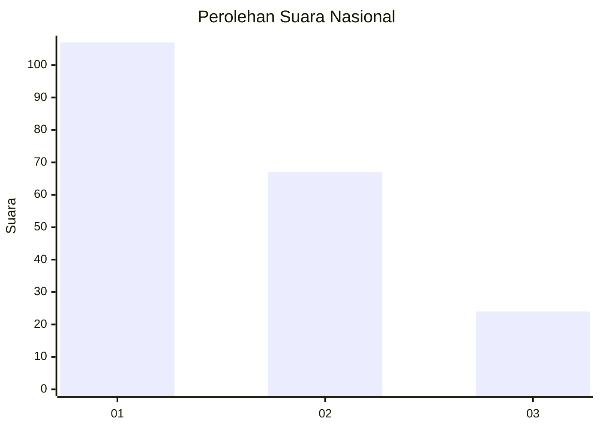
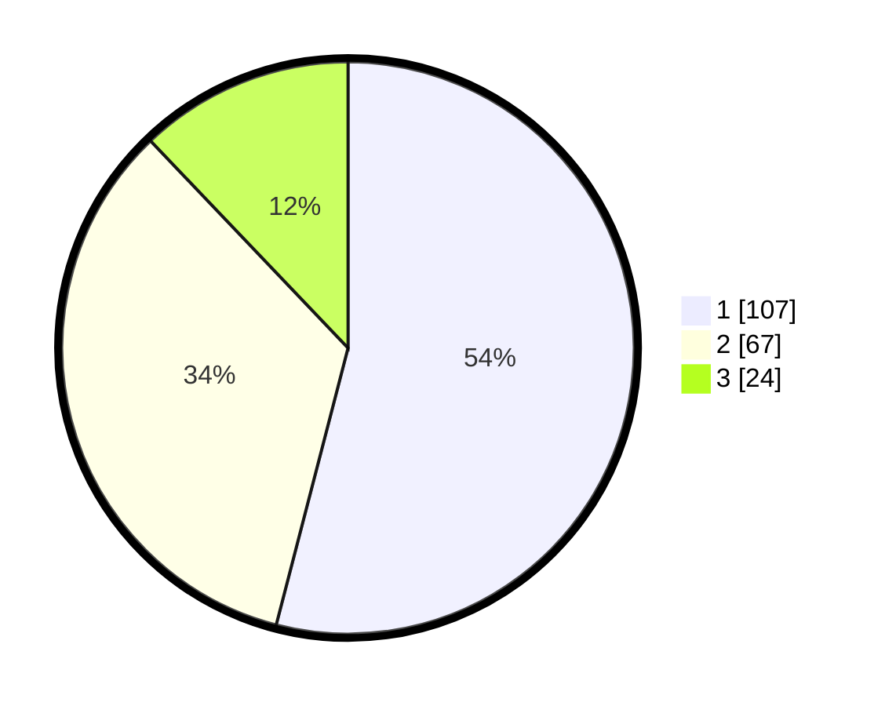

# Hasil

## Grafik

## Tabel

| No.    | Nama Paslon    | Suara | Suara (raw) | Persentase |
|:------ |:-------------- | -----:| -----------:| ----------:|
| 100025 | ANIES MUHAIMIN | 107   | [107][p-1]  | 54,04      |
| 100026 | PRABOWO GIBRAN | 67    | [67][p-2]   | 33,84      |
| 100027 | GANJAR MAHFUD  | 24    | [24][p-3]   | 12,12      |

[p-1]: https://github.com/gigit-pemilu/pemilu-2024/blob/main/pilpres/hitung-suara/sub/31-dki-jakarta/sub/71-jakarta-pusat/sub/04-senen/sub/1003-paseban/sub/069-tps/sub/paslon-1.txt
[p-2]: https://github.com/gigit-pemilu/pemilu-2024/blob/main/pilpres/hitung-suara/sub/31-dki-jakarta/sub/71-jakarta-pusat/sub/04-senen/sub/1003-paseban/sub/069-tps/sub/paslon-2.txt
[p-3]: https://github.com/gigit-pemilu/pemilu-2024/blob/main/pilpres/hitung-suara/sub/31-dki-jakarta/sub/71-jakarta-pusat/sub/04-senen/sub/1003-paseban/sub/069-tps/sub/paslon-3.txt

## Foto C Plano

https://sirekap-obj-formc.kpu.go.id/b02b/pemilu/ppwp/31/71/04/10/03/3171041003069-20240219-220438--210dfd7a-ffcb-424d-a367-3871d49efc93.jpg

https://sirekap-obj-formc.kpu.go.id/b02b/pemilu/ppwp/31/71/04/10/03/3171041003069-20240214-220247--d94661f6-c5bb-41bc-a1b6-5a62ea5878d0.jpg

https://sirekap-obj-formc.kpu.go.id/b02b/pemilu/ppwp/31/71/04/10/03/3171041003069-20240214-222300--eeab6979-3ee7-44b5-969e-804fdb9d63ff.jpg

## Metadata

| Key        | Value               |
| ---------- | ------------------- |
| Time Stamp | 2024-02-19 23:00:00 |

