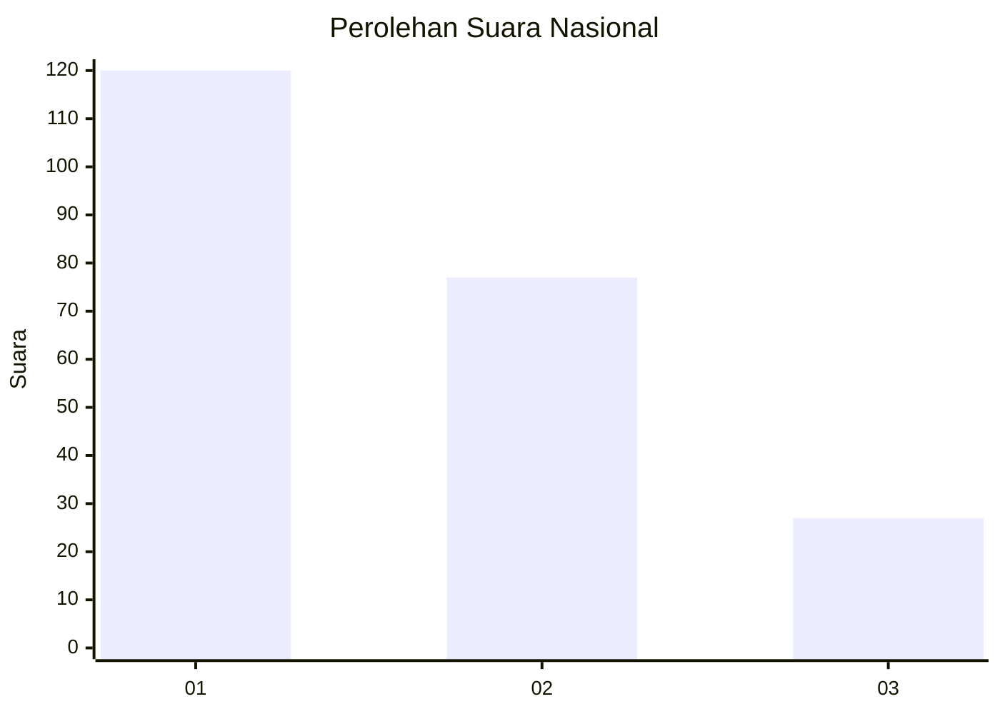
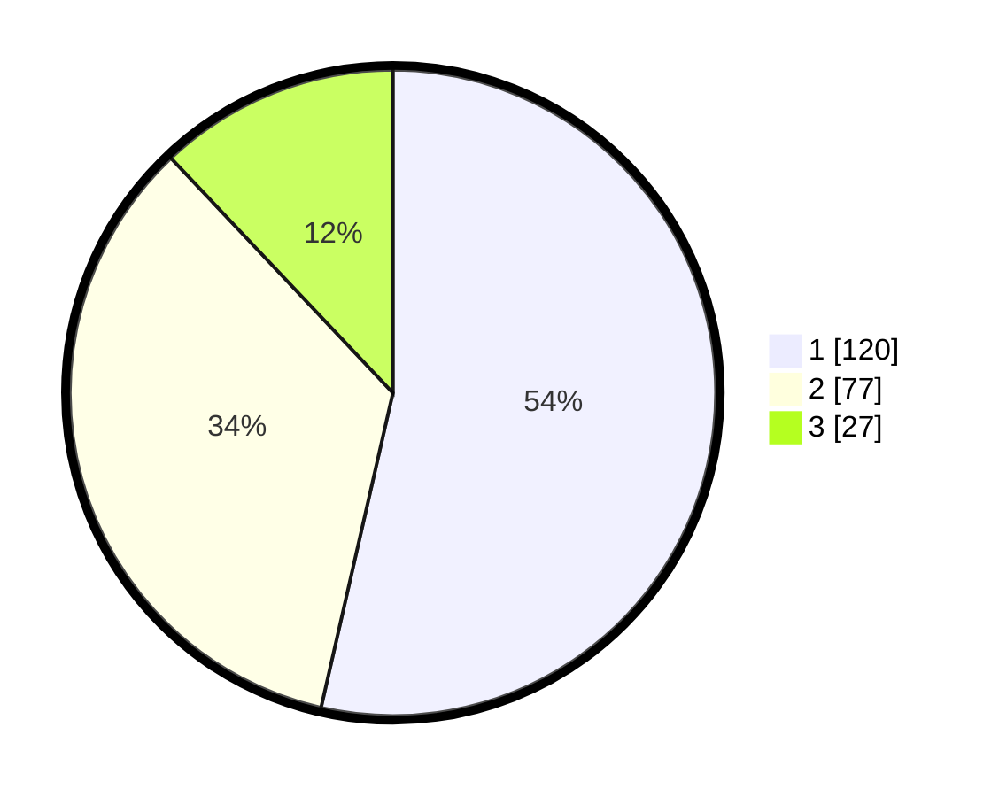

# Hasil

## Grafik

## Tabel

| No.    | Nama Paslon    | Suara | Suara (raw) | Persentase |
|:------ |:-------------- | -----:| -----------:| ----------:|
| 100025 | ANIES MUHAIMIN | 120   | [120][p-1]  | 53,57      |
| 100026 | PRABOWO GIBRAN | 77    | [77][p-2]   | 34,38      |
| 100027 | GANJAR MAHFUD  | 27    | [27][p-3]   | 12,05      |

[p-1]: https://github.com/gigit-pemilu/pemilu-2024/blob/main/pilpres/hitung-suara/sub/31-dki-jakarta/sub/71-jakarta-pusat/sub/04-senen/sub/1003-paseban/sub/075-tps/sub/paslon-1.txt
[p-2]: https://github.com/gigit-pemilu/pemilu-2024/blob/main/pilpres/hitung-suara/sub/31-dki-jakarta/sub/71-jakarta-pusat/sub/04-senen/sub/1003-paseban/sub/075-tps/sub/paslon-2.txt
[p-3]: https://github.com/gigit-pemilu/pemilu-2024/blob/main/pilpres/hitung-suara/sub/31-dki-jakarta/sub/71-jakarta-pusat/sub/04-senen/sub/1003-paseban/sub/075-tps/sub/paslon-3.txt

## Foto C Plano

https://sirekap-obj-formc.kpu.go.id/32ef/pemilu/ppwp/31/71/04/10/03/3171041003075-20240214-231242--786432cb-b062-4c47-a814-56a5b9db2568.jpg

https://sirekap-obj-formc.kpu.go.id/32ef/pemilu/ppwp/31/71/04/10/03/3171041003075-20240214-231352--fac2a0b1-ce64-4b8d-a362-3d591ce45b0a.jpg

https://sirekap-obj-formc.kpu.go.id/32ef/pemilu/ppwp/31/71/04/10/03/3171041003075-20240214-231447--8886a714-bd38-4f31-a44a-6241fd9a5e09.jpg

## Metadata

| Key        | Value               |
| ---------- | ------------------- |
| Time Stamp | 2024-02-15 22:00:27 |

