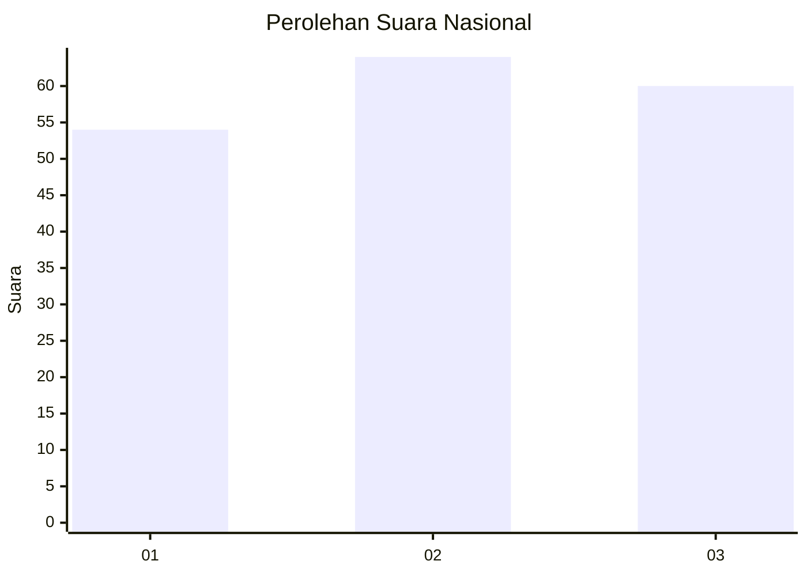
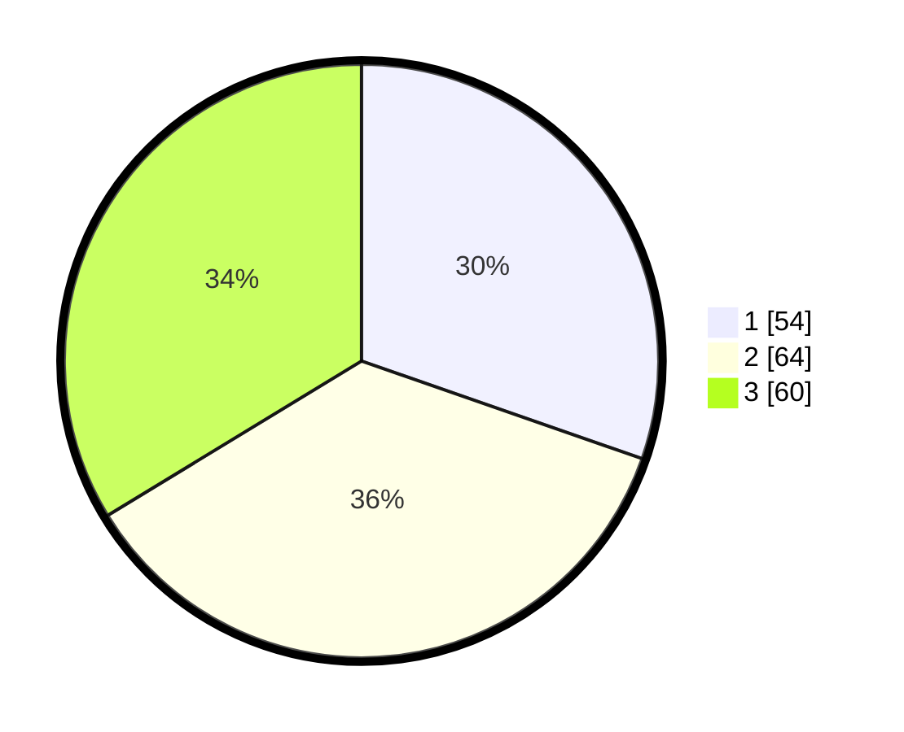

# Hasil

## Grafik

## Tabel

| No.    | Nama Paslon    | Suara | Suara (raw) | Persentase |
|:------ |:-------------- | -----:| -----------:| ----------:|
| 100025 | ANIES MUHAIMIN | 54    | [54][p-1]   | 30,34      |
| 100026 | PRABOWO GIBRAN | 64    | [64][p-2]   | 35,96      |
| 100027 | GANJAR MAHFUD  | 60    | [60][p-3]   | 33,71      |

[p-1]: https://github.com/gigit-pemilu/pemilu-2024/blob/main/pilpres/hitung-suara/sub/31-dki-jakarta/sub/71-jakarta-pusat/sub/04-senen/sub/1004-kramat/sub/010-tps/sub/paslon-1.txt
[p-2]: https://github.com/gigit-pemilu/pemilu-2024/blob/main/pilpres/hitung-suara/sub/31-dki-jakarta/sub/71-jakarta-pusat/sub/04-senen/sub/1004-kramat/sub/010-tps/sub/paslon-2.txt
[p-3]: https://github.com/gigit-pemilu/pemilu-2024/blob/main/pilpres/hitung-suara/sub/31-dki-jakarta/sub/71-jakarta-pusat/sub/04-senen/sub/1004-kramat/sub/010-tps/sub/paslon-3.txt

## Foto C Plano

https://sirekap-obj-formc.kpu.go.id/f60e/pemilu/ppwp/31/71/04/10/04/3171041004010-20240214-213740--1134ecbb-88aa-4df7-80d5-56f98d2ca90d.jpg

https://sirekap-obj-formc.kpu.go.id/f60e/pemilu/ppwp/31/71/04/10/04/3171041004010-20240218-152803--82f5fce4-8f2f-4e0f-99e9-be279d4c5199.jpg

https://sirekap-obj-formc.kpu.go.id/f60e/pemilu/ppwp/31/71/04/10/04/3171041004010-20240218-152802--c635b17f-6e6b-470e-a216-fe2d12262ab1.jpg

## Metadata

| Key        | Value               |
| ---------- | ------------------- |
| Time Stamp | 2024-02-21 16:00:00 |

