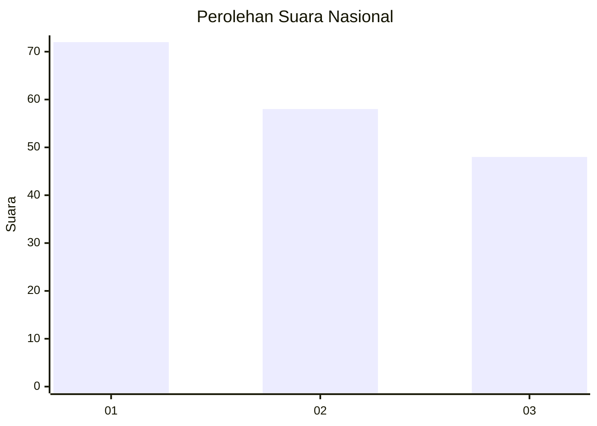
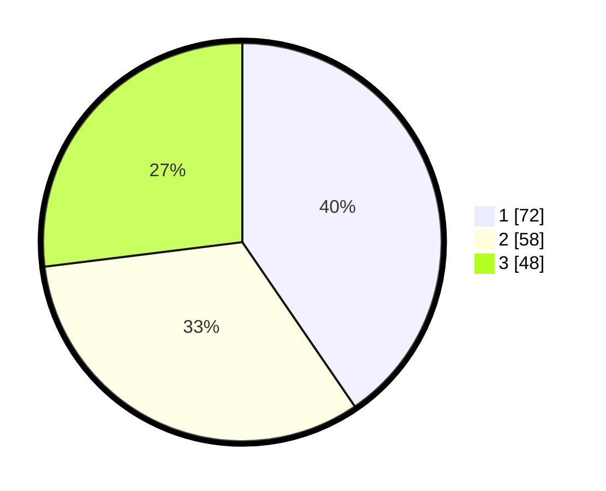

# Hasil

## Grafik

## Tabel

| No.    | Nama Paslon    | Suara | Suara (raw) | Persentase |
|:------ |:-------------- | -----:| -----------:| ----------:|
| 100025 | ANIES MUHAIMIN | 72    | [72][p-1]   | 40,45      |
| 100026 | PRABOWO GIBRAN | 58    | [58][p-2]   | 32,58      |
| 100027 | GANJAR MAHFUD  | 48    | [48][p-3]   | 26,97      |

[p-1]: https://github.com/gigit-pemilu/pemilu-2024/blob/main/pilpres/hitung-suara/sub/31-dki-jakarta/sub/71-jakarta-pusat/sub/04-senen/sub/1004-kramat/sub/036-tps/sub/paslon-1.txt
[p-2]: https://github.com/gigit-pemilu/pemilu-2024/blob/main/pilpres/hitung-suara/sub/31-dki-jakarta/sub/71-jakarta-pusat/sub/04-senen/sub/1004-kramat/sub/036-tps/sub/paslon-2.txt
[p-3]: https://github.com/gigit-pemilu/pemilu-2024/blob/main/pilpres/hitung-suara/sub/31-dki-jakarta/sub/71-jakarta-pusat/sub/04-senen/sub/1004-kramat/sub/036-tps/sub/paslon-3.txt

## Foto C Plano

https://sirekap-obj-formc.kpu.go.id/09ec/pemilu/ppwp/31/71/04/10/04/3171041004036-20240214-224358--57d25a86-e265-4105-b692-102805232b70.jpg

https://sirekap-obj-formc.kpu.go.id/09ec/pemilu/ppwp/31/71/04/10/04/3171041004036-20240214-224842--b5cf3e13-11a1-4914-982f-3fbb06dcf69e.jpg

https://sirekap-obj-formc.kpu.go.id/09ec/pemilu/ppwp/31/71/04/10/04/3171041004036-20240214-225031--fdfd2e96-9611-4f3e-b7b9-d244b123ffda.jpg

## Metadata

| Key        | Value               |
| ---------- | ------------------- |
| Time Stamp | 2024-02-15 21:30:27 |

