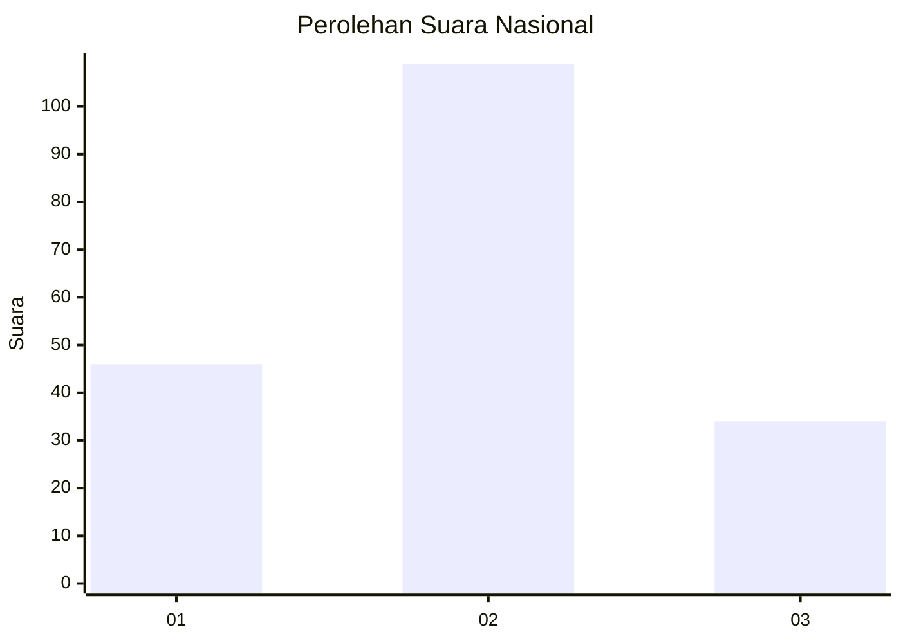
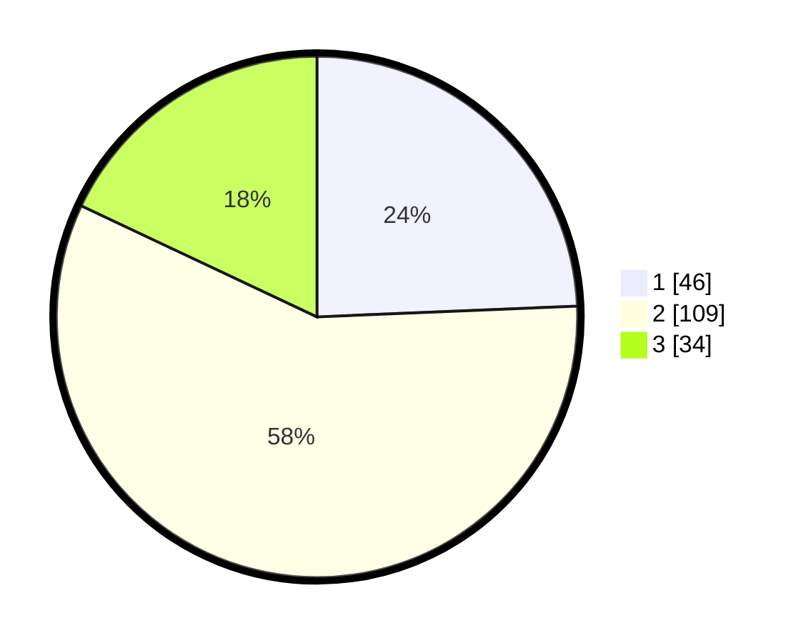

# Hasil

## Grafik

## Tabel

| No.    | Nama Paslon    | Suara | Suara (raw) | Persentase |
|:------ |:-------------- | -----:| -----------:| ----------:|
| 100025 | ANIES MUHAIMIN | 46    | [46][p-1]   | 24,34      |
| 100026 | PRABOWO GIBRAN | 109   | [109][p-2]  | 57,67      |
| 100027 | GANJAR MAHFUD  | 34    | [34][p-3]   | 17,99      |

[p-1]: https://github.com/gigit-pemilu/pemilu-2024/blob/main/pilpres/hitung-suara/sub/31-dki-jakarta/sub/71-jakarta-pusat/sub/04-senen/sub/1004-kramat/sub/040-tps/sub/paslon-1.txt
[p-2]: https://github.com/gigit-pemilu/pemilu-2024/blob/main/pilpres/hitung-suara/sub/31-dki-jakarta/sub/71-jakarta-pusat/sub/04-senen/sub/1004-kramat/sub/040-tps/sub/paslon-2.txt
[p-3]: https://github.com/gigit-pemilu/pemilu-2024/blob/main/pilpres/hitung-suara/sub/31-dki-jakarta/sub/71-jakarta-pusat/sub/04-senen/sub/1004-kramat/sub/040-tps/sub/paslon-3.txt

## Foto C Plano

https://sirekap-obj-formc.kpu.go.id/7873/pemilu/ppwp/31/71/04/10/04/3171041004040-20240218-192056--6316e0be-4df1-4119-9a23-74f31a1c3868.jpg

https://sirekap-obj-formc.kpu.go.id/7873/pemilu/ppwp/31/71/04/10/04/3171041004040-20240214-224718--e0b46bde-3b8e-497f-918a-d3ca1a3394ee.jpg

https://sirekap-obj-formc.kpu.go.id/7873/pemilu/ppwp/31/71/04/10/04/3171041004040-20240214-224719--ac6aa695-13fd-4632-bda4-abe33dd3b558.jpg

## Metadata

| Key        | Value               |
| ---------- | ------------------- |
| Time Stamp | 2024-02-19 06:16:00 |

