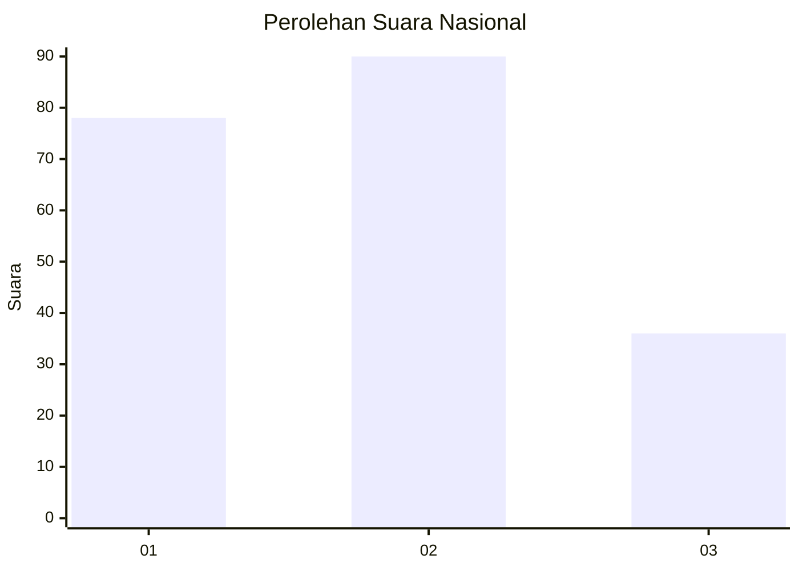
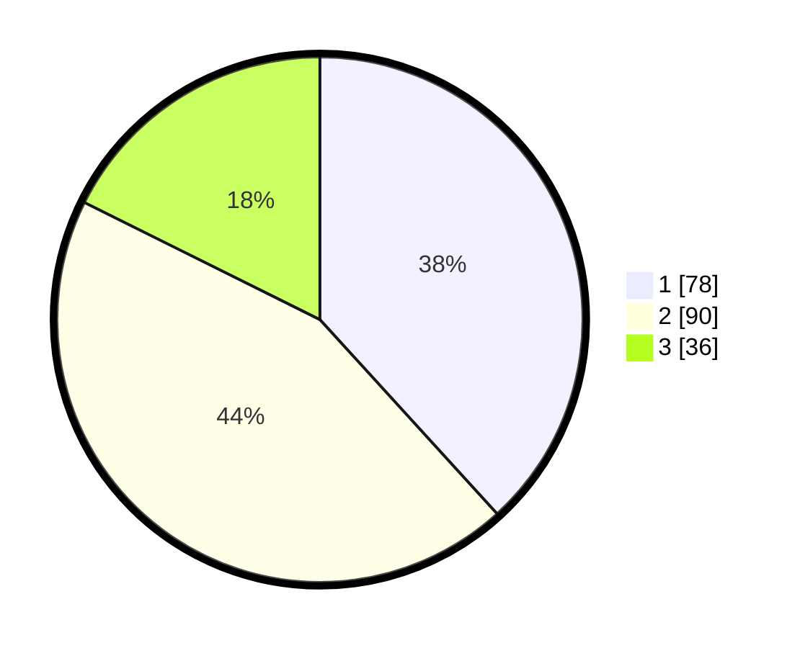

# Hasil

## Grafik

## Tabel

| No.    | Nama Paslon    | Suara | Suara (raw) | Persentase |
|:------ |:-------------- | -----:| -----------:| ----------:|
| 100025 | ANIES MUHAIMIN | 78    | [78][p-1]   | 38,24      |
| 100026 | PRABOWO GIBRAN | 90    | [90][p-2]   | 44,12      |
| 100027 | GANJAR MAHFUD  | 36    | [36][p-3]   | 17,65      |

[p-1]: https://github.com/gigit-pemilu/pemilu-2024/blob/main/pilpres/hitung-suara/sub/31-dki-jakarta/sub/71-jakarta-pusat/sub/04-senen/sub/1004-kramat/sub/041-tps/sub/paslon-1.txt
[p-2]: https://github.com/gigit-pemilu/pemilu-2024/blob/main/pilpres/hitung-suara/sub/31-dki-jakarta/sub/71-jakarta-pusat/sub/04-senen/sub/1004-kramat/sub/041-tps/sub/paslon-2.txt
[p-3]: https://github.com/gigit-pemilu/pemilu-2024/blob/main/pilpres/hitung-suara/sub/31-dki-jakarta/sub/71-jakarta-pusat/sub/04-senen/sub/1004-kramat/sub/041-tps/sub/paslon-3.txt

## Foto C Plano

https://sirekap-obj-formc.kpu.go.id/ea00/pemilu/ppwp/31/71/04/10/04/3171041004041-20240218-173113--97721a28-57ae-407a-a61e-cc70ed70ac45.jpg

https://sirekap-obj-formc.kpu.go.id/ea00/pemilu/ppwp/31/71/04/10/04/3171041004041-20240218-171611--7d9b664f-fce0-4365-997a-55cff105c7eb.jpg

https://sirekap-obj-formc.kpu.go.id/ea00/pemilu/ppwp/31/71/04/10/04/3171041004041-20240218-171803--564d6ed4-25e1-4398-9770-2fd1ca330756.jpg

## Metadata

| Key        | Value               |
| ---------- | ------------------- |
| Time Stamp | 2024-02-24 22:31:28 |

