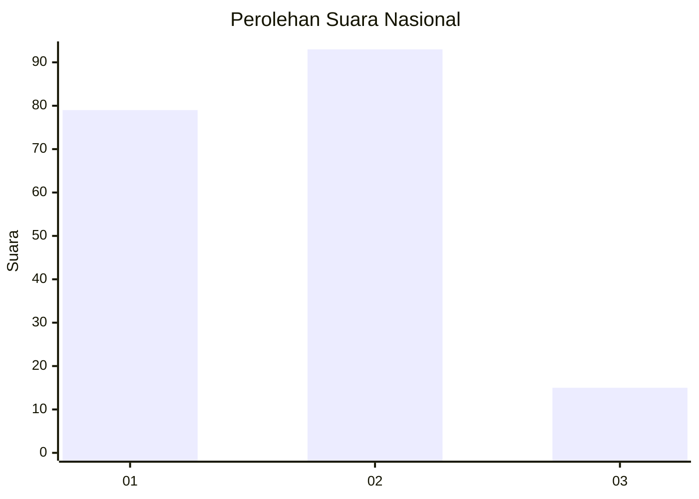
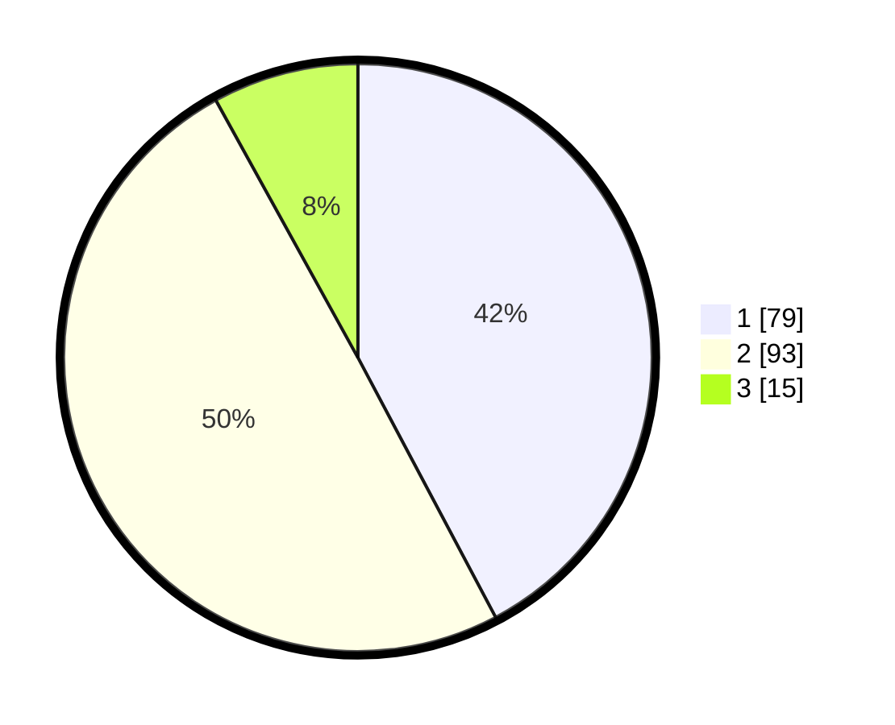

# Hasil

## Grafik

## Tabel

| No.    | Nama Paslon    | Suara | Suara (raw) | Persentase |
|:------ |:-------------- | -----:| -----------:| ----------:|
| 100025 | ANIES MUHAIMIN | 79    | [79][p-1]   | 42,25      |
| 100026 | PRABOWO GIBRAN | 93    | [93][p-2]   | 49,73      |
| 100027 | GANJAR MAHFUD  | 15    | [15][p-3]   | 8,02       |

[p-1]: https://github.com/gigit-pemilu/pemilu-2024/blob/main/pilpres/hitung-suara/sub/31-dki-jakarta/sub/71-jakarta-pusat/sub/04-senen/sub/1004-kramat/sub/095-tps/sub/paslon-1.txt
[p-2]: https://github.com/gigit-pemilu/pemilu-2024/blob/main/pilpres/hitung-suara/sub/31-dki-jakarta/sub/71-jakarta-pusat/sub/04-senen/sub/1004-kramat/sub/095-tps/sub/paslon-2.txt
[p-3]: https://github.com/gigit-pemilu/pemilu-2024/blob/main/pilpres/hitung-suara/sub/31-dki-jakarta/sub/71-jakarta-pusat/sub/04-senen/sub/1004-kramat/sub/095-tps/sub/paslon-3.txt

## Foto C Plano

https://sirekap-obj-formc.kpu.go.id/ce24/pemilu/ppwp/31/71/04/10/04/3171041004095-20240226-151700--16d6b6b0-f0e0-439a-b6f9-65b20c0d65e7.jpg

https://sirekap-obj-formc.kpu.go.id/ce24/pemilu/ppwp/31/71/04/10/04/3171041004095-20240226-151846--ada53ad1-d350-4c81-9006-973565909de2.jpg

https://sirekap-obj-formc.kpu.go.id/ce24/pemilu/ppwp/31/71/04/10/04/3171041004095-20240226-151931--f1c30f77-6531-4984-8ad8-67616e3a2a7e.jpg

## Metadata

| Key        | Value               |
| ---------- | ------------------- |
| Time Stamp | 2024-02-26 17:00:04 |

## DATA PEMILIH TETAP

Jumlah pemilih dalam DPT: **257**.
 * L: **344**.
 * P: **833**.

## DATA PENGGUNA HAK PILIH

Jumlah pengguna hak pilih dalam DPT: **779**.
 * L: **89**.
 * P: **90**.

Jumlah pengguna hak pilih dalam DPTb: **0**.
 * L: **80**.
 * P: **800**.

Jumlah pengguna hak pilih dalam DPK: **77**.
 * L: **4**.
 * P: **7**.

Jumlah pengguna hak pilih: **190**.
 * L: **93**.
 * P: **97**.

## JUMLAH SUARA SAH DAN TIDAK SAH

JUMLAH SELURUH SUARA SAH: **187**.

JUMLAH SUARA TIDAK SAH: **3**.

JUMLAH SELURUH SUARA SAH DAN SUARA TIDAK SAH: **190**.

