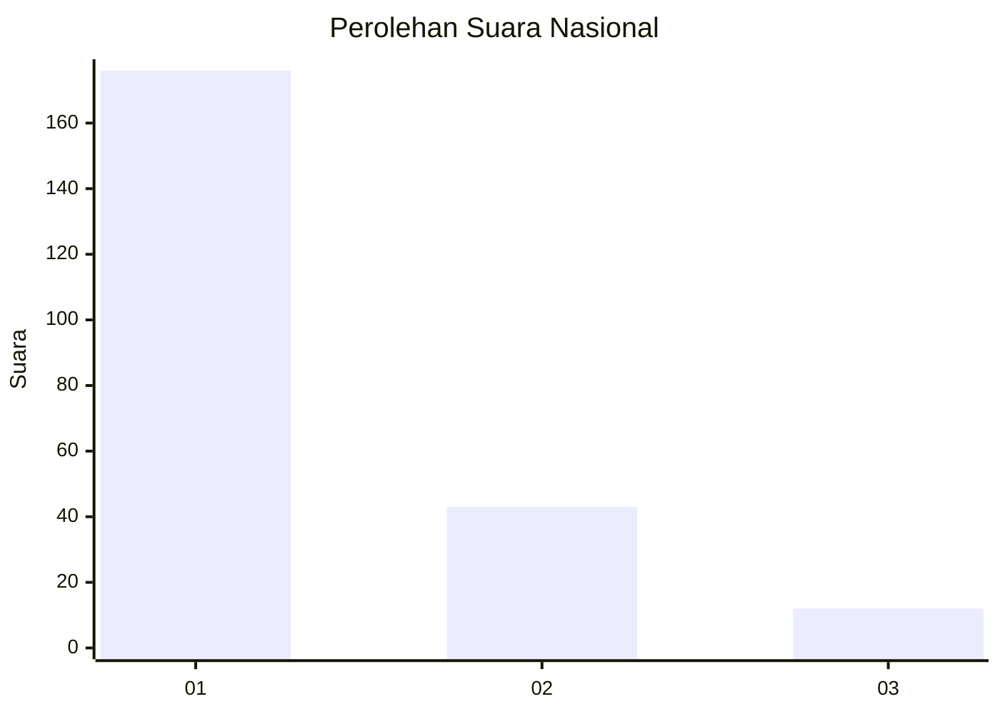
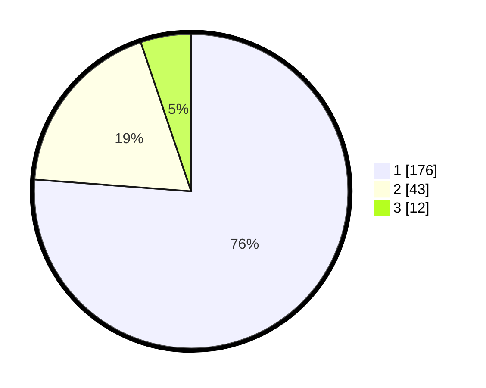

# Hasil

## Grafik

## Tabel

| No.    | Nama Paslon    | Suara | Suara (raw) | Persentase |
|:------ |:-------------- | -----:| -----------:| ----------:|
| 100025 | ANIES MUHAIMIN | 176   | [176][p-1]  | 76,19      |
| 100026 | PRABOWO GIBRAN | 43    | [43][p-2]   | 18,61      |
| 100027 | GANJAR MAHFUD  | 12    | [12][p-3]   | 5,19       |

[p-1]: https://github.com/gigit-pemilu/pemilu-2024/blob/main/pilpres/hitung-suara/sub/31-dki-jakarta/sub/71-jakarta-pusat/sub/04-senen/sub/1005-kwitang/sub/014-tps/sub/paslon-1.txt
[p-2]: https://github.com/gigit-pemilu/pemilu-2024/blob/main/pilpres/hitung-suara/sub/31-dki-jakarta/sub/71-jakarta-pusat/sub/04-senen/sub/1005-kwitang/sub/014-tps/sub/paslon-2.txt
[p-3]: https://github.com/gigit-pemilu/pemilu-2024/blob/main/pilpres/hitung-suara/sub/31-dki-jakarta/sub/71-jakarta-pusat/sub/04-senen/sub/1005-kwitang/sub/014-tps/sub/paslon-3.txt

## Foto C Plano

https://sirekap-obj-formc.kpu.go.id/e5cd/pemilu/ppwp/31/71/04/10/05/3171041005014-20240215-003716--5664ebd9-9595-4374-bf80-ffcb86dde122.jpg

https://sirekap-obj-formc.kpu.go.id/e5cd/pemilu/ppwp/31/71/04/10/05/3171041005014-20240215-003812--f468a0f0-f3c7-4fbb-8eee-d75c6895ef01.jpg

https://sirekap-obj-formc.kpu.go.id/e5cd/pemilu/ppwp/31/71/04/10/05/3171041005014-20240215-003845--7f1819e5-b19c-4fe4-9f9d-389211b52b68.jpg

## Metadata

| Key        | Value               |
| ---------- | ------------------- |
| Time Stamp | 2024-02-15 21:01:18 |

