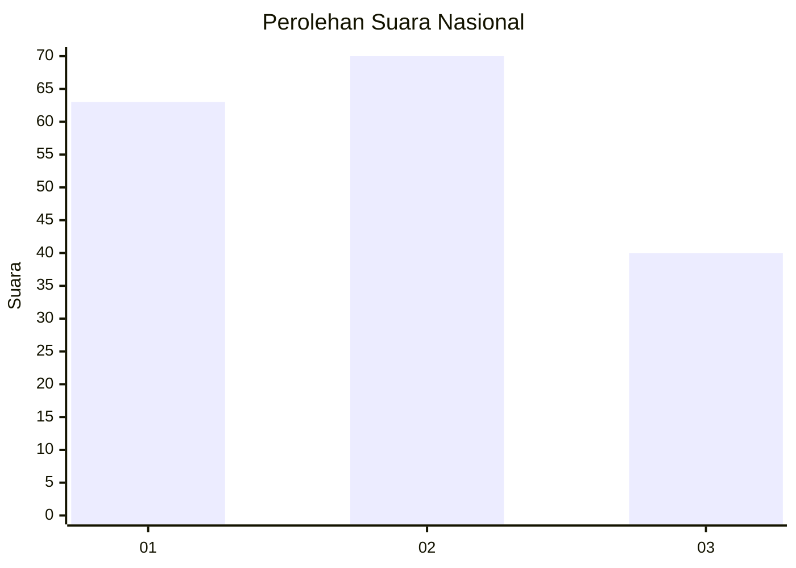
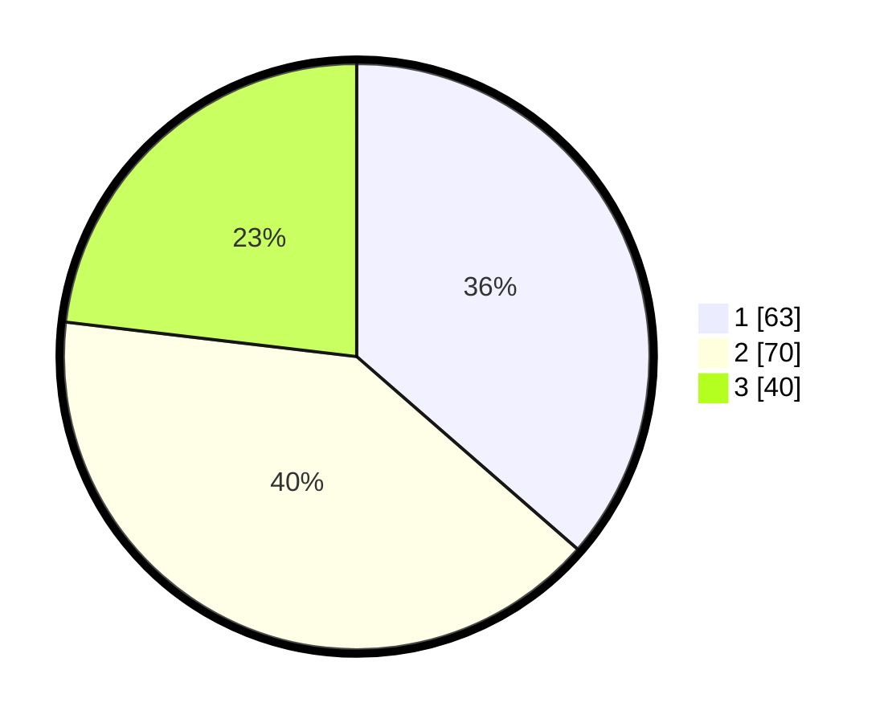

# Hasil

## Grafik

## Tabel

| No.    | Nama Paslon    | Suara | Suara (raw) | Persentase |
|:------ |:-------------- | -----:| -----------:| ----------:|
| 100025 | ANIES MUHAIMIN | 63    | [63][p-1]   | 36,42      |
| 100026 | PRABOWO GIBRAN | 70    | [70][p-2]   | 40,46      |
| 100027 | GANJAR MAHFUD  | 40    | [40][p-3]   | 23,12      |

[p-1]: https://github.com/gigit-pemilu/pemilu-2024/blob/main/pilpres/hitung-suara/sub/31-dki-jakarta/sub/71-jakarta-pusat/sub/04-senen/sub/1005-kwitang/sub/051-tps/sub/paslon-1.txt
[p-2]: https://github.com/gigit-pemilu/pemilu-2024/blob/main/pilpres/hitung-suara/sub/31-dki-jakarta/sub/71-jakarta-pusat/sub/04-senen/sub/1005-kwitang/sub/051-tps/sub/paslon-2.txt
[p-3]: https://github.com/gigit-pemilu/pemilu-2024/blob/main/pilpres/hitung-suara/sub/31-dki-jakarta/sub/71-jakarta-pusat/sub/04-senen/sub/1005-kwitang/sub/051-tps/sub/paslon-3.txt

## Foto C Plano

https://sirekap-obj-formc.kpu.go.id/63df/pemilu/ppwp/31/71/04/10/05/3171041005051-20240214-205230--64c3c5e7-097f-4645-a948-b7a0f157c18e.jpg

https://sirekap-obj-formc.kpu.go.id/63df/pemilu/ppwp/31/71/04/10/05/3171041005051-20240214-205317--41668af0-9775-4dc9-922c-baae3f3574df.jpg

https://sirekap-obj-formc.kpu.go.id/63df/pemilu/ppwp/31/71/04/10/05/3171041005051-20240214-205427--6e01e633-4d58-452a-bacd-4f80a053744d.jpg

## Metadata

| Key        | Value               |
| ---------- | ------------------- |
| Time Stamp | 2024-02-15 21:01:18 |

