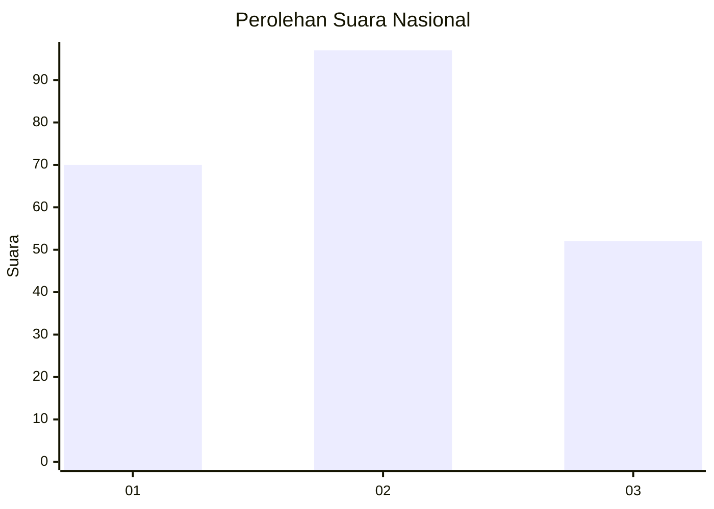
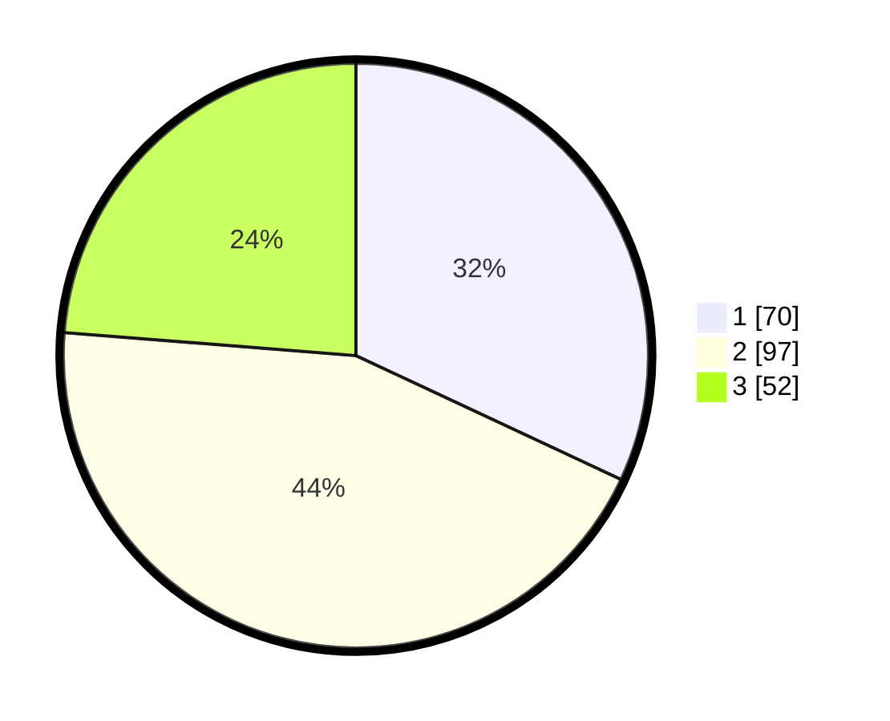

# Hasil

## Grafik

## Tabel

| No.    | Nama Paslon    | Suara | Suara (raw) | Persentase |
|:------ |:-------------- | -----:| -----------:| ----------:|
| 100025 | ANIES MUHAIMIN | 70    | [70][p-1]   | 31,96      |
| 100026 | PRABOWO GIBRAN | 97    | [97][p-2]   | 44,29      |
| 100027 | GANJAR MAHFUD  | 52    | [52][p-3]   | 23,74      |

[p-1]: https://github.com/gigit-pemilu/pemilu-2024/blob/main/pilpres/hitung-suara/sub/31-dki-jakarta/sub/71-jakarta-pusat/sub/05-cempaka-putih/sub/1001-cempaka-putih-timur/sub/002-tps/sub/paslon-1.txt
[p-2]: https://github.com/gigit-pemilu/pemilu-2024/blob/main/pilpres/hitung-suara/sub/31-dki-jakarta/sub/71-jakarta-pusat/sub/05-cempaka-putih/sub/1001-cempaka-putih-timur/sub/002-tps/sub/paslon-2.txt
[p-3]: https://github.com/gigit-pemilu/pemilu-2024/blob/main/pilpres/hitung-suara/sub/31-dki-jakarta/sub/71-jakarta-pusat/sub/05-cempaka-putih/sub/1001-cempaka-putih-timur/sub/002-tps/sub/paslon-3.txt

## Foto C Plano

https://sirekap-obj-formc.kpu.go.id/6b89/pemilu/ppwp/31/71/05/10/01/3171051001002-20240216-014129--a7c7a43b-f301-4ef5-8ee9-073e3e1a1fa4.jpg

https://sirekap-obj-formc.kpu.go.id/6b89/pemilu/ppwp/31/71/05/10/01/3171051001002-20240216-014132--6e09fe30-c68d-45fe-b5ae-ac4a8afbffdf.jpg

https://sirekap-obj-formc.kpu.go.id/6b89/pemilu/ppwp/31/71/05/10/01/3171051001002-20240216-014130--9a44d54b-733f-4b8c-ae18-66bba0d7d8ef.jpg

## Metadata

| Key        | Value               |
| ---------- | ------------------- |
| Time Stamp | 2024-02-16 10:30:29 |

## DATA PEMILIH TETAP

Jumlah pemilih dalam DPT: **251**.
 * L: **112**.
 * P: **139**.

## DATA PENGGUNA HAK PILIH

Jumlah pengguna hak pilih dalam DPT: **211**.
 * L: **97**.
 * P: **114**.

Jumlah pengguna hak pilih dalam DPTb: **4**.
 * L: **1**.
 * P: **3**.

Jumlah pengguna hak pilih dalam DPK: **7**.
 * L: **3**.
 * P: **4**.

Jumlah pengguna hak pilih: **222**.
 * L: **101**.
 * P: **121**.

## JUMLAH SUARA SAH DAN TIDAK SAH

JUMLAH SELURUH SUARA SAH: **219**.

JUMLAH SUARA TIDAK SAH: **3**.

JUMLAH SELURUH SUARA SAH DAN SUARA TIDAK SAH: **222**.

