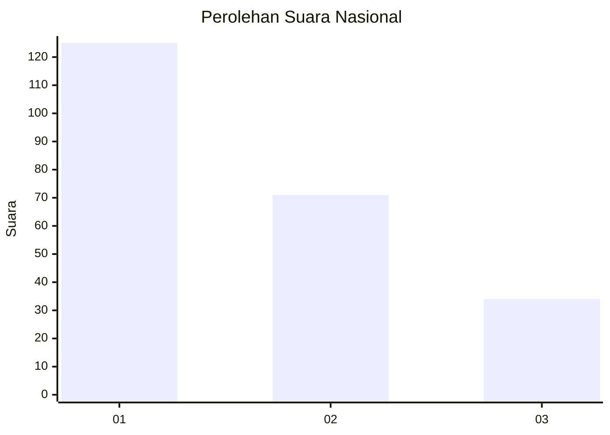
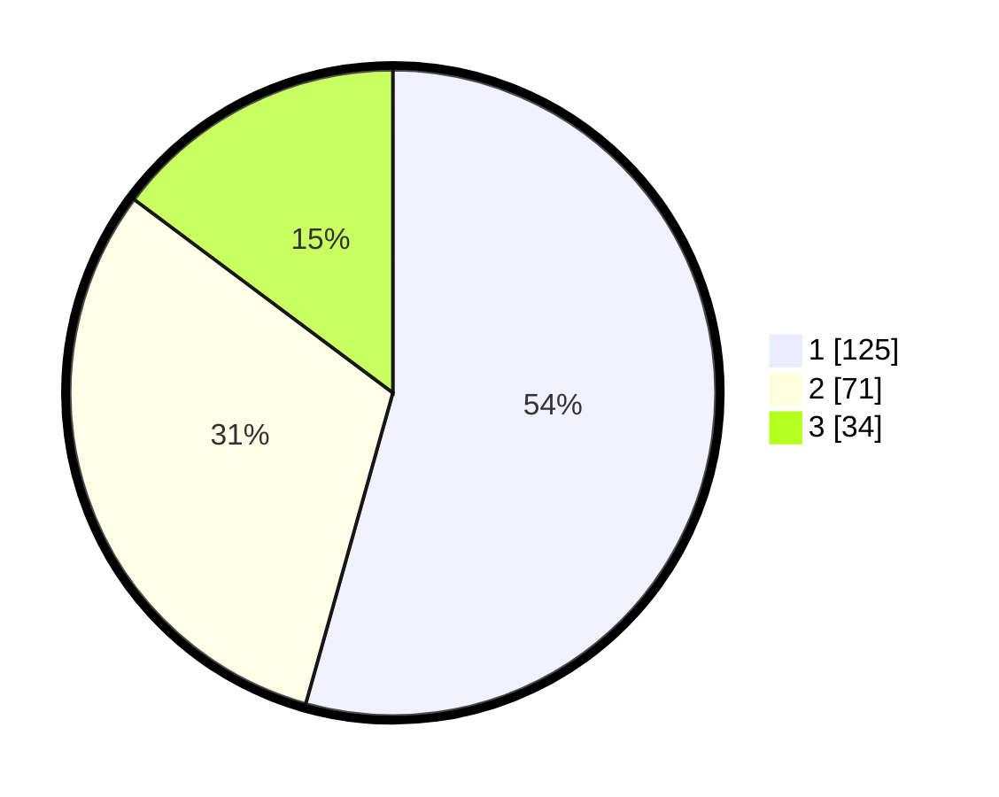

# Hasil

## Grafik

## Tabel

| No.    | Nama Paslon    | Suara | Suara (raw) | Persentase |
|:------ |:-------------- | -----:| -----------:| ----------:|
| 100025 | ANIES MUHAIMIN | 125   | [125][p-1]  | 54,35      |
| 100026 | PRABOWO GIBRAN | 71    | [71][p-2]   | 30,87      |
| 100027 | GANJAR MAHFUD  | 34    | [34][p-3]   | 14,78      |

[p-1]: https://github.com/gigit-pemilu/pemilu-2024/blob/main/pilpres/hitung-suara/sub/31-dki-jakarta/sub/71-jakarta-pusat/sub/06-menteng/sub/1001-menteng/sub/020-tps/sub/paslon-1.txt
[p-2]: https://github.com/gigit-pemilu/pemilu-2024/blob/main/pilpres/hitung-suara/sub/31-dki-jakarta/sub/71-jakarta-pusat/sub/06-menteng/sub/1001-menteng/sub/020-tps/sub/paslon-2.txt
[p-3]: https://github.com/gigit-pemilu/pemilu-2024/blob/main/pilpres/hitung-suara/sub/31-dki-jakarta/sub/71-jakarta-pusat/sub/06-menteng/sub/1001-menteng/sub/020-tps/sub/paslon-3.txt

## Foto C Plano

https://sirekap-obj-formc.kpu.go.id/0955/pemilu/ppwp/31/71/06/10/01/3171061001020-20240219-150144--335bf602-6340-4dee-acbd-c4855fa8bec9.jpg

https://sirekap-obj-formc.kpu.go.id/0955/pemilu/ppwp/31/71/06/10/01/3171061001020-20240219-145942--db1f12e4-418f-4ba6-a094-f4f29e7f7b5b.jpg

https://sirekap-obj-formc.kpu.go.id/0955/pemilu/ppwp/31/71/06/10/01/3171061001020-20240219-150212--1145bfd3-51b1-4fc1-b046-e1d8c67ad8b0.jpg

## Metadata

| Key        | Value               |
| ---------- | ------------------- |
| Time Stamp | 2024-02-24 22:31:28 |

