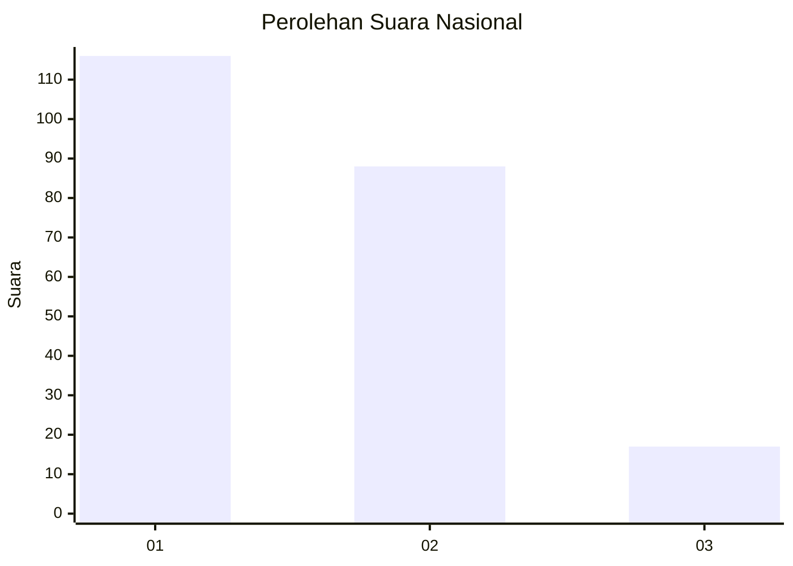
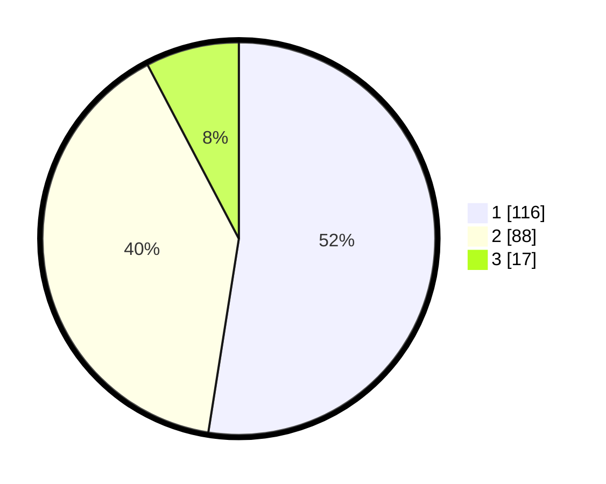

# Hasil

## Grafik

## Tabel

| No.    | Nama Paslon    | Suara | Suara (raw) | Persentase |
|:------ |:-------------- | -----:| -----------:| ----------:|
| 100025 | ANIES MUHAIMIN | 116   | [116][p-1]  | 52,49      |
| 100026 | PRABOWO GIBRAN | 88    | [88][p-2]   | 39,82      |
| 100027 | GANJAR MAHFUD  | 17    | [17][p-3]   | 7,69       |

[p-1]: https://github.com/gigit-pemilu/pemilu-2024/blob/main/pilpres/hitung-suara/sub/31-dki-jakarta/sub/71-jakarta-pusat/sub/06-menteng/sub/1001-menteng/sub/024-tps/sub/paslon-1.txt
[p-2]: https://github.com/gigit-pemilu/pemilu-2024/blob/main/pilpres/hitung-suara/sub/31-dki-jakarta/sub/71-jakarta-pusat/sub/06-menteng/sub/1001-menteng/sub/024-tps/sub/paslon-2.txt
[p-3]: https://github.com/gigit-pemilu/pemilu-2024/blob/main/pilpres/hitung-suara/sub/31-dki-jakarta/sub/71-jakarta-pusat/sub/06-menteng/sub/1001-menteng/sub/024-tps/sub/paslon-3.txt

## Foto C Plano

https://sirekap-obj-formc.kpu.go.id/76e4/pemilu/ppwp/31/71/06/10/01/3171061001024-20240218-160257--1f26c1b9-e2e5-44f9-a859-6e9cdfab4b42.jpg

https://sirekap-obj-formc.kpu.go.id/76e4/pemilu/ppwp/31/71/06/10/01/3171061001024-20240218-155932--62073445-c7b3-4652-b284-7a35bbb2a7bf.jpg

https://sirekap-obj-formc.kpu.go.id/76e4/pemilu/ppwp/31/71/06/10/01/3171061001024-20240218-160358--54ad2007-9d63-41fa-b74b-91275ce58085.jpg

## Metadata

| Key        | Value               |
| ---------- | ------------------- |
| Time Stamp | 2024-02-21 12:00:00 |

