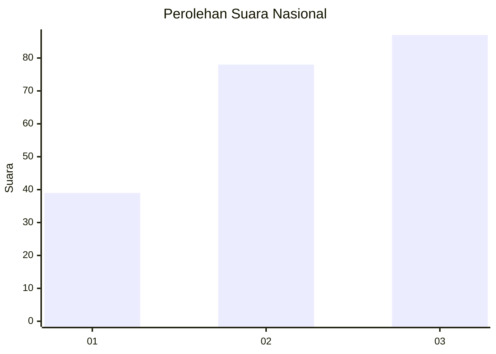
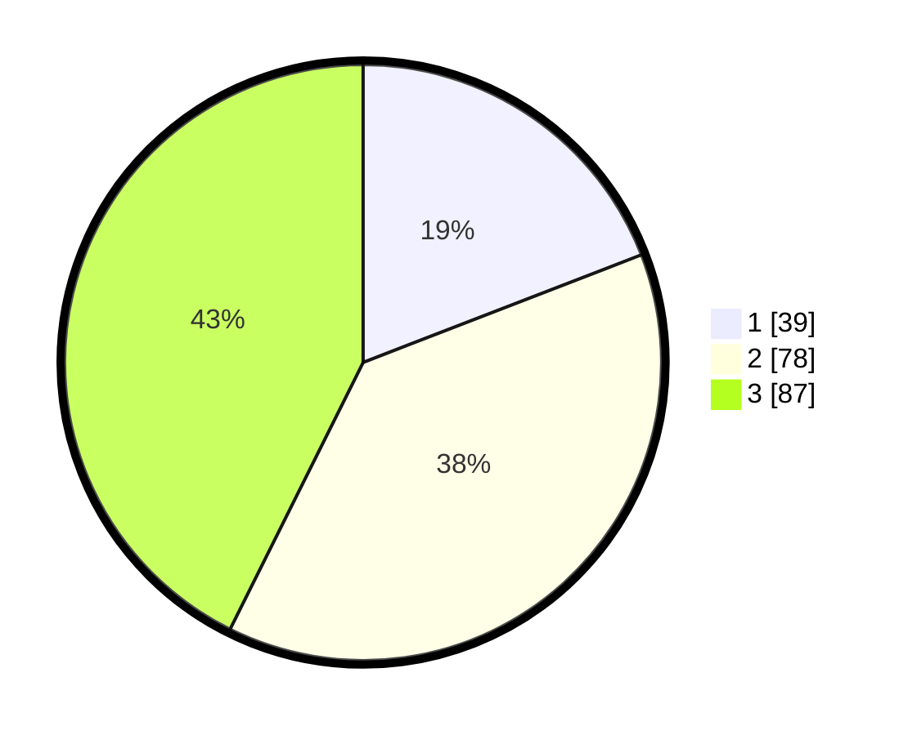

# Hasil

## Grafik

## Tabel

| No.    | Nama Paslon    | Suara | Suara (raw) | Persentase |
|:------ |:-------------- | -----:| -----------:| ----------:|
| 100025 | ANIES MUHAIMIN | 39    | [39][p-1]   | 19,12      |
| 100026 | PRABOWO GIBRAN | 78    | [78][p-2]   | 38,24      |
| 100027 | GANJAR MAHFUD  | 87    | [87][p-3]   | 42,65      |

[p-1]: https://github.com/gigit-pemilu/pemilu-2024/blob/main/pilpres/hitung-suara/sub/31-dki-jakarta/sub/71-jakarta-pusat/sub/06-menteng/sub/1001-menteng/sub/041-tps/sub/paslon-1.txt
[p-2]: https://github.com/gigit-pemilu/pemilu-2024/blob/main/pilpres/hitung-suara/sub/31-dki-jakarta/sub/71-jakarta-pusat/sub/06-menteng/sub/1001-menteng/sub/041-tps/sub/paslon-2.txt
[p-3]: https://github.com/gigit-pemilu/pemilu-2024/blob/main/pilpres/hitung-suara/sub/31-dki-jakarta/sub/71-jakarta-pusat/sub/06-menteng/sub/1001-menteng/sub/041-tps/sub/paslon-3.txt

## Foto C Plano

https://sirekap-obj-formc.kpu.go.id/4c05/pemilu/ppwp/31/71/06/10/01/3171061001041-20240218-210852--a782e082-daa7-40cd-912b-bfd7a5dbe3ce.jpg

https://sirekap-obj-formc.kpu.go.id/4c05/pemilu/ppwp/31/71/06/10/01/3171061001041-20240218-204122--c8112a82-2858-4382-8ba8-7cab2b6c22d5.jpg

https://sirekap-obj-formc.kpu.go.id/4c05/pemilu/ppwp/31/71/06/10/01/3171061001041-20240218-204313--f400352f-e1cb-48fb-a409-efe50ddb2f2e.jpg

## Metadata

| Key        | Value               |
| ---------- | ------------------- |
| Time Stamp | 2024-02-24 22:31:28 |

