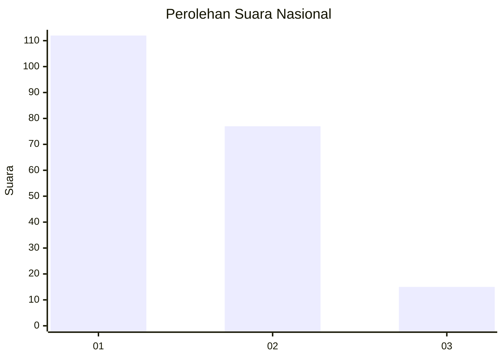
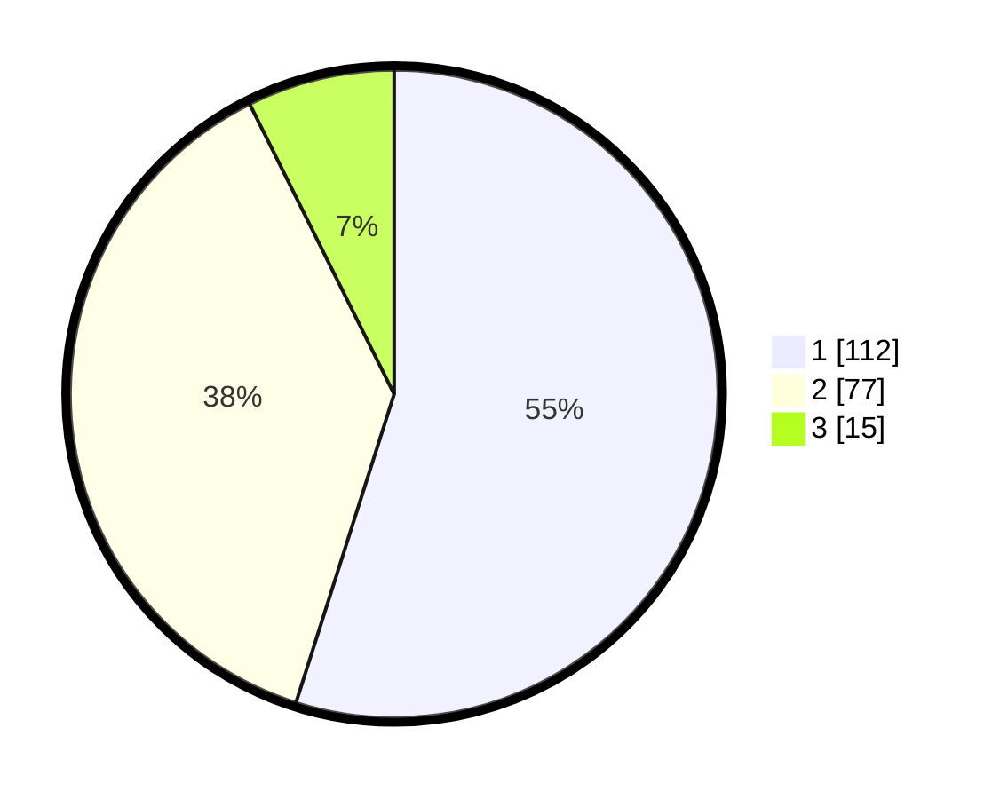

# Hasil

## Grafik

## Tabel

| No.    | Nama Paslon    | Suara | Suara (raw) | Persentase |
|:------ |:-------------- | -----:| -----------:| ----------:|
| 100025 | ANIES MUHAIMIN | 112   | [112][p-1]  | 54,90      |
| 100026 | PRABOWO GIBRAN | 77    | [77][p-2]   | 37,75      |
| 100027 | GANJAR MAHFUD  | 15    | [15][p-3]   | 7,35       |

[p-1]: https://github.com/gigit-pemilu/pemilu-2024/blob/main/pilpres/hitung-suara/sub/31-dki-jakarta/sub/71-jakarta-pusat/sub/06-menteng/sub/1005-kebon-sirih/sub/009-tps/sub/paslon-1.txt
[p-2]: https://github.com/gigit-pemilu/pemilu-2024/blob/main/pilpres/hitung-suara/sub/31-dki-jakarta/sub/71-jakarta-pusat/sub/06-menteng/sub/1005-kebon-sirih/sub/009-tps/sub/paslon-2.txt
[p-3]: https://github.com/gigit-pemilu/pemilu-2024/blob/main/pilpres/hitung-suara/sub/31-dki-jakarta/sub/71-jakarta-pusat/sub/06-menteng/sub/1005-kebon-sirih/sub/009-tps/sub/paslon-3.txt

## Foto C Plano

https://sirekap-obj-formc.kpu.go.id/aae4/pemilu/ppwp/31/71/06/10/05/3171061005009-20240215-002249--b765a322-1a2e-4d07-b92a-6e979fdd624d.jpg

https://sirekap-obj-formc.kpu.go.id/aae4/pemilu/ppwp/31/71/06/10/05/3171061005009-20240215-002357--1a5883d9-71bf-408d-af0a-c8eaa00fc66a.jpg

https://sirekap-obj-formc.kpu.go.id/aae4/pemilu/ppwp/31/71/06/10/05/3171061005009-20240215-002503--3559f608-a9f6-401f-9a33-2b56a18db067.jpg

## Metadata

| Key        | Value               |
| ---------- | ------------------- |
| Time Stamp | 2024-02-15 21:30:27 |

