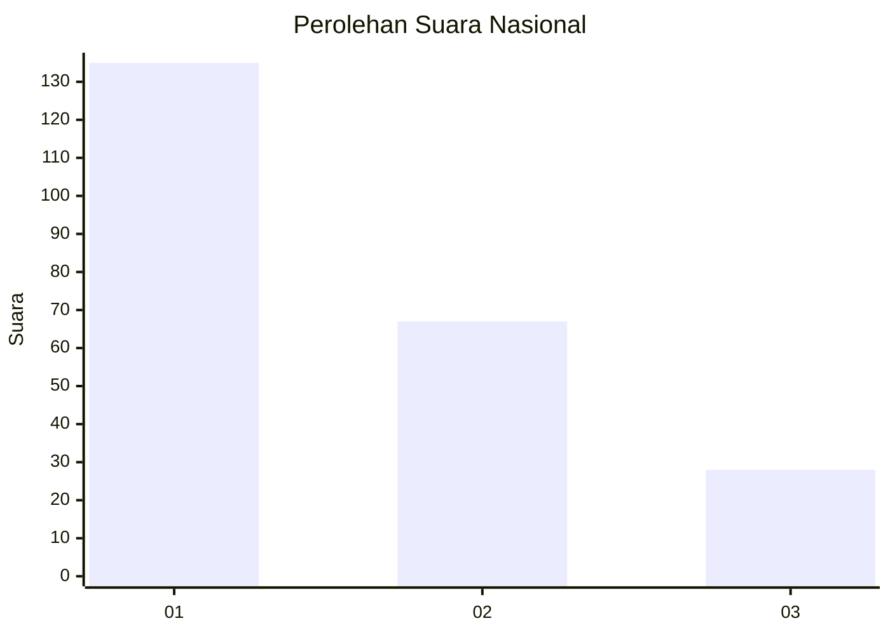
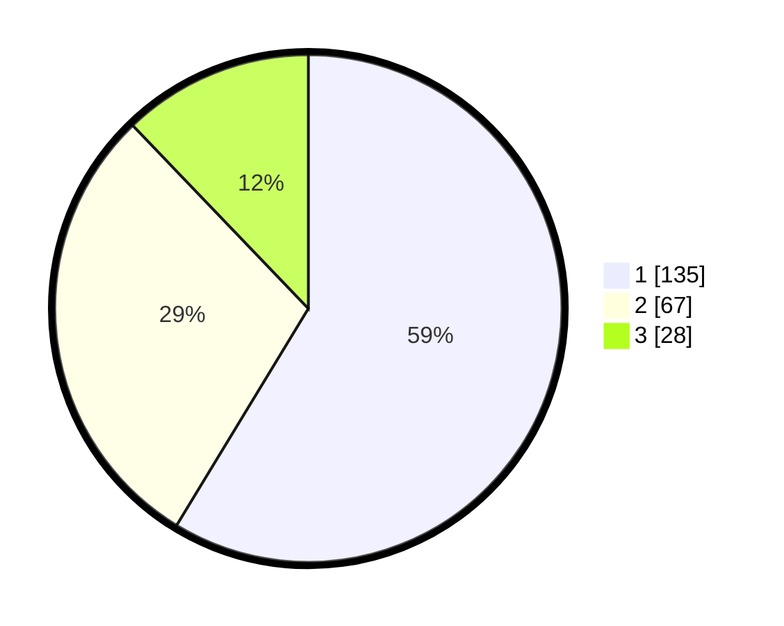

# Hasil

## Grafik

## Tabel

| No.    | Nama Paslon    | Suara | Suara (raw) | Persentase |
|:------ |:-------------- | -----:| -----------:| ----------:|
| 100025 | ANIES MUHAIMIN | 135   | [135][p-1]  | 58,70      |
| 100026 | PRABOWO GIBRAN | 67    | [67][p-2]   | 29,13      |
| 100027 | GANJAR MAHFUD  | 28    | [28][p-3]   | 12,17      |

[p-1]: https://github.com/gigit-pemilu/pemilu-2024/blob/main/pilpres/hitung-suara/sub/31-dki-jakarta/sub/71-jakarta-pusat/sub/06-menteng/sub/1005-kebon-sirih/sub/024-tps/sub/paslon-1.txt
[p-2]: https://github.com/gigit-pemilu/pemilu-2024/blob/main/pilpres/hitung-suara/sub/31-dki-jakarta/sub/71-jakarta-pusat/sub/06-menteng/sub/1005-kebon-sirih/sub/024-tps/sub/paslon-2.txt
[p-3]: https://github.com/gigit-pemilu/pemilu-2024/blob/main/pilpres/hitung-suara/sub/31-dki-jakarta/sub/71-jakarta-pusat/sub/06-menteng/sub/1005-kebon-sirih/sub/024-tps/sub/paslon-3.txt

## Foto C Plano

https://sirekap-obj-formc.kpu.go.id/2be0/pemilu/ppwp/31/71/06/10/05/3171061005024-20240218-122024--3954230d-0190-4156-b7af-8b62f11ba307.jpg

https://sirekap-obj-formc.kpu.go.id/2be0/pemilu/ppwp/31/71/06/10/05/3171061005024-20240215-005904--62084670-ad00-4b19-a3a4-52a3d74e70c2.jpg

https://sirekap-obj-formc.kpu.go.id/2be0/pemilu/ppwp/31/71/06/10/05/3171061005024-20240215-010005--5ee8966f-3944-4b35-bd00-21a47e229781.jpg

## Metadata

| Key        | Value               |
| ---------- | ------------------- |
| Time Stamp | 2024-02-19 06:16:00 |

