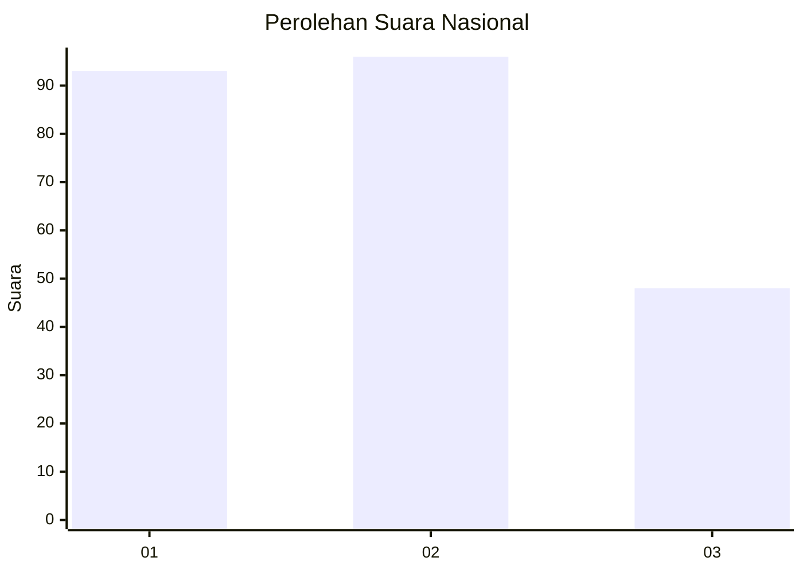
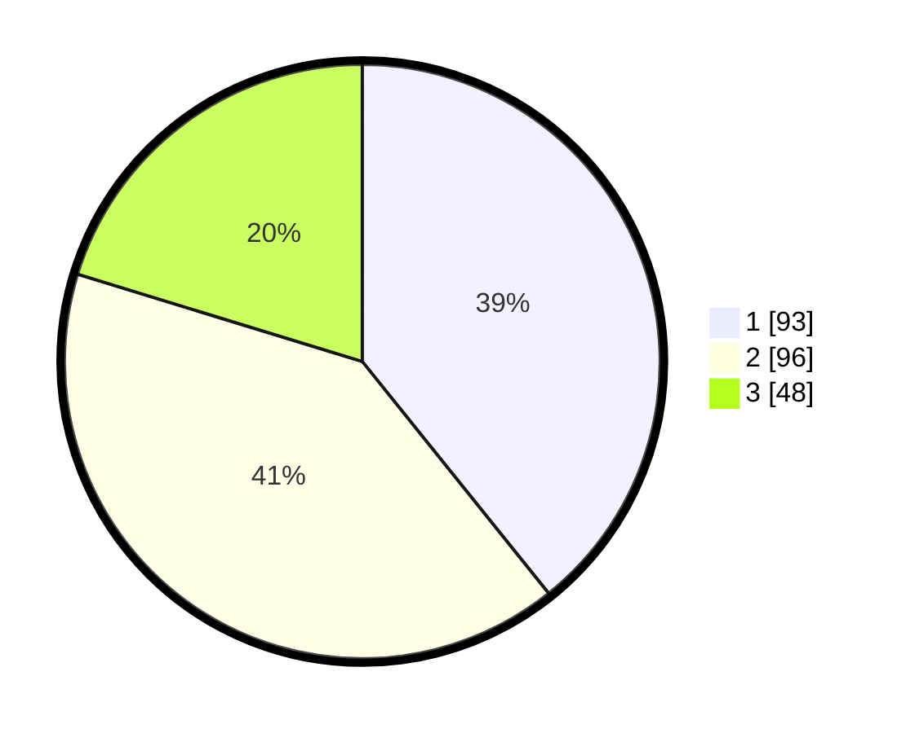

# Hasil

## Grafik

## Tabel

| No.    | Nama Paslon    | Suara | Suara (raw) | Persentase |
|:------ |:-------------- | -----:| -----------:| ----------:|
| 100025 | ANIES MUHAIMIN | 93    | [93][p-1]   | 39,24      |
| 100026 | PRABOWO GIBRAN | 96    | [96][p-2]   | 40,51      |
| 100027 | GANJAR MAHFUD  | 48    | [48][p-3]   | 20,25      |

[p-1]: https://github.com/gigit-pemilu/pemilu-2024/blob/main/pilpres/hitung-suara/sub/31-dki-jakarta/sub/71-jakarta-pusat/sub/07-tanah-abang/sub/1002-bendungan-hilir/sub/019-tps/sub/paslon-1.txt
[p-2]: https://github.com/gigit-pemilu/pemilu-2024/blob/main/pilpres/hitung-suara/sub/31-dki-jakarta/sub/71-jakarta-pusat/sub/07-tanah-abang/sub/1002-bendungan-hilir/sub/019-tps/sub/paslon-2.txt
[p-3]: https://github.com/gigit-pemilu/pemilu-2024/blob/main/pilpres/hitung-suara/sub/31-dki-jakarta/sub/71-jakarta-pusat/sub/07-tanah-abang/sub/1002-bendungan-hilir/sub/019-tps/sub/paslon-3.txt

## Foto C Plano

https://sirekap-obj-formc.kpu.go.id/a557/pemilu/ppwp/31/71/07/10/02/3171071002019-20240220-161837--96a65314-ba13-4c71-97a5-eec8bb52e1a4.jpg

https://sirekap-obj-formc.kpu.go.id/a557/pemilu/ppwp/31/71/07/10/02/3171071002019-20240220-161900--d1468453-04c4-4087-bb5c-e4598d178284.jpg

https://sirekap-obj-formc.kpu.go.id/a557/pemilu/ppwp/31/71/07/10/02/3171071002019-20240220-161927--0001a34c-2504-4da9-8ec7-12ecad016335.jpg

## Metadata

| Key        | Value               |
| ---------- | ------------------- |
| Time Stamp | 2024-02-20 17:00:00 |

## DATA PEMILIH TETAP

Jumlah pemilih dalam DPT: **285**.
 * L: **140**.
 * P: **145**.

## DATA PENGGUNA HAK PILIH

Jumlah pengguna hak pilih dalam DPT: **555**.
 * L: **96**.
 * P: **200**.

Jumlah pengguna hak pilih dalam DPTb: **837**.
 * L: **886**.
 * P: **831**.

Jumlah pengguna hak pilih dalam DPK: **881**.
 * L: **888**.
 * P: **881**.

Jumlah pengguna hak pilih: **239**.
 * L: **102**.
 * P: **137**.

## JUMLAH SUARA SAH DAN TIDAK SAH

JUMLAH SELURUH SUARA SAH: **237**.

JUMLAH SUARA TIDAK SAH: **822**.

JUMLAH SELURUH SUARA SAH DAN SUARA TIDAK SAH: **239**.

