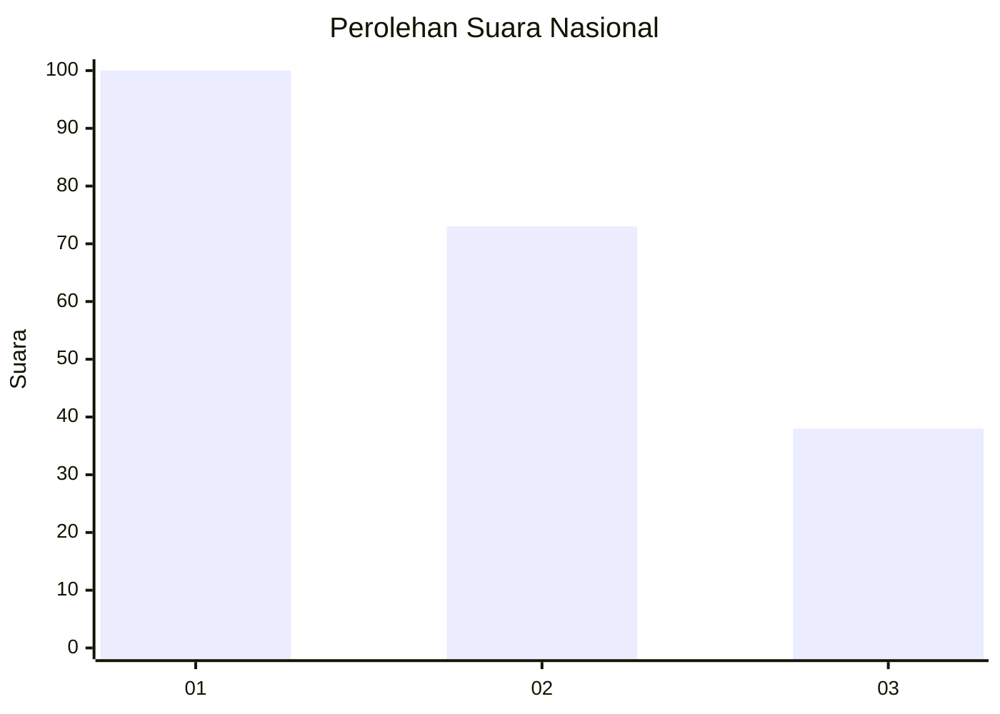
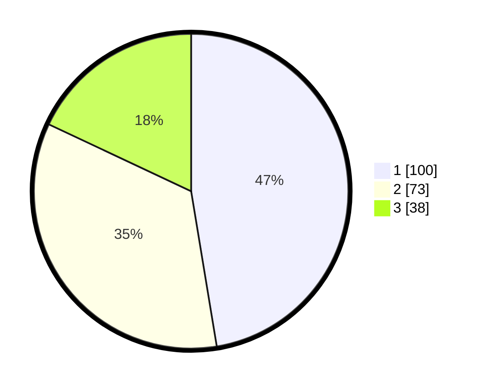

# Hasil

## Grafik

## Tabel

| No.    | Nama Paslon    | Suara | Suara (raw) | Persentase |
|:------ |:-------------- | -----:| -----------:| ----------:|
| 100025 | ANIES MUHAIMIN | 100   | [100][p-1]  | 47,39      |
| 100026 | PRABOWO GIBRAN | 73    | [73][p-2]   | 34,60      |
| 100027 | GANJAR MAHFUD  | 38    | [38][p-3]   | 18,01      |

[p-1]: https://github.com/gigit-pemilu/pemilu-2024/blob/main/pilpres/hitung-suara/sub/31-dki-jakarta/sub/71-jakarta-pusat/sub/07-tanah-abang/sub/1002-bendungan-hilir/sub/021-tps/sub/paslon-1.txt
[p-2]: https://github.com/gigit-pemilu/pemilu-2024/blob/main/pilpres/hitung-suara/sub/31-dki-jakarta/sub/71-jakarta-pusat/sub/07-tanah-abang/sub/1002-bendungan-hilir/sub/021-tps/sub/paslon-2.txt
[p-3]: https://github.com/gigit-pemilu/pemilu-2024/blob/main/pilpres/hitung-suara/sub/31-dki-jakarta/sub/71-jakarta-pusat/sub/07-tanah-abang/sub/1002-bendungan-hilir/sub/021-tps/sub/paslon-3.txt

## Foto C Plano

https://sirekap-obj-formc.kpu.go.id/cf21/pemilu/ppwp/31/71/07/10/02/3171071002021-20240220-172509--618e3718-f55f-429f-8130-ebc2e2db9082.jpg

https://sirekap-obj-formc.kpu.go.id/cf21/pemilu/ppwp/31/71/07/10/02/3171071002021-20240220-172732--e35c477c-8d9a-4917-a8e8-ce4a5a9c1207.jpg

https://sirekap-obj-formc.kpu.go.id/cf21/pemilu/ppwp/31/71/07/10/02/3171071002021-20240220-172547--5967aa28-1f73-40d3-96db-10eff3ba2683.jpg

## Metadata

| Key        | Value               |
| ---------- | ------------------- |
| Time Stamp | 2024-02-20 18:00:00 |

## DATA PEMILIH TETAP

Jumlah pemilih dalam DPT: **262**.
 * L: **115**.
 * P: **147**.

## DATA PENGGUNA HAK PILIH

Jumlah pengguna hak pilih dalam DPT: **194**.
 * L: **81**.
 * P: **113**.

Jumlah pengguna hak pilih dalam DPTb: **78**.
 * L: **9**.
 * P: **74**.

Jumlah pengguna hak pilih dalam DPK: **100**.
 * L: **100**.
 * P: **0**.

Jumlah pengguna hak pilih: **801**.
 * L: **308**.
 * P: **512**.

## JUMLAH SUARA SAH DAN TIDAK SAH

JUMLAH SELURUH SUARA SAH: **211**.

JUMLAH SUARA TIDAK SAH: **2**.

JUMLAH SELURUH SUARA SAH DAN SUARA TIDAK SAH: **213**.

