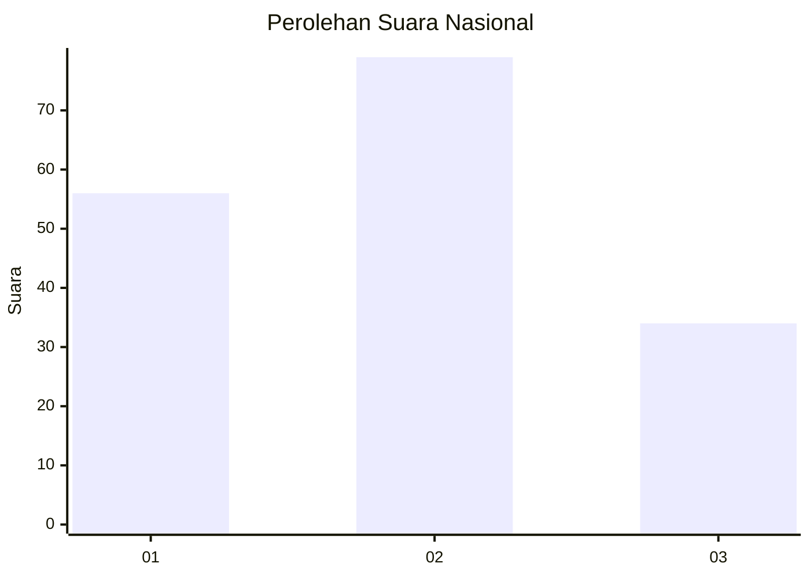
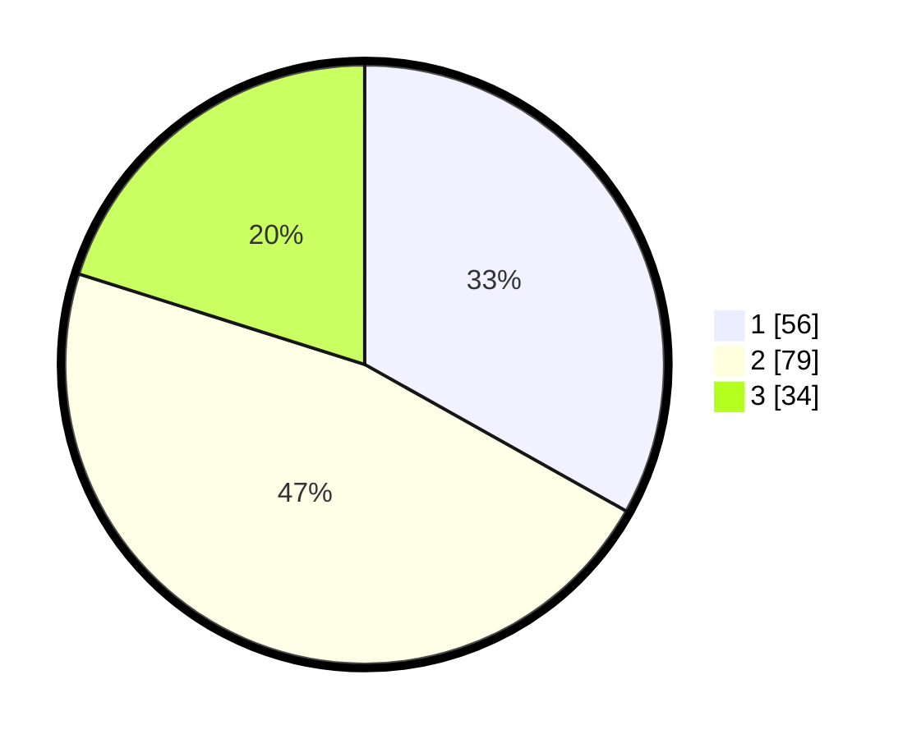

# Hasil

## Grafik

## Tabel

| No.    | Nama Paslon    | Suara | Suara (raw) | Persentase |
|:------ |:-------------- | -----:| -----------:| ----------:|
| 100025 | ANIES MUHAIMIN | 56    | [56][p-1]   | 33,14      |
| 100026 | PRABOWO GIBRAN | 79    | [79][p-2]   | 46,75      |
| 100027 | GANJAR MAHFUD  | 34    | [34][p-3]   | 20,12      |

[p-1]: https://github.com/gigit-pemilu/pemilu-2024/blob/main/pilpres/hitung-suara/sub/31-dki-jakarta/sub/71-jakarta-pusat/sub/07-tanah-abang/sub/1002-bendungan-hilir/sub/033-tps/sub/paslon-1.txt
[p-2]: https://github.com/gigit-pemilu/pemilu-2024/blob/main/pilpres/hitung-suara/sub/31-dki-jakarta/sub/71-jakarta-pusat/sub/07-tanah-abang/sub/1002-bendungan-hilir/sub/033-tps/sub/paslon-2.txt
[p-3]: https://github.com/gigit-pemilu/pemilu-2024/blob/main/pilpres/hitung-suara/sub/31-dki-jakarta/sub/71-jakarta-pusat/sub/07-tanah-abang/sub/1002-bendungan-hilir/sub/033-tps/sub/paslon-3.txt

## Foto C Plano

https://sirekap-obj-formc.kpu.go.id/258c/pemilu/ppwp/31/71/07/10/02/3171071002033-20240214-185523--d9706289-6cf0-4ea8-89bb-bd26441fe3f7.jpg

https://sirekap-obj-formc.kpu.go.id/258c/pemilu/ppwp/31/71/07/10/02/3171071002033-20240214-185542--e23c31dc-2af0-4e32-ad88-fc10c68020d0.jpg

https://sirekap-obj-formc.kpu.go.id/258c/pemilu/ppwp/31/71/07/10/02/3171071002033-20240214-185551--ad9720f7-1f32-48b3-8dd7-53aecda76ee9.jpg

## Metadata

| Key        | Value               |
| ---------- | ------------------- |
| Time Stamp | 2024-02-19 06:16:00 |

