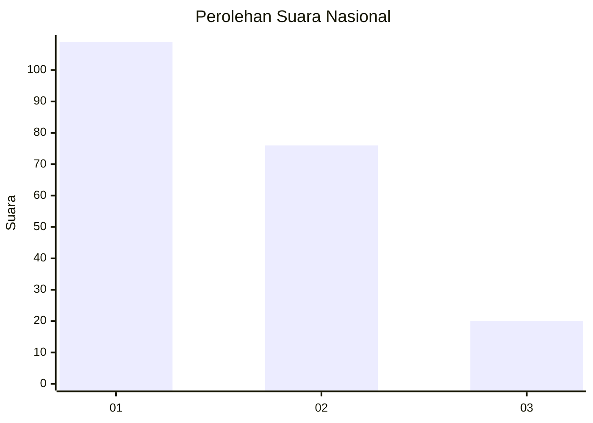
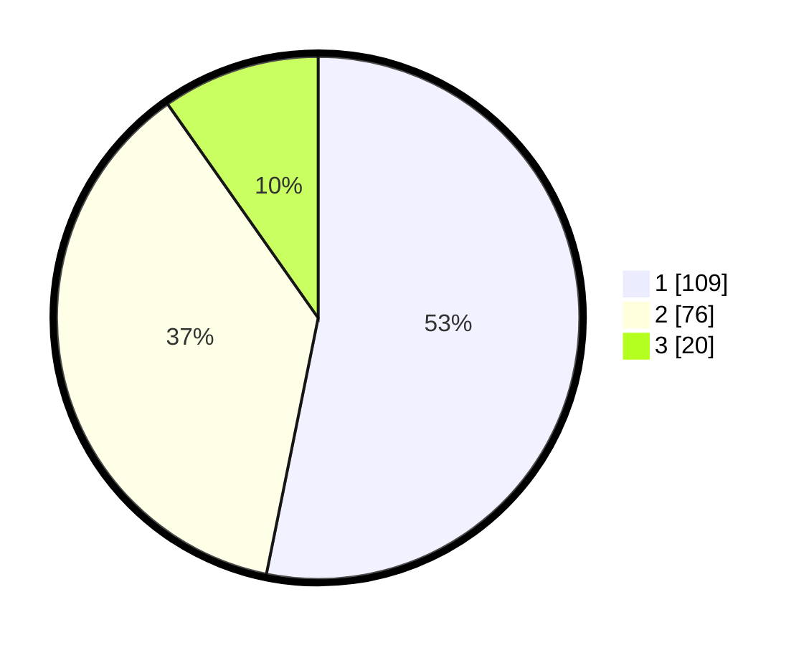

# Hasil

## Grafik

## Tabel

| No.    | Nama Paslon    | Suara | Suara (raw) | Persentase |
|:------ |:-------------- | -----:| -----------:| ----------:|
| 100025 | ANIES MUHAIMIN | 109   | [109][p-1]  | 53,17      |
| 100026 | PRABOWO GIBRAN | 76    | [76][p-2]   | 37,07      |
| 100027 | GANJAR MAHFUD  | 20    | [20][p-3]   | 9,76       |

[p-1]: https://github.com/gigit-pemilu/pemilu-2024/blob/main/pilpres/hitung-suara/sub/31-dki-jakarta/sub/71-jakarta-pusat/sub/07-tanah-abang/sub/1003-karet-tengsin/sub/021-tps/sub/paslon-1.txt
[p-2]: https://github.com/gigit-pemilu/pemilu-2024/blob/main/pilpres/hitung-suara/sub/31-dki-jakarta/sub/71-jakarta-pusat/sub/07-tanah-abang/sub/1003-karet-tengsin/sub/021-tps/sub/paslon-2.txt
[p-3]: https://github.com/gigit-pemilu/pemilu-2024/blob/main/pilpres/hitung-suara/sub/31-dki-jakarta/sub/71-jakarta-pusat/sub/07-tanah-abang/sub/1003-karet-tengsin/sub/021-tps/sub/paslon-3.txt

## Foto C Plano

https://sirekap-obj-formc.kpu.go.id/31b7/pemilu/ppwp/31/71/07/10/03/3171071003021-20240224-141200--a99bfb43-53c1-4c30-9b78-3ed5dfb8a487.jpg

https://sirekap-obj-formc.kpu.go.id/31b7/pemilu/ppwp/31/71/07/10/03/3171071003021-20240224-141512--3a198fa1-1b2a-45d8-a9e3-57f39a04d973.jpg

https://sirekap-obj-formc.kpu.go.id/31b7/pemilu/ppwp/31/71/07/10/03/3171071003021-20240214-194411--16290950-a5f6-40a8-8db5-b4deabb1d656.jpg

## Metadata

| Key        | Value               |
| ---------- | ------------------- |
| Time Stamp | 2024-02-28 10:00:00 |

