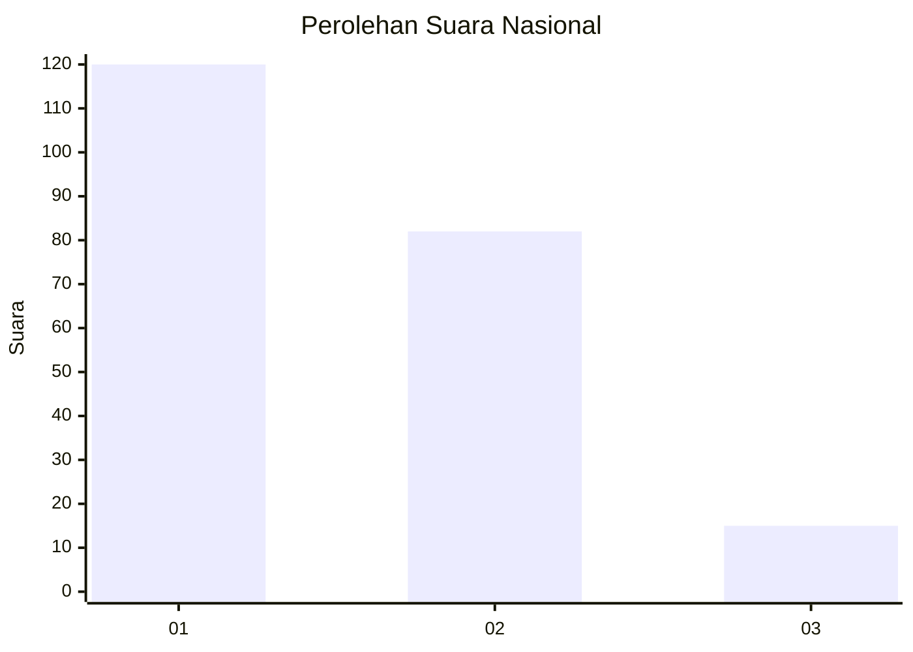
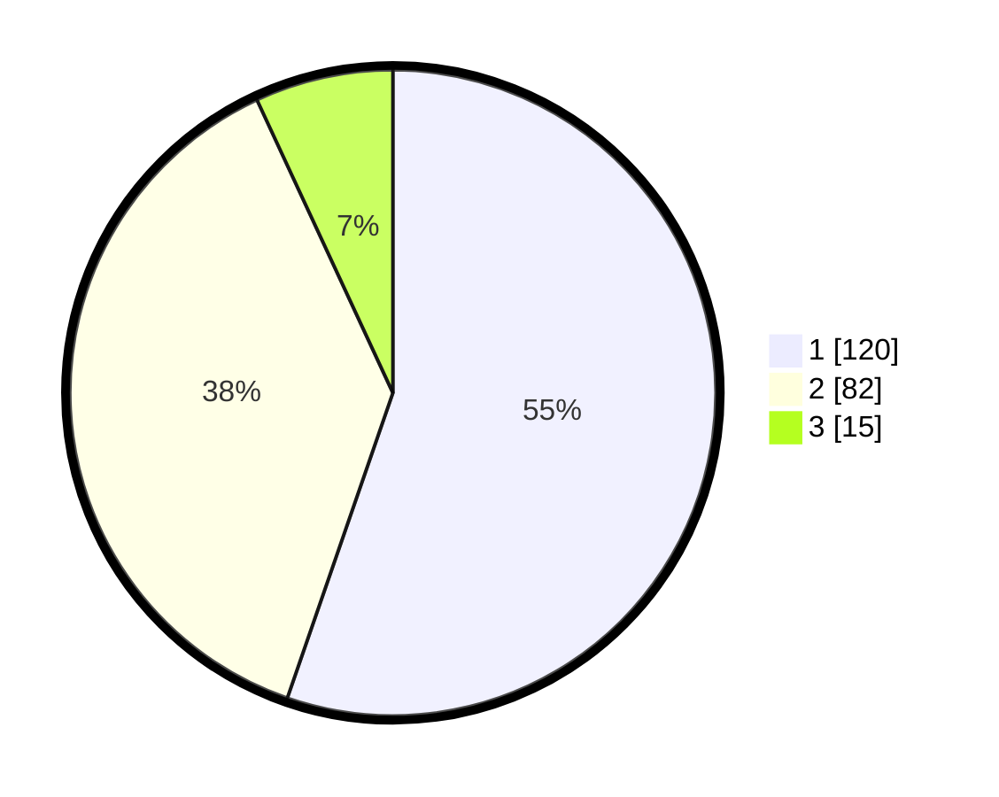

# Hasil

## Grafik

## Tabel

| No.    | Nama Paslon    | Suara | Suara (raw) | Persentase |
|:------ |:-------------- | -----:| -----------:| ----------:|
| 100025 | ANIES MUHAIMIN | 120   | [120][p-1]  | 55,30      |
| 100026 | PRABOWO GIBRAN | 82    | [82][p-2]   | 37,79      |
| 100027 | GANJAR MAHFUD  | 15    | [15][p-3]   | 6,91       |

[p-1]: https://github.com/gigit-pemilu/pemilu-2024/blob/main/pilpres/hitung-suara/sub/31-dki-jakarta/sub/71-jakarta-pusat/sub/07-tanah-abang/sub/1004-petamburan/sub/090-tps/sub/paslon-1.txt
[p-2]: https://github.com/gigit-pemilu/pemilu-2024/blob/main/pilpres/hitung-suara/sub/31-dki-jakarta/sub/71-jakarta-pusat/sub/07-tanah-abang/sub/1004-petamburan/sub/090-tps/sub/paslon-2.txt
[p-3]: https://github.com/gigit-pemilu/pemilu-2024/blob/main/pilpres/hitung-suara/sub/31-dki-jakarta/sub/71-jakarta-pusat/sub/07-tanah-abang/sub/1004-petamburan/sub/090-tps/sub/paslon-3.txt

## Foto C Plano

https://sirekap-obj-formc.kpu.go.id/1eed/pemilu/ppwp/31/71/07/10/04/3171071004090-20240214-191925--3bc29adf-921f-4d94-902d-aaabceab493b.jpg

https://sirekap-obj-formc.kpu.go.id/1eed/pemilu/ppwp/31/71/07/10/04/3171071004090-20240214-192027--c1f11ea0-fab8-49f6-9aa1-8c9a4d3bcade.jpg

https://sirekap-obj-formc.kpu.go.id/1eed/pemilu/ppwp/31/71/07/10/04/3171071004090-20240214-192114--608204f3-3987-4df7-b3c7-54252c8dbb6b.jpg

## Metadata

| Key        | Value               |
| ---------- | ------------------- |
| Time Stamp | 2024-02-16 17:00:00 |

