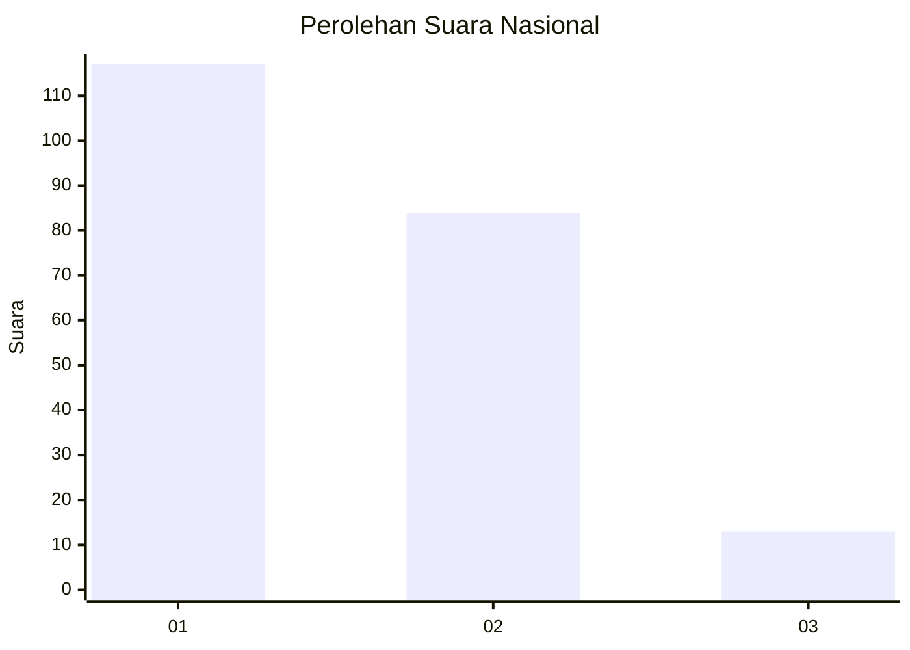
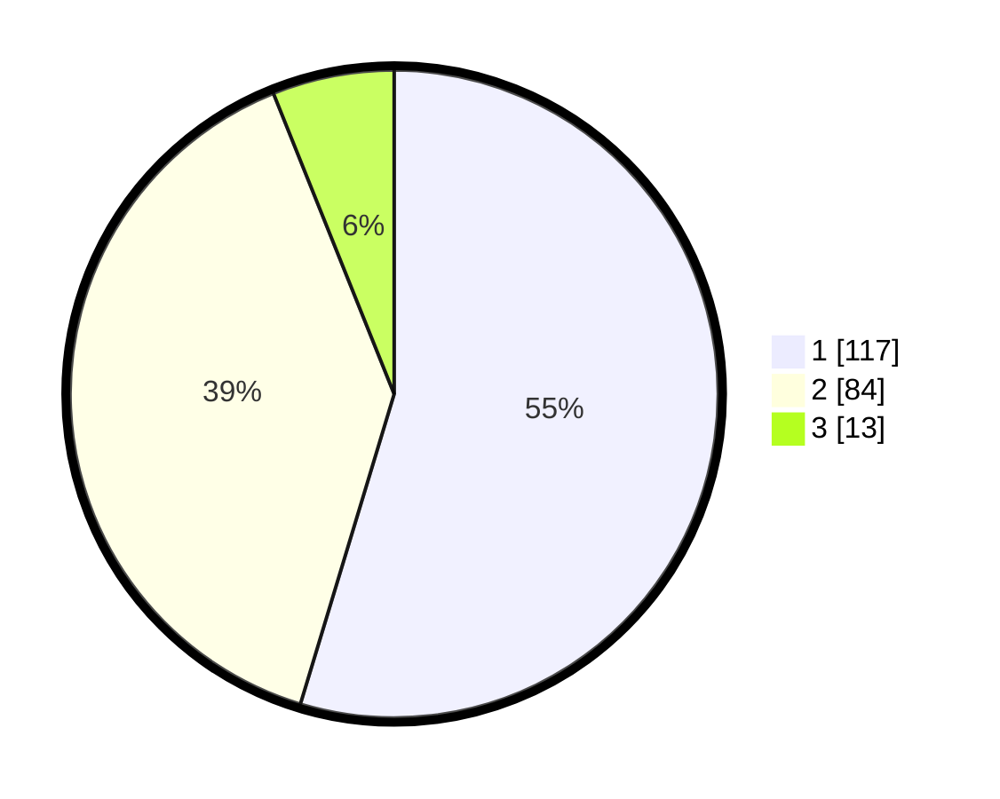

# Hasil

## Grafik

## Tabel

| No.    | Nama Paslon    | Suara | Suara (raw) | Persentase |
|:------ |:-------------- | -----:| -----------:| ----------:|
| 100025 | ANIES MUHAIMIN | 117   | [117][p-1]  | 54,67      |
| 100026 | PRABOWO GIBRAN | 84    | [84][p-2]   | 39,25      |
| 100027 | GANJAR MAHFUD  | 13    | [13][p-3]   | 6,07       |

[p-1]: https://github.com/gigit-pemilu/pemilu-2024/blob/main/pilpres/hitung-suara/sub/31-dki-jakarta/sub/71-jakarta-pusat/sub/07-tanah-abang/sub/1004-petamburan/sub/099-tps/sub/paslon-1.txt
[p-2]: https://github.com/gigit-pemilu/pemilu-2024/blob/main/pilpres/hitung-suara/sub/31-dki-jakarta/sub/71-jakarta-pusat/sub/07-tanah-abang/sub/1004-petamburan/sub/099-tps/sub/paslon-2.txt
[p-3]: https://github.com/gigit-pemilu/pemilu-2024/blob/main/pilpres/hitung-suara/sub/31-dki-jakarta/sub/71-jakarta-pusat/sub/07-tanah-abang/sub/1004-petamburan/sub/099-tps/sub/paslon-3.txt

## Foto C Plano

https://sirekap-obj-formc.kpu.go.id/e803/pemilu/ppwp/31/71/07/10/04/3171071004099-20240214-155233--6fb22420-3c26-4da5-affe-bdf7f0994f97.jpg

https://sirekap-obj-formc.kpu.go.id/e803/pemilu/ppwp/31/71/07/10/04/3171071004099-20240214-155648--4c66471c-578f-4a33-a66d-f63cf5034831.jpg

https://sirekap-obj-formc.kpu.go.id/e803/pemilu/ppwp/31/71/07/10/04/3171071004099-20240214-160059--d84b5adc-4f49-4add-b3bb-ff7c3441d801.jpg

## Metadata

| Key        | Value               |
| ---------- | ------------------- |
| Time Stamp | 2024-02-14 21:46:01 |

