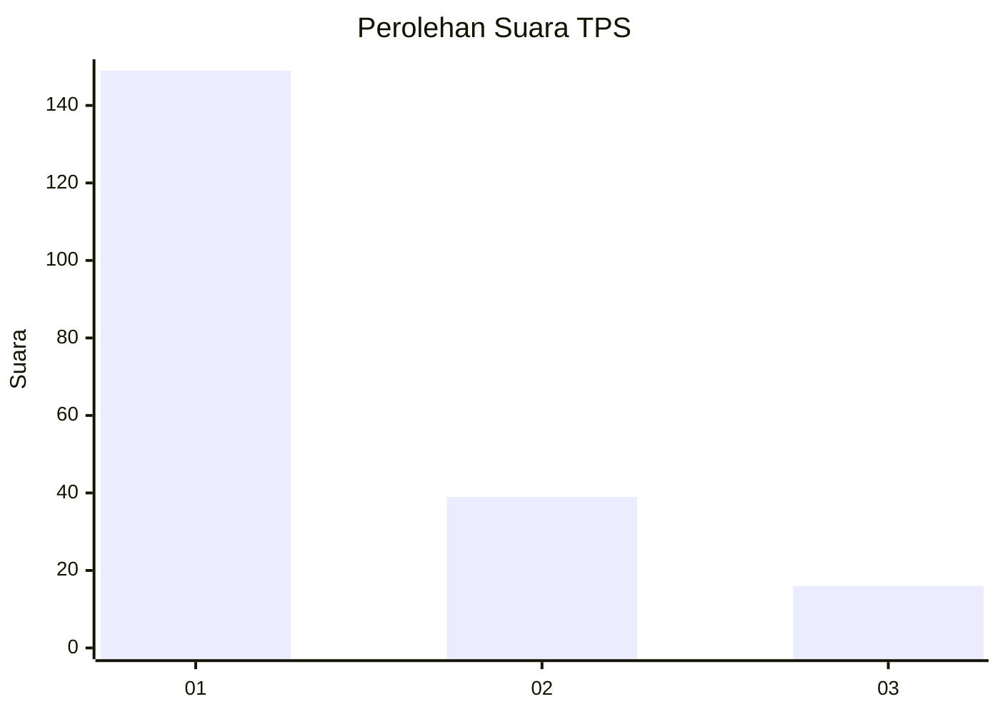
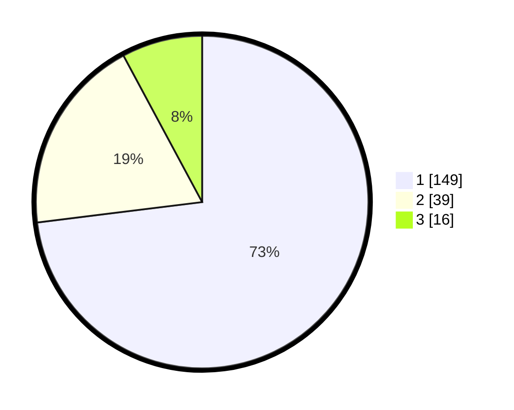

# Hasil

## Grafik

## Tabel

| No. | Nama Paslon    | Suara | Suara (raw) | Persentase |
|:--- |:-------------- | -----:| -----------:| ----------:|
| 1   | ANIES MUHAIMIN | 149   | [149][p-1]  | 73,04      |
| 2   | PRABOWO GIBRAN | 39    | [39][p-2]   | 19,12      |
| 3   | GANJAR MAHFUD  | 16    | [16][p-3]   | 7,84       |

[p-1]: https://github.com/gigit-pemilu/pemilu-2024-31-dki-jakarta/blob/main/pilpres/hitung-suara/sub/31-dki-jakarta/sub/71-jakarta-pusat/sub/07-tanah-abang/sub/1005-kebon-melati/sub/050-tps/sub/paslon-1.txt
[p-2]: https://github.com/gigit-pemilu/pemilu-2024-31-dki-jakarta/blob/main/pilpres/hitung-suara/sub/31-dki-jakarta/sub/71-jakarta-pusat/sub/07-tanah-abang/sub/1005-kebon-melati/sub/050-tps/sub/paslon-2.txt
[p-3]: https://github.com/gigit-pemilu/pemilu-2024-31-dki-jakarta/blob/main/pilpres/hitung-suara/sub/31-dki-jakarta/sub/71-jakarta-pusat/sub/07-tanah-abang/sub/1005-kebon-melati/sub/050-tps/sub/paslon-3.txt

## Foto C Plano

https://sirekap-obj-formc.kpu.go.id/474e/pemilu/ppwp/31/71/07/10/05/3171071005050-20240223-103046--7b9939fa-3176-430b-84c2-16ffc5bdb3be.jpg

https://sirekap-obj-formc.kpu.go.id/474e/pemilu/ppwp/31/71/07/10/05/3171071005050-20240223-103503--47ccd5f7-5708-41c5-a60b-a5699334ba9e.jpg

https://sirekap-obj-formc.kpu.go.id/474e/pemilu/ppwp/31/71/07/10/05/3171071005050-20240214-222749--466671db-e4eb-4485-a258-ab69b3a7861f.jpg

## Metadata

| Key        | Value               |
| ---------- | ------------------- |
| Time Stamp | 2024-02-25 10:00:00 |

## DATA PEMILIH TETAP

Jumlah pemilih dalam DPT: **776**.
 * L: **550**.
 * P: **555**.

## DATA PENGGUNA HAK PILIH

Jumlah pengguna hak pilih dalam DPT: **444**.
 * L: **444**.
 * P: **444**.

Jumlah pengguna hak pilih dalam DPTb: **644**.
 * L: **822**.
 * P: **424**.

Jumlah pengguna hak pilih dalam DPK: **8**.
 * L: **444**.
 * P: **426**.

Jumlah pengguna hak pilih: **206**.
 * L: **666**.
 * P: **614**.

## JUMLAH SUARA SAH DAN TIDAK SAH

JUMLAH SELURUH SUARA SAH: **204**.

JUMLAH SUARA TIDAK SAH: **2**.

JUMLAH SELURUH SUARA SAH DAN SUARA TIDAK SAH: **206**.

