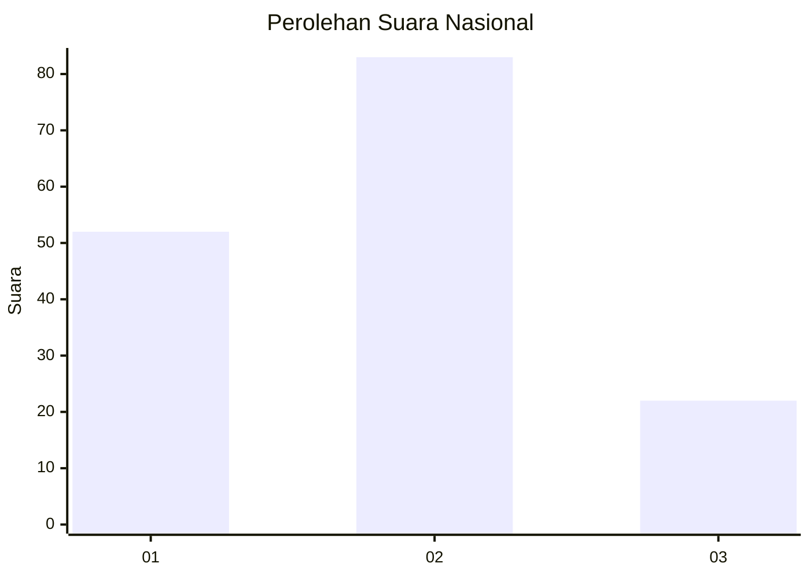
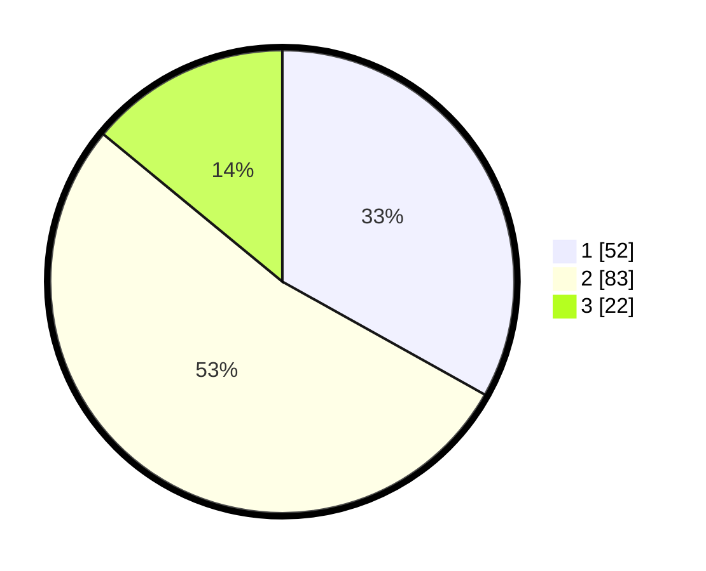

# Hasil

## Grafik

## Tabel

| No.    | Nama Paslon    | Suara | Suara (raw) | Persentase |
|:------ |:-------------- | -----:| -----------:| ----------:|
| 100025 | ANIES MUHAIMIN | 52    | [52][p-1]   | 33,12      |
| 100026 | PRABOWO GIBRAN | 83    | [83][p-2]   | 52,87      |
| 100027 | GANJAR MAHFUD  | 22    | [22][p-3]   | 14,01      |

[p-1]: https://github.com/gigit-pemilu/pemilu-2024/blob/main/pilpres/hitung-suara/sub/31-dki-jakarta/sub/71-jakarta-pusat/sub/07-tanah-abang/sub/1005-kebon-melati/sub/069-tps/sub/paslon-1.txt
[p-2]: https://github.com/gigit-pemilu/pemilu-2024/blob/main/pilpres/hitung-suara/sub/31-dki-jakarta/sub/71-jakarta-pusat/sub/07-tanah-abang/sub/1005-kebon-melati/sub/069-tps/sub/paslon-2.txt
[p-3]: https://github.com/gigit-pemilu/pemilu-2024/blob/main/pilpres/hitung-suara/sub/31-dki-jakarta/sub/71-jakarta-pusat/sub/07-tanah-abang/sub/1005-kebon-melati/sub/069-tps/sub/paslon-3.txt

## Foto C Plano

https://sirekap-obj-formc.kpu.go.id/62b0/pemilu/ppwp/31/71/07/10/05/3171071005069-20240214-222555--e9a70f7e-d395-4b1a-8979-5a859d2e6fd4.jpg

https://sirekap-obj-formc.kpu.go.id/62b0/pemilu/ppwp/31/71/07/10/05/3171071005069-20240214-222625--83a8efe1-d238-47fa-b4ac-0ba544da9643.jpg

https://sirekap-obj-formc.kpu.go.id/62b0/pemilu/ppwp/31/71/07/10/05/3171071005069-20240214-222657--4a512a8d-323b-4ba2-9b6f-64d2d0e85709.jpg

## Metadata

| Key        | Value               |
| ---------- | ------------------- |
| Time Stamp | 2024-02-15 15:00:29 |

