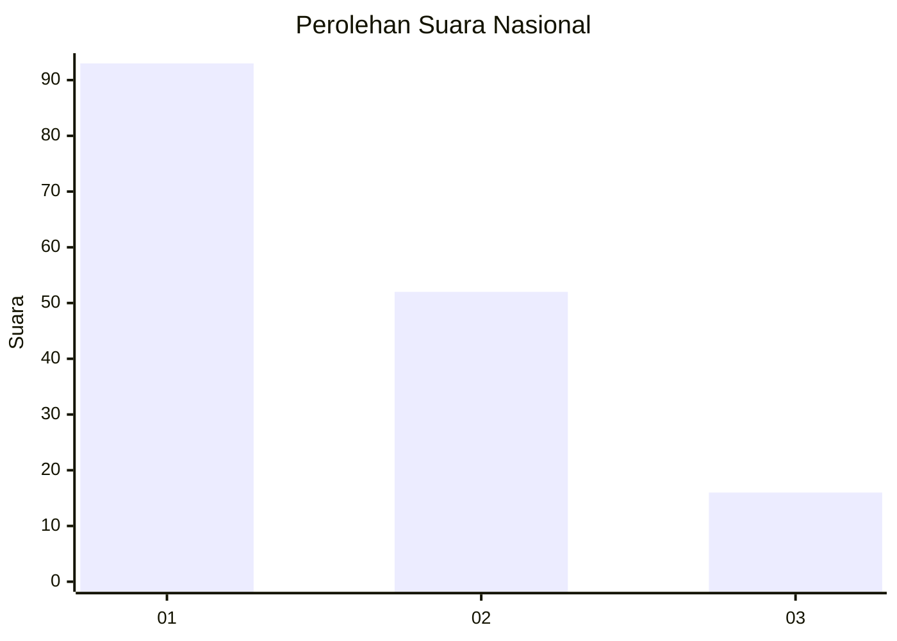
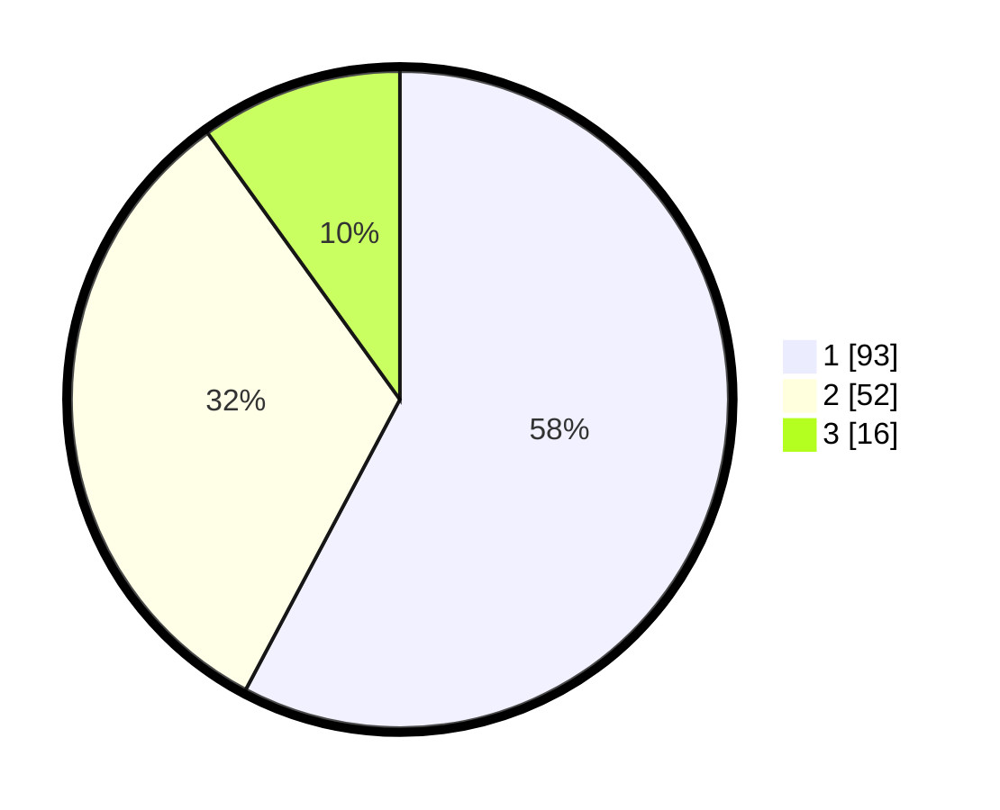

# Hasil

## Grafik

## Tabel

| No.    | Nama Paslon    | Suara | Suara (raw) | Persentase |
|:------ |:-------------- | -----:| -----------:| ----------:|
| 100025 | ANIES MUHAIMIN | 93    | [93][p-1]   | 57,76      |
| 100026 | PRABOWO GIBRAN | 52    | [52][p-2]   | 32,30      |
| 100027 | GANJAR MAHFUD  | 16    | [16][p-3]   | 9,94       |

[p-1]: https://github.com/gigit-pemilu/pemilu-2024/blob/main/pilpres/hitung-suara/sub/31-dki-jakarta/sub/71-jakarta-pusat/sub/07-tanah-abang/sub/1005-kebon-melati/sub/079-tps/sub/paslon-1.txt
[p-2]: https://github.com/gigit-pemilu/pemilu-2024/blob/main/pilpres/hitung-suara/sub/31-dki-jakarta/sub/71-jakarta-pusat/sub/07-tanah-abang/sub/1005-kebon-melati/sub/079-tps/sub/paslon-2.txt
[p-3]: https://github.com/gigit-pemilu/pemilu-2024/blob/main/pilpres/hitung-suara/sub/31-dki-jakarta/sub/71-jakarta-pusat/sub/07-tanah-abang/sub/1005-kebon-melati/sub/079-tps/sub/paslon-3.txt

## Foto C Plano

https://sirekap-obj-formc.kpu.go.id/ccfc/pemilu/ppwp/31/71/07/10/05/3171071005079-20240214-225232--6373f829-06d1-4a3f-95ef-0d1f1af90fc2.jpg

https://sirekap-obj-formc.kpu.go.id/ccfc/pemilu/ppwp/31/71/07/10/05/3171071005079-20240214-225325--4b04ec7d-67da-4cd7-8d48-1d4e6733eb4c.jpg

https://sirekap-obj-formc.kpu.go.id/ccfc/pemilu/ppwp/31/71/07/10/05/3171071005079-20240214-225430--18d8c4e6-cf33-40ce-b154-f5c863a1543b.jpg

## Metadata

| Key        | Value               |
| ---------- | ------------------- |
| Time Stamp | 2024-02-15 15:00:29 |

