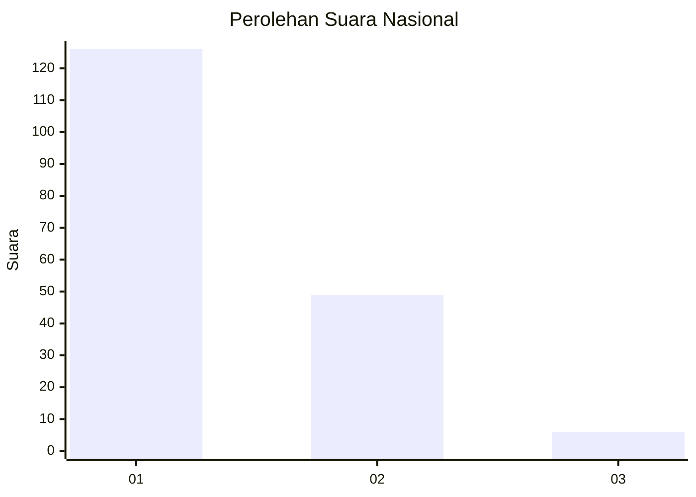
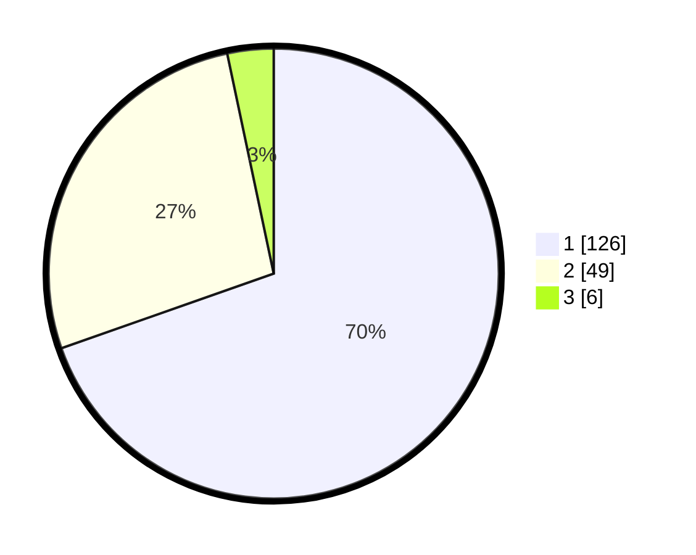

# Hasil

## Grafik

## Tabel

| No.    | Nama Paslon    | Suara | Suara (raw) | Persentase |
|:------ |:-------------- | -----:| -----------:| ----------:|
| 100025 | ANIES MUHAIMIN | 126   | [126][p-1]  | 69,61      |
| 100026 | PRABOWO GIBRAN | 49    | [49][p-2]   | 27,07      |
| 100027 | GANJAR MAHFUD  | 6     | [6][p-3]    | 3,31       |

[p-1]: https://github.com/gigit-pemilu/pemilu-2024/blob/main/pilpres/hitung-suara/sub/31-dki-jakarta/sub/71-jakarta-pusat/sub/07-tanah-abang/sub/1005-kebon-melati/sub/084-tps/sub/paslon-1.txt
[p-2]: https://github.com/gigit-pemilu/pemilu-2024/blob/main/pilpres/hitung-suara/sub/31-dki-jakarta/sub/71-jakarta-pusat/sub/07-tanah-abang/sub/1005-kebon-melati/sub/084-tps/sub/paslon-2.txt
[p-3]: https://github.com/gigit-pemilu/pemilu-2024/blob/main/pilpres/hitung-suara/sub/31-dki-jakarta/sub/71-jakarta-pusat/sub/07-tanah-abang/sub/1005-kebon-melati/sub/084-tps/sub/paslon-3.txt

## Foto C Plano

https://sirekap-obj-formc.kpu.go.id/2001/pemilu/ppwp/31/71/07/10/05/3171071005084-20240214-221052--2f9d2fa9-a758-448b-8b1d-f022d8c0b640.jpg

https://sirekap-obj-formc.kpu.go.id/2001/pemilu/ppwp/31/71/07/10/05/3171071005084-20240214-222617--e4b3d3bb-5b5c-428d-a8bb-3d8367e07b83.jpg

https://sirekap-obj-formc.kpu.go.id/2001/pemilu/ppwp/31/71/07/10/05/3171071005084-20240214-222913--6de4087c-ce6b-4b05-8f7b-a0c2627d2b2a.jpg

## Metadata

| Key        | Value               |
| ---------- | ------------------- |
| Time Stamp | 2024-02-16 00:00:26 |

