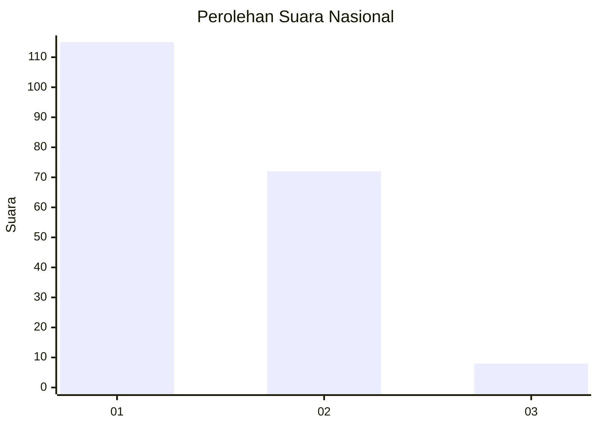
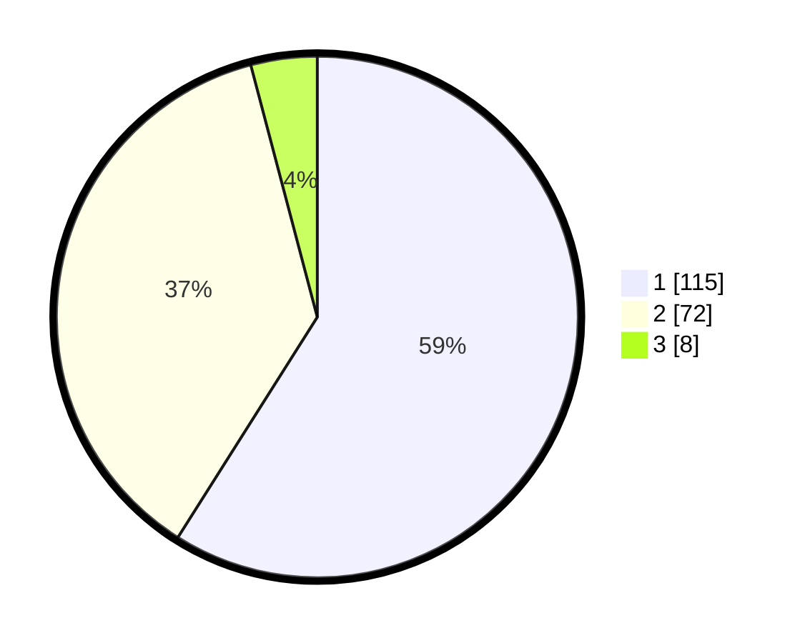

# Hasil

## Grafik

## Tabel

| No.    | Nama Paslon    | Suara | Suara (raw) | Persentase |
|:------ |:-------------- | -----:| -----------:| ----------:|
| 100025 | ANIES MUHAIMIN | 115   | [115][p-1]  | 58,97      |
| 100026 | PRABOWO GIBRAN | 72    | [72][p-2]   | 36,92      |
| 100027 | GANJAR MAHFUD  | 8     | [8][p-3]    | 4,10       |

[p-1]: https://github.com/gigit-pemilu/pemilu-2024/blob/main/pilpres/hitung-suara/sub/31-dki-jakarta/sub/71-jakarta-pusat/sub/07-tanah-abang/sub/1005-kebon-melati/sub/085-tps/sub/paslon-1.txt
[p-2]: https://github.com/gigit-pemilu/pemilu-2024/blob/main/pilpres/hitung-suara/sub/31-dki-jakarta/sub/71-jakarta-pusat/sub/07-tanah-abang/sub/1005-kebon-melati/sub/085-tps/sub/paslon-2.txt
[p-3]: https://github.com/gigit-pemilu/pemilu-2024/blob/main/pilpres/hitung-suara/sub/31-dki-jakarta/sub/71-jakarta-pusat/sub/07-tanah-abang/sub/1005-kebon-melati/sub/085-tps/sub/paslon-3.txt

## Foto C Plano

https://sirekap-obj-formc.kpu.go.id/5091/pemilu/ppwp/31/71/07/10/05/3171071005085-20240215-022046--64d0b50b-0bed-4110-8236-39ebd349f8b3.jpg

https://sirekap-obj-formc.kpu.go.id/5091/pemilu/ppwp/31/71/07/10/05/3171071005085-20240215-022036--7349d2f9-996c-4309-ba9d-878051e49a25.jpg

https://sirekap-obj-formc.kpu.go.id/5091/pemilu/ppwp/31/71/07/10/05/3171071005085-20240215-022055--7d2c6e8e-9dd9-4ee3-9cef-98d03472d6ee.jpg

## Metadata

| Key        | Value               |
| ---------- | ------------------- |
| Time Stamp | 2024-02-16 00:00:26 |

