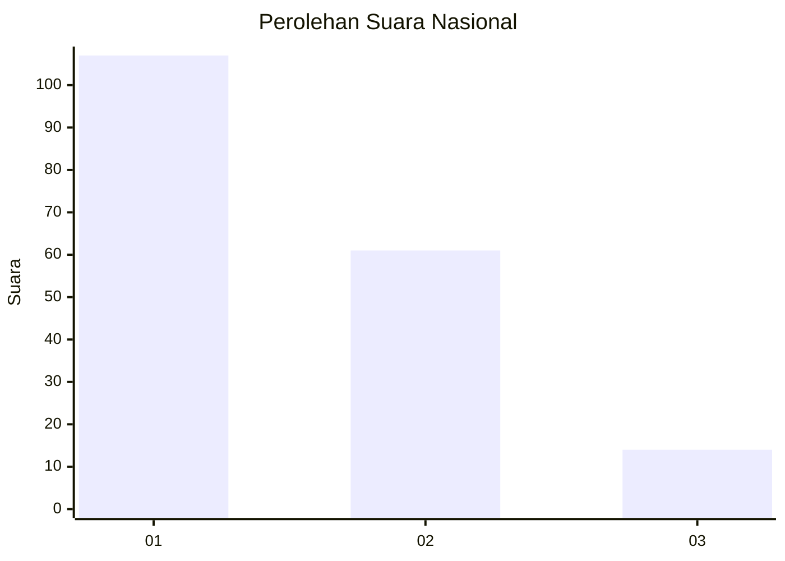
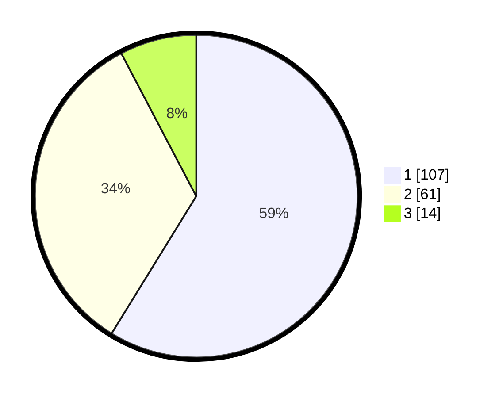

# Hasil

## Grafik

## Tabel

| No.    | Nama Paslon    | Suara | Suara (raw) | Persentase |
|:------ |:-------------- | -----:| -----------:| ----------:|
| 100025 | ANIES MUHAIMIN | 107   | [107][p-1]  | 58,79      |
| 100026 | PRABOWO GIBRAN | 61    | [61][p-2]   | 33,52      |
| 100027 | GANJAR MAHFUD  | 14    | [14][p-3]   | 7,69       |

[p-1]: https://github.com/gigit-pemilu/pemilu-2024/blob/main/pilpres/hitung-suara/sub/31-dki-jakarta/sub/71-jakarta-pusat/sub/07-tanah-abang/sub/1005-kebon-melati/sub/087-tps/sub/paslon-1.txt
[p-2]: https://github.com/gigit-pemilu/pemilu-2024/blob/main/pilpres/hitung-suara/sub/31-dki-jakarta/sub/71-jakarta-pusat/sub/07-tanah-abang/sub/1005-kebon-melati/sub/087-tps/sub/paslon-2.txt
[p-3]: https://github.com/gigit-pemilu/pemilu-2024/blob/main/pilpres/hitung-suara/sub/31-dki-jakarta/sub/71-jakarta-pusat/sub/07-tanah-abang/sub/1005-kebon-melati/sub/087-tps/sub/paslon-3.txt

## Foto C Plano

https://sirekap-obj-formc.kpu.go.id/6bb3/pemilu/ppwp/31/71/07/10/05/3171071005087-20240215-023334--b1d4be58-b1ec-4224-b4ef-81b87b1af2b6.jpg

https://sirekap-obj-formc.kpu.go.id/6bb3/pemilu/ppwp/31/71/07/10/05/3171071005087-20240215-023442--11ea3597-6d03-4f11-bdbc-06a543e03986.jpg

https://sirekap-obj-formc.kpu.go.id/6bb3/pemilu/ppwp/31/71/07/10/05/3171071005087-20240215-023510--2d40117e-29a7-4b82-ae15-503153698cf9.jpg

## Metadata

| Key        | Value               |
| ---------- | ------------------- |
| Time Stamp | 2024-02-16 00:00:26 |

