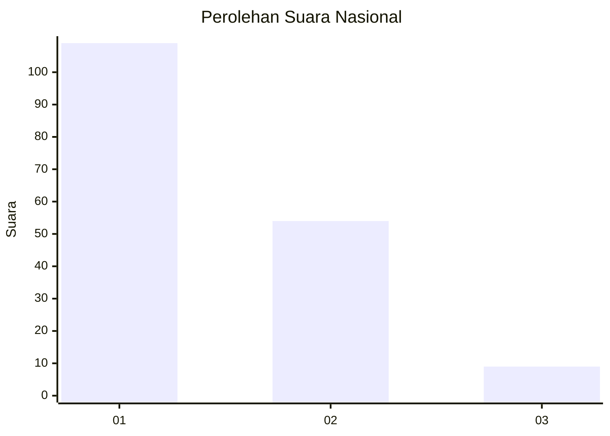
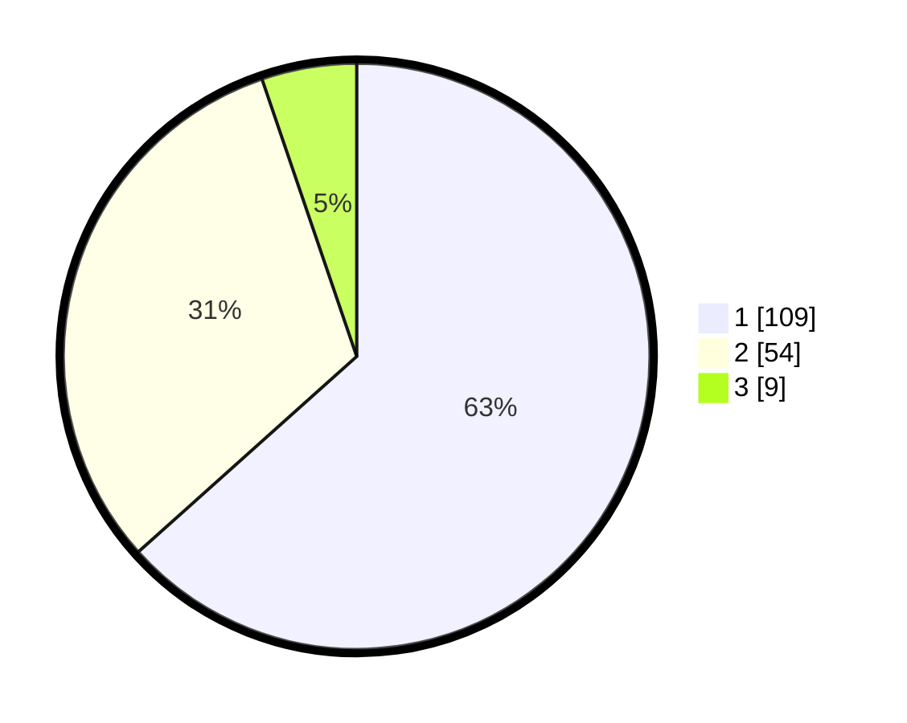

# Hasil

## Grafik

## Tabel

| No.    | Nama Paslon    | Suara | Suara (raw) | Persentase |
|:------ |:-------------- | -----:| -----------:| ----------:|
| 100025 | ANIES MUHAIMIN | 109   | [109][p-1]  | 63,37      |
| 100026 | PRABOWO GIBRAN | 54    | [54][p-2]   | 31,40      |
| 100027 | GANJAR MAHFUD  | 9     | [9][p-3]    | 5,23       |

[p-1]: https://github.com/gigit-pemilu/pemilu-2024/blob/main/pilpres/hitung-suara/sub/31-dki-jakarta/sub/71-jakarta-pusat/sub/07-tanah-abang/sub/1005-kebon-melati/sub/095-tps/sub/paslon-1.txt
[p-2]: https://github.com/gigit-pemilu/pemilu-2024/blob/main/pilpres/hitung-suara/sub/31-dki-jakarta/sub/71-jakarta-pusat/sub/07-tanah-abang/sub/1005-kebon-melati/sub/095-tps/sub/paslon-2.txt
[p-3]: https://github.com/gigit-pemilu/pemilu-2024/blob/main/pilpres/hitung-suara/sub/31-dki-jakarta/sub/71-jakarta-pusat/sub/07-tanah-abang/sub/1005-kebon-melati/sub/095-tps/sub/paslon-3.txt

## Foto C Plano

https://sirekap-obj-formc.kpu.go.id/e535/pemilu/ppwp/31/71/07/10/05/3171071005095-20240215-004120--fbb9df95-2c81-4a3d-a617-11422e4ad6ca.jpg

https://sirekap-obj-formc.kpu.go.id/e535/pemilu/ppwp/31/71/07/10/05/3171071005095-20240215-021903--f88651a8-bac2-49b0-b65d-b1c9f1070386.jpg

https://sirekap-obj-formc.kpu.go.id/e535/pemilu/ppwp/31/71/07/10/05/3171071005095-20240215-004327--ac648bcf-af35-41df-baa6-13a3cc76227c.jpg

## Metadata

| Key        | Value               |
| ---------- | ------------------- |
| Time Stamp | 2024-02-16 00:30:27 |

