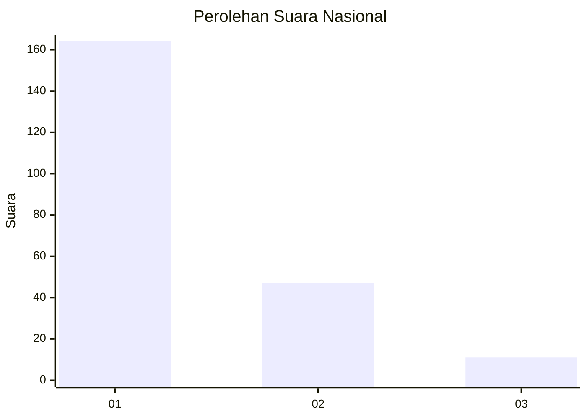
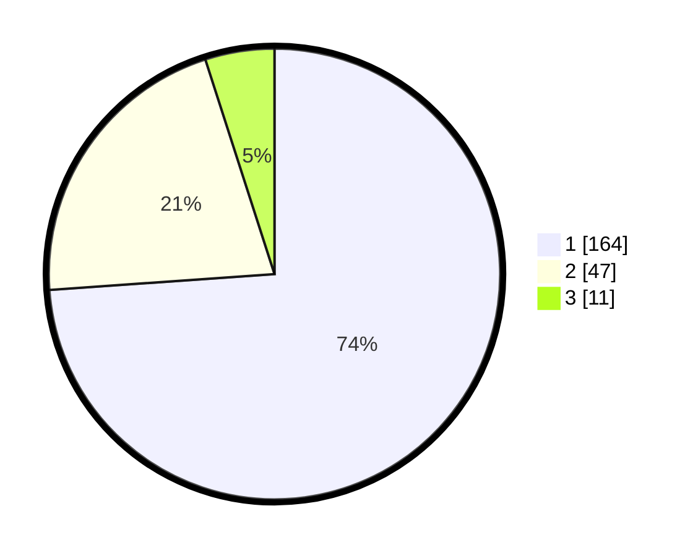

# Hasil

## Grafik

## Tabel

| No.    | Nama Paslon    | Suara | Suara (raw) | Persentase |
|:------ |:-------------- | -----:| -----------:| ----------:|
| 100025 | ANIES MUHAIMIN | 164   | [164][p-1]  | 73,87      |
| 100026 | PRABOWO GIBRAN | 47    | [47][p-2]   | 21,17      |
| 100027 | GANJAR MAHFUD  | 11    | [11][p-3]   | 4,95       |

[p-1]: https://github.com/gigit-pemilu/pemilu-2024/blob/main/pilpres/hitung-suara/sub/31-dki-jakarta/sub/71-jakarta-pusat/sub/07-tanah-abang/sub/1005-kebon-melati/sub/096-tps/sub/paslon-1.txt
[p-2]: https://github.com/gigit-pemilu/pemilu-2024/blob/main/pilpres/hitung-suara/sub/31-dki-jakarta/sub/71-jakarta-pusat/sub/07-tanah-abang/sub/1005-kebon-melati/sub/096-tps/sub/paslon-2.txt
[p-3]: https://github.com/gigit-pemilu/pemilu-2024/blob/main/pilpres/hitung-suara/sub/31-dki-jakarta/sub/71-jakarta-pusat/sub/07-tanah-abang/sub/1005-kebon-melati/sub/096-tps/sub/paslon-3.txt

## Foto C Plano

https://sirekap-obj-formc.kpu.go.id/1422/pemilu/ppwp/31/71/07/10/05/3171071005096-20240215-005946--6e5bb115-fc91-4451-bf1c-1e46d1acca66.jpg

https://sirekap-obj-formc.kpu.go.id/1422/pemilu/ppwp/31/71/07/10/05/3171071005096-20240215-010223--84d9526a-b7ab-45cc-9f13-eb54568e2e3f.jpg

https://sirekap-obj-formc.kpu.go.id/1422/pemilu/ppwp/31/71/07/10/05/3171071005096-20240215-010445--9074e684-63b5-48b7-b1e2-243f6b9a1009.jpg

## Metadata

| Key        | Value               |
| ---------- | ------------------- |
| Time Stamp | 2024-02-16 00:30:27 |

