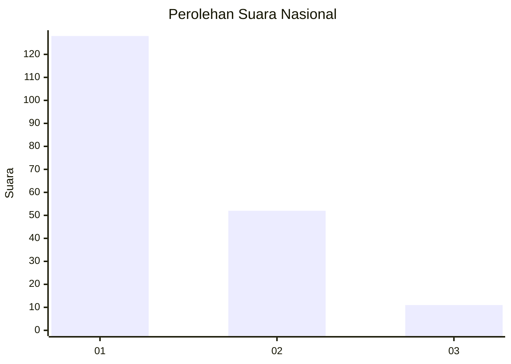
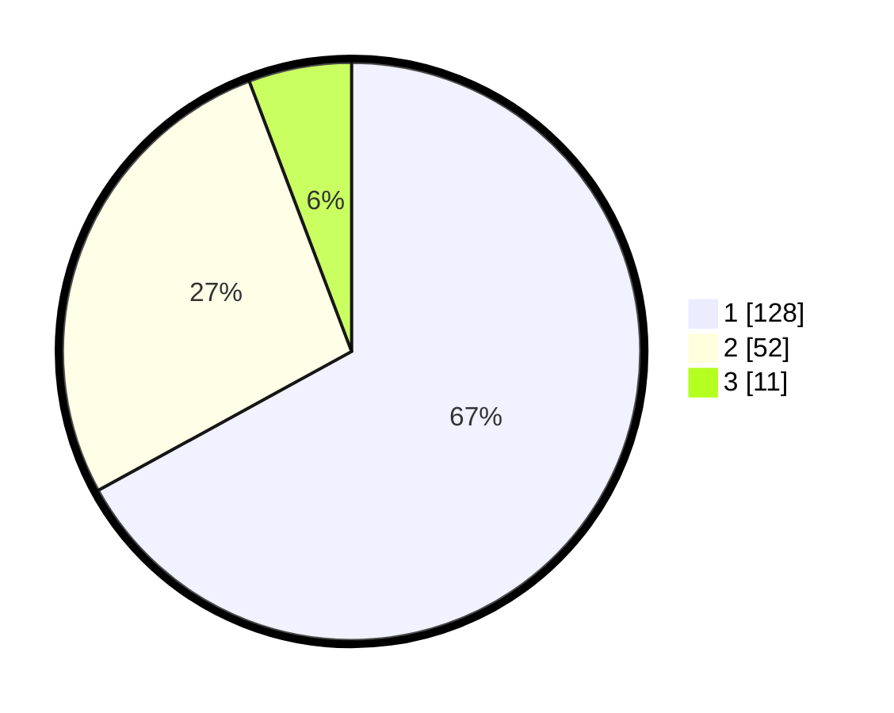

# Hasil

## Grafik

## Tabel

| No.    | Nama Paslon    | Suara | Suara (raw) | Persentase |
|:------ |:-------------- | -----:| -----------:| ----------:|
| 100025 | ANIES MUHAIMIN | 128   | [128][p-1]  | 67,02      |
| 100026 | PRABOWO GIBRAN | 52    | [52][p-2]   | 27,23      |
| 100027 | GANJAR MAHFUD  | 11    | [11][p-3]   | 5,76       |

[p-1]: https://github.com/gigit-pemilu/pemilu-2024/blob/main/pilpres/hitung-suara/sub/31-dki-jakarta/sub/71-jakarta-pusat/sub/07-tanah-abang/sub/1005-kebon-melati/sub/109-tps/sub/paslon-1.txt
[p-2]: https://github.com/gigit-pemilu/pemilu-2024/blob/main/pilpres/hitung-suara/sub/31-dki-jakarta/sub/71-jakarta-pusat/sub/07-tanah-abang/sub/1005-kebon-melati/sub/109-tps/sub/paslon-2.txt
[p-3]: https://github.com/gigit-pemilu/pemilu-2024/blob/main/pilpres/hitung-suara/sub/31-dki-jakarta/sub/71-jakarta-pusat/sub/07-tanah-abang/sub/1005-kebon-melati/sub/109-tps/sub/paslon-3.txt

## Foto C Plano

https://sirekap-obj-formc.kpu.go.id/5301/pemilu/ppwp/31/71/07/10/05/3171071005109-20240218-143819--41665a6e-4296-4780-8d19-2210bce7b9a4.jpg

https://sirekap-obj-formc.kpu.go.id/5301/pemilu/ppwp/31/71/07/10/05/3171071005109-20240218-144001--d5ed5ee9-370b-4f2c-9761-d86da8b09cce.jpg

https://sirekap-obj-formc.kpu.go.id/5301/pemilu/ppwp/31/71/07/10/05/3171071005109-20240218-144124--06c87ba3-1630-4ee6-9582-0eda5b173d9b.jpg

## Metadata

| Key        | Value               |
| ---------- | ------------------- |
| Time Stamp | 2024-02-28 10:00:00 |

