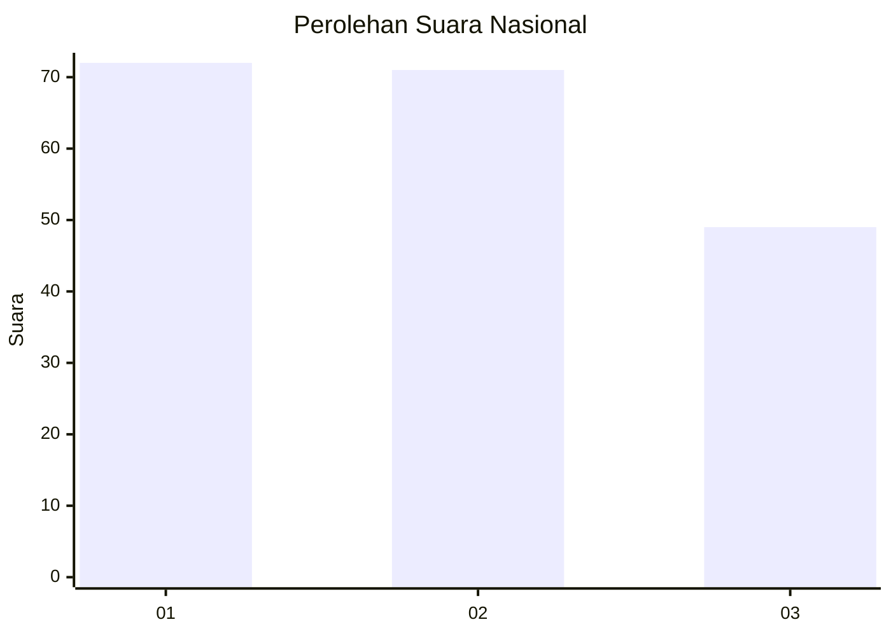
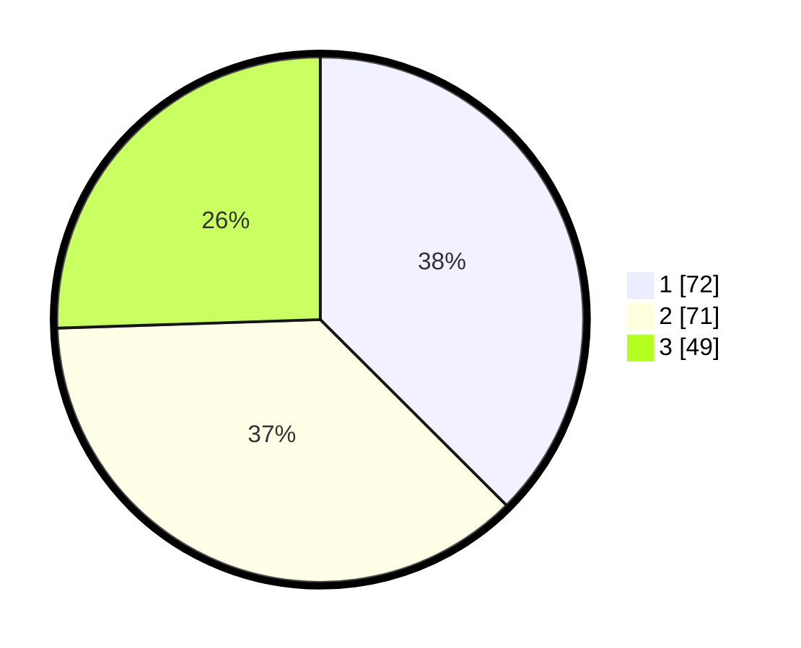

# Hasil

## Grafik

## Tabel

| No.    | Nama Paslon    | Suara | Suara (raw) | Persentase |
|:------ |:-------------- | -----:| -----------:| ----------:|
| 100025 | ANIES MUHAIMIN | 72    | [72][p-1]   | 37,50      |
| 100026 | PRABOWO GIBRAN | 71    | [71][p-2]   | 36,98      |
| 100027 | GANJAR MAHFUD  | 49    | [49][p-3]   | 25,52      |

[p-1]: https://github.com/gigit-pemilu/pemilu-2024/blob/main/pilpres/hitung-suara/sub/31-dki-jakarta/sub/71-jakarta-pusat/sub/07-tanah-abang/sub/1006-kebon-kacang/sub/003-tps/sub/paslon-1.txt
[p-2]: https://github.com/gigit-pemilu/pemilu-2024/blob/main/pilpres/hitung-suara/sub/31-dki-jakarta/sub/71-jakarta-pusat/sub/07-tanah-abang/sub/1006-kebon-kacang/sub/003-tps/sub/paslon-2.txt
[p-3]: https://github.com/gigit-pemilu/pemilu-2024/blob/main/pilpres/hitung-suara/sub/31-dki-jakarta/sub/71-jakarta-pusat/sub/07-tanah-abang/sub/1006-kebon-kacang/sub/003-tps/sub/paslon-3.txt

## Foto C Plano

https://sirekap-obj-formc.kpu.go.id/8c2d/pemilu/ppwp/31/71/07/10/06/3171071006003-20240217-185932--6e17ed4f-e2e4-4d5f-acaa-0b7978aa49e8.jpg

https://sirekap-obj-formc.kpu.go.id/8c2d/pemilu/ppwp/31/71/07/10/06/3171071006003-20240217-190343--e9459f20-ff8b-45fc-94a1-e0be378102b5.jpg

https://sirekap-obj-formc.kpu.go.id/8c2d/pemilu/ppwp/31/71/07/10/06/3171071006003-20240217-190215--a50ba664-ad54-4eae-ab52-cdf8dcacbcac.jpg

## Metadata

| Key        | Value               |
| ---------- | ------------------- |
| Time Stamp | 2024-02-19 06:16:00 |

