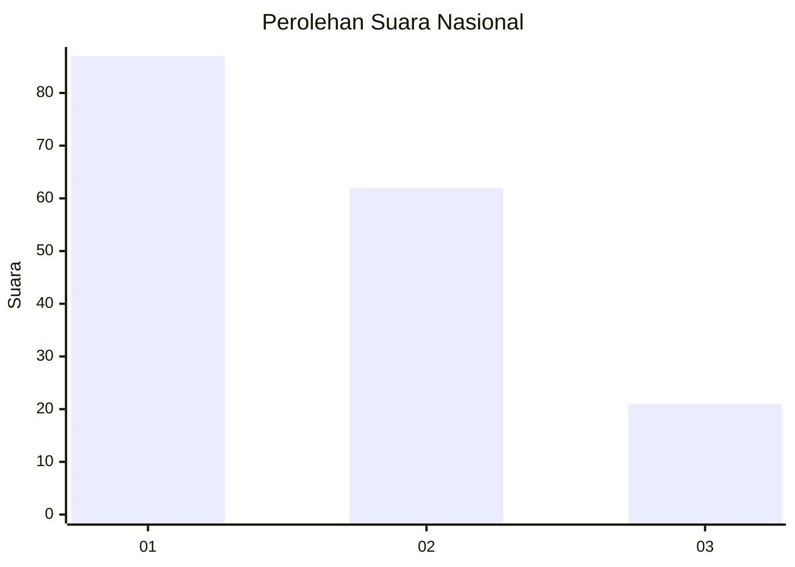
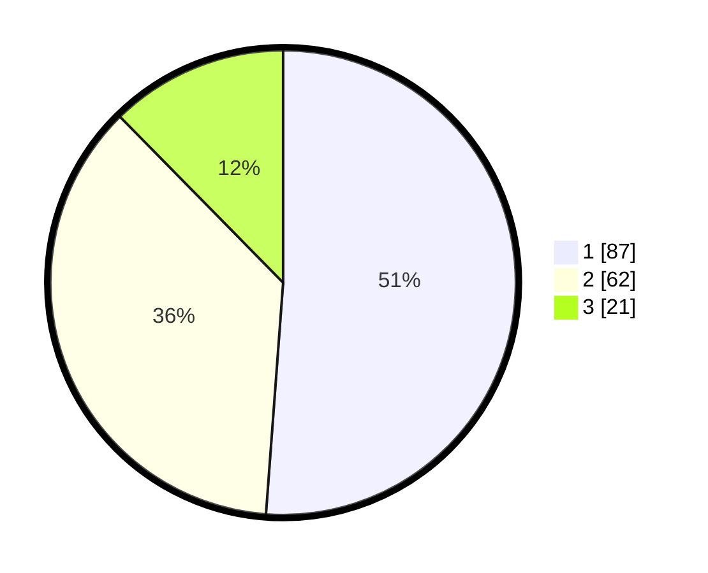

# Hasil

## Grafik

## Tabel

| No.    | Nama Paslon    | Suara | Suara (raw) | Persentase |
|:------ |:-------------- | -----:| -----------:| ----------:|
| 100025 | ANIES MUHAIMIN | 87    | [87][p-1]   | 51,18      |
| 100026 | PRABOWO GIBRAN | 62    | [62][p-2]   | 36,47      |
| 100027 | GANJAR MAHFUD  | 21    | [21][p-3]   | 12,35      |

[p-1]: https://github.com/gigit-pemilu/pemilu-2024/blob/main/pilpres/hitung-suara/sub/31-dki-jakarta/sub/71-jakarta-pusat/sub/07-tanah-abang/sub/1006-kebon-kacang/sub/012-tps/sub/paslon-1.txt
[p-2]: https://github.com/gigit-pemilu/pemilu-2024/blob/main/pilpres/hitung-suara/sub/31-dki-jakarta/sub/71-jakarta-pusat/sub/07-tanah-abang/sub/1006-kebon-kacang/sub/012-tps/sub/paslon-2.txt
[p-3]: https://github.com/gigit-pemilu/pemilu-2024/blob/main/pilpres/hitung-suara/sub/31-dki-jakarta/sub/71-jakarta-pusat/sub/07-tanah-abang/sub/1006-kebon-kacang/sub/012-tps/sub/paslon-3.txt

## Foto C Plano

https://sirekap-obj-formc.kpu.go.id/becb/pemilu/ppwp/31/71/07/10/06/3171071006012-20240214-212115--dbba5a6a-d179-41b7-9c8c-835a2cf2ce1f.jpg

https://sirekap-obj-formc.kpu.go.id/becb/pemilu/ppwp/31/71/07/10/06/3171071006012-20240214-215357--4840e81d-8e31-4ff7-8c62-c1c536a7ccd5.jpg

https://sirekap-obj-formc.kpu.go.id/becb/pemilu/ppwp/31/71/07/10/06/3171071006012-20240214-214234--474f7c2e-88ea-4dbb-a2a2-edd3ef588c23.jpg

## Metadata

| Key        | Value               |
| ---------- | ------------------- |
| Time Stamp | 2024-02-16 00:00:26 |

