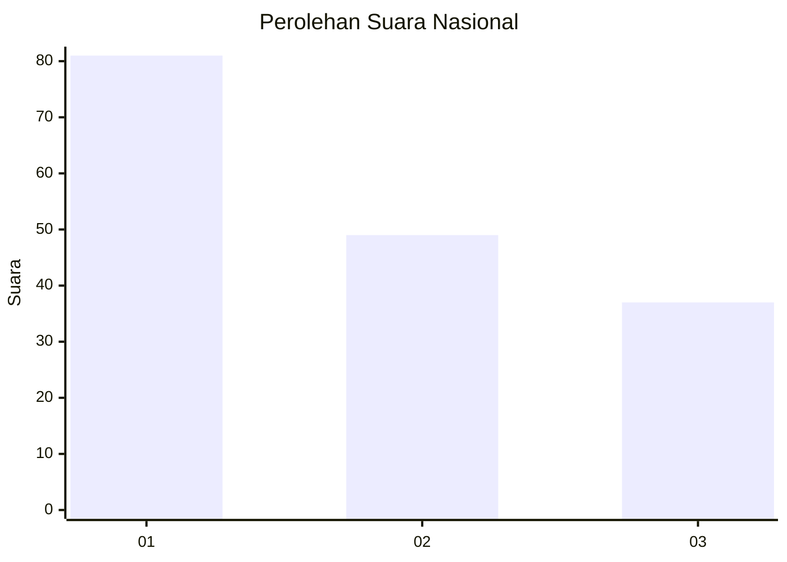
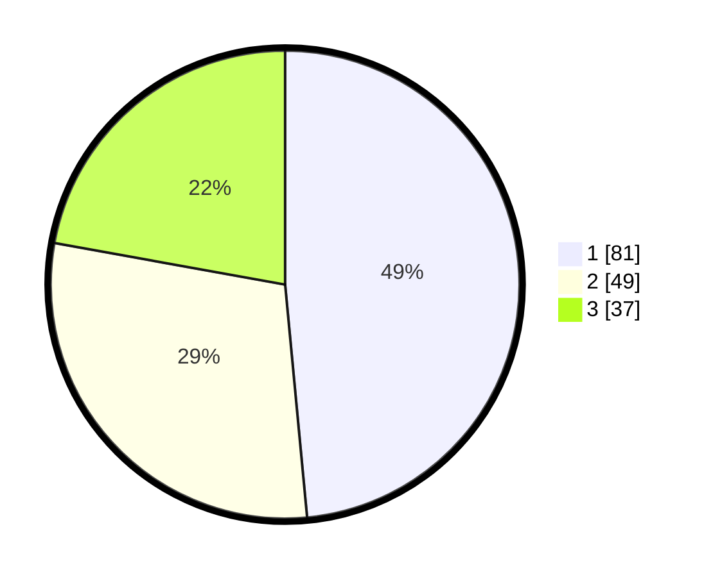

# Hasil

## Grafik

## Tabel

| No.    | Nama Paslon    | Suara | Suara (raw) | Persentase |
|:------ |:-------------- | -----:| -----------:| ----------:|
| 100025 | ANIES MUHAIMIN | 81    | [81][p-1]   | 48,50      |
| 100026 | PRABOWO GIBRAN | 49    | [49][p-2]   | 29,34      |
| 100027 | GANJAR MAHFUD  | 37    | [37][p-3]   | 22,16      |

[p-1]: https://github.com/gigit-pemilu/pemilu-2024/blob/main/pilpres/hitung-suara/sub/31-dki-jakarta/sub/71-jakarta-pusat/sub/07-tanah-abang/sub/1006-kebon-kacang/sub/055-tps/sub/paslon-1.txt
[p-2]: https://github.com/gigit-pemilu/pemilu-2024/blob/main/pilpres/hitung-suara/sub/31-dki-jakarta/sub/71-jakarta-pusat/sub/07-tanah-abang/sub/1006-kebon-kacang/sub/055-tps/sub/paslon-2.txt
[p-3]: https://github.com/gigit-pemilu/pemilu-2024/blob/main/pilpres/hitung-suara/sub/31-dki-jakarta/sub/71-jakarta-pusat/sub/07-tanah-abang/sub/1006-kebon-kacang/sub/055-tps/sub/paslon-3.txt

## Foto C Plano

https://sirekap-obj-formc.kpu.go.id/355b/pemilu/ppwp/31/71/07/10/06/3171071006055-20240214-155613--242f5efe-0816-457e-befd-739dc08b1139.jpg

https://sirekap-obj-formc.kpu.go.id/355b/pemilu/ppwp/31/71/07/10/06/3171071006055-20240214-155831--c081a0bc-63b6-4f45-bf62-26c0431617fc.jpg

https://sirekap-obj-formc.kpu.go.id/355b/pemilu/ppwp/31/71/07/10/06/3171071006055-20240214-160119--c7674513-a9c5-4105-a5f0-633107f04c22.jpg

## Metadata

| Key        | Value               |
| ---------- | ------------------- |
| Time Stamp | 2024-02-16 00:00:26 |

