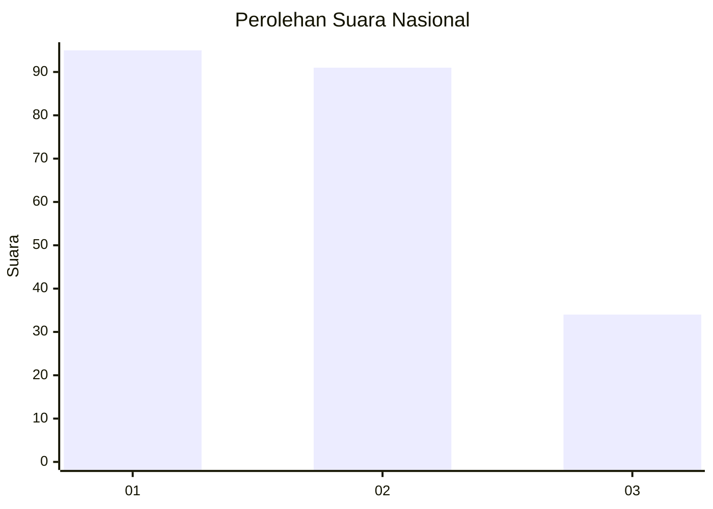
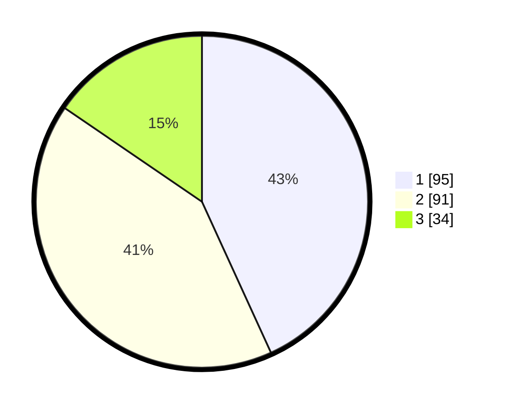

# Hasil

## Grafik

## Tabel

| No.    | Nama Paslon    | Suara | Suara (raw) | Persentase |
|:------ |:-------------- | -----:| -----------:| ----------:|
| 100025 | ANIES MUHAIMIN | 95    | [95][p-1]   | 43,18      |
| 100026 | PRABOWO GIBRAN | 91    | [91][p-2]   | 41,36      |
| 100027 | GANJAR MAHFUD  | 34    | [34][p-3]   | 15,45      |

[p-1]: https://github.com/gigit-pemilu/pemilu-2024/blob/main/pilpres/hitung-suara/sub/31-dki-jakarta/sub/71-jakarta-pusat/sub/08-johar-baru/sub/1002-kampung-rawa/sub/001-tps/sub/paslon-1.txt
[p-2]: https://github.com/gigit-pemilu/pemilu-2024/blob/main/pilpres/hitung-suara/sub/31-dki-jakarta/sub/71-jakarta-pusat/sub/08-johar-baru/sub/1002-kampung-rawa/sub/001-tps/sub/paslon-2.txt
[p-3]: https://github.com/gigit-pemilu/pemilu-2024/blob/main/pilpres/hitung-suara/sub/31-dki-jakarta/sub/71-jakarta-pusat/sub/08-johar-baru/sub/1002-kampung-rawa/sub/001-tps/sub/paslon-3.txt

## Foto C Plano

https://sirekap-obj-formc.kpu.go.id/b4b1/pemilu/ppwp/31/71/08/10/02/3171081002001-20240215-004403--b8805d84-bcf3-4fe0-bf8a-d14d9308f25a.jpg

https://sirekap-obj-formc.kpu.go.id/b4b1/pemilu/ppwp/31/71/08/10/02/3171081002001-20240215-025645--1970bb5f-4134-4cdb-9abe-3546b378f488.jpg

https://sirekap-obj-formc.kpu.go.id/b4b1/pemilu/ppwp/31/71/08/10/02/3171081002001-20240215-025736--ce5a352d-e52c-4339-8434-e5f635d44f12.jpg

## Metadata

| Key        | Value               |
| ---------- | ------------------- |
| Time Stamp | 2024-02-15 23:29:50 |

