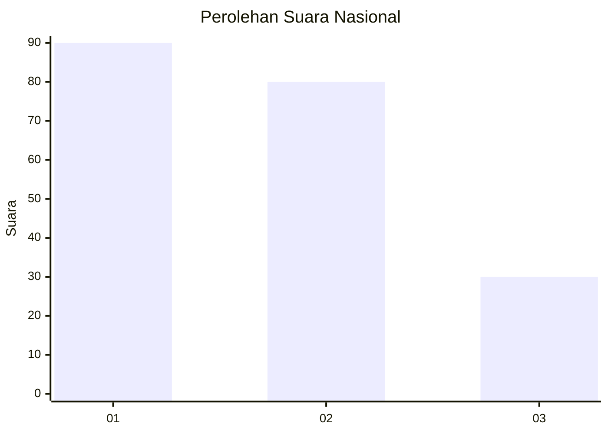
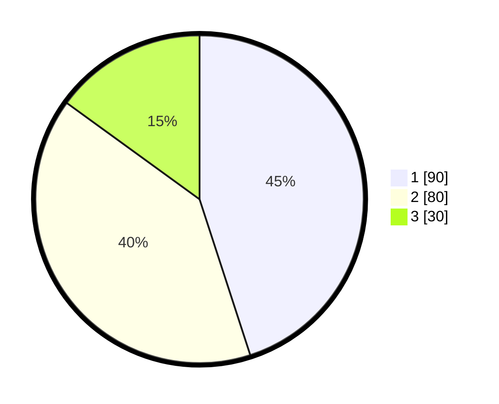

# Hasil

## Grafik

## Tabel

| No.    | Nama Paslon    | Suara | Suara (raw) | Persentase |
|:------ |:-------------- | -----:| -----------:| ----------:|
| 100025 | ANIES MUHAIMIN | 90    | [90][p-1]   | 45,00      |
| 100026 | PRABOWO GIBRAN | 80    | [80][p-2]   | 40,00      |
| 100027 | GANJAR MAHFUD  | 30    | [30][p-3]   | 15,00      |

[p-1]: https://github.com/gigit-pemilu/pemilu-2024/blob/main/pilpres/hitung-suara/sub/31-dki-jakarta/sub/71-jakarta-pusat/sub/08-johar-baru/sub/1002-kampung-rawa/sub/019-tps/sub/paslon-1.txt
[p-2]: https://github.com/gigit-pemilu/pemilu-2024/blob/main/pilpres/hitung-suara/sub/31-dki-jakarta/sub/71-jakarta-pusat/sub/08-johar-baru/sub/1002-kampung-rawa/sub/019-tps/sub/paslon-2.txt
[p-3]: https://github.com/gigit-pemilu/pemilu-2024/blob/main/pilpres/hitung-suara/sub/31-dki-jakarta/sub/71-jakarta-pusat/sub/08-johar-baru/sub/1002-kampung-rawa/sub/019-tps/sub/paslon-3.txt

## Foto C Plano

https://sirekap-obj-formc.kpu.go.id/e5a0/pemilu/ppwp/31/71/08/10/02/3171081002019-20240218-093842--ca98f87f-7c8c-4b40-8b42-2b446ae560f3.jpg

https://sirekap-obj-formc.kpu.go.id/e5a0/pemilu/ppwp/31/71/08/10/02/3171081002019-20240218-093926--a56f80a7-b7bc-4a8c-915c-dd92b37aded2.jpg

https://sirekap-obj-formc.kpu.go.id/e5a0/pemilu/ppwp/31/71/08/10/02/3171081002019-20240214-234008--5549a77d-5dce-4453-b37f-7aa3e079f454.jpg

## Metadata

| Key        | Value               |
| ---------- | ------------------- |
| Time Stamp | 2024-02-19 06:16:00 |

