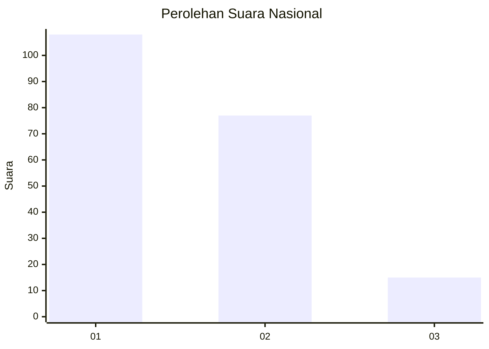
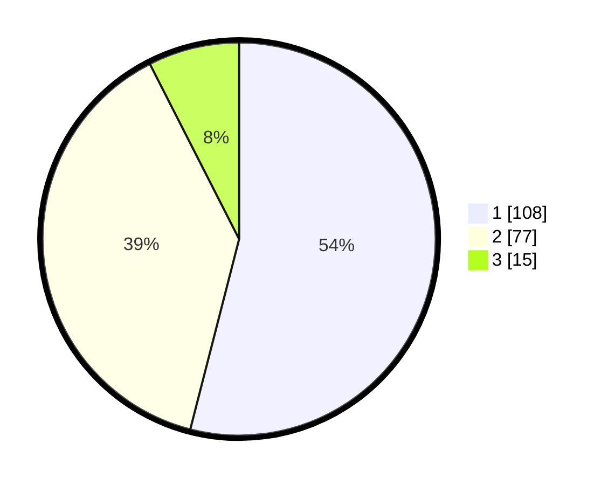

# Hasil

## Grafik

## Tabel

| No.    | Nama Paslon    | Suara | Suara (raw) | Persentase |
|:------ |:-------------- | -----:| -----------:| ----------:|
| 100025 | ANIES MUHAIMIN | 108   | [108][p-1]  | 54,00      |
| 100026 | PRABOWO GIBRAN | 77    | [77][p-2]   | 38,50      |
| 100027 | GANJAR MAHFUD  | 15    | [15][p-3]   | 7,50       |

[p-1]: https://github.com/gigit-pemilu/pemilu-2024/blob/main/pilpres/hitung-suara/sub/31-dki-jakarta/sub/71-jakarta-pusat/sub/08-johar-baru/sub/1002-kampung-rawa/sub/057-tps/sub/paslon-1.txt
[p-2]: https://github.com/gigit-pemilu/pemilu-2024/blob/main/pilpres/hitung-suara/sub/31-dki-jakarta/sub/71-jakarta-pusat/sub/08-johar-baru/sub/1002-kampung-rawa/sub/057-tps/sub/paslon-2.txt
[p-3]: https://github.com/gigit-pemilu/pemilu-2024/blob/main/pilpres/hitung-suara/sub/31-dki-jakarta/sub/71-jakarta-pusat/sub/08-johar-baru/sub/1002-kampung-rawa/sub/057-tps/sub/paslon-3.txt

## Foto C Plano

https://sirekap-obj-formc.kpu.go.id/a7c3/pemilu/ppwp/31/71/08/10/02/3171081002057-20240215-033924--9ec2e0df-59c4-44f5-9f93-c5dadb45376e.jpg

https://sirekap-obj-formc.kpu.go.id/a7c3/pemilu/ppwp/31/71/08/10/02/3171081002057-20240215-034313--8c40de30-0e7e-4eed-9d38-68748cb1df3c.jpg

https://sirekap-obj-formc.kpu.go.id/a7c3/pemilu/ppwp/31/71/08/10/02/3171081002057-20240215-034527--38a85082-9d10-4eaa-b38c-34487ff020b9.jpg

## Metadata

| Key        | Value               |
| ---------- | ------------------- |
| Time Stamp | 2024-02-15 23:29:50 |

