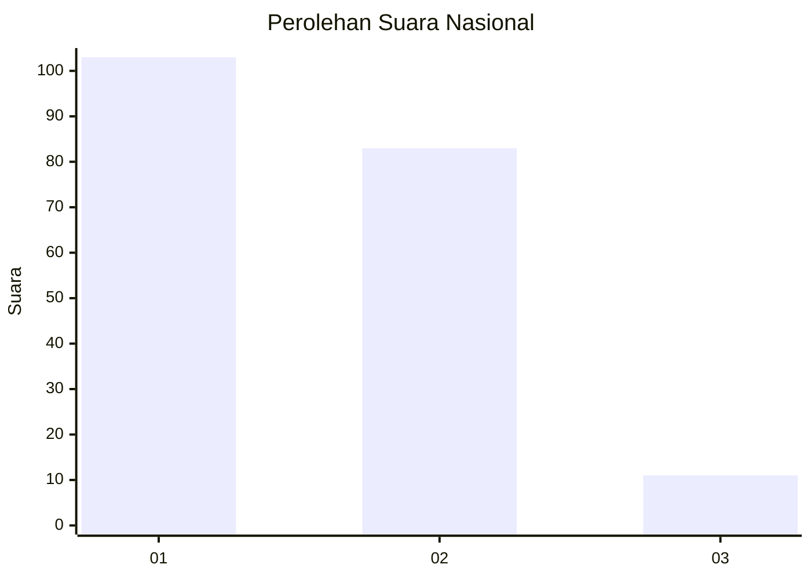
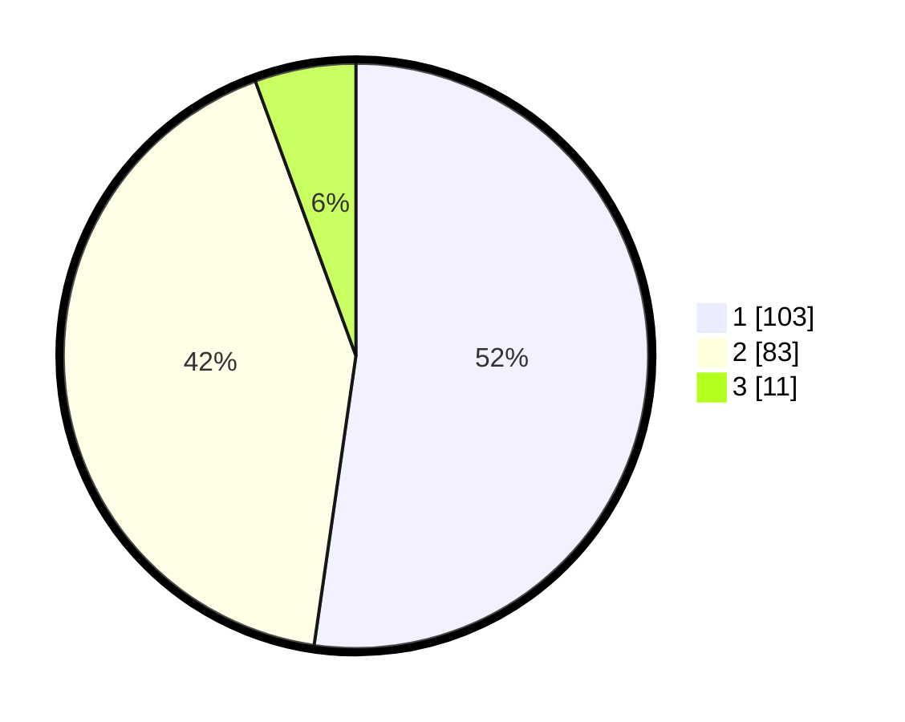

# Hasil

## Grafik

## Tabel

| No.    | Nama Paslon    | Suara | Suara (raw) | Persentase |
|:------ |:-------------- | -----:| -----------:| ----------:|
| 100025 | ANIES MUHAIMIN | 103   | [103][p-1]  | 52,28      |
| 100026 | PRABOWO GIBRAN | 83    | [83][p-2]   | 42,13      |
| 100027 | GANJAR MAHFUD  | 11    | [11][p-3]   | 5,58       |

[p-1]: https://github.com/gigit-pemilu/pemilu-2024/blob/main/pilpres/hitung-suara/sub/31-dki-jakarta/sub/71-jakarta-pusat/sub/08-johar-baru/sub/1003-galur/sub/029-tps/sub/paslon-1.txt
[p-2]: https://github.com/gigit-pemilu/pemilu-2024/blob/main/pilpres/hitung-suara/sub/31-dki-jakarta/sub/71-jakarta-pusat/sub/08-johar-baru/sub/1003-galur/sub/029-tps/sub/paslon-2.txt
[p-3]: https://github.com/gigit-pemilu/pemilu-2024/blob/main/pilpres/hitung-suara/sub/31-dki-jakarta/sub/71-jakarta-pusat/sub/08-johar-baru/sub/1003-galur/sub/029-tps/sub/paslon-3.txt

## Foto C Plano

https://sirekap-obj-formc.kpu.go.id/3db1/pemilu/ppwp/31/71/08/10/03/3171081003029-20240214-190005--0b2d3411-29ec-4e8c-99bf-ae415cbdce37.jpg

https://sirekap-obj-formc.kpu.go.id/3db1/pemilu/ppwp/31/71/08/10/03/3171081003029-20240214-190146--c9ff9f49-f76d-42bd-9644-9eda6d4633b0.jpg

https://sirekap-obj-formc.kpu.go.id/3db1/pemilu/ppwp/31/71/08/10/03/3171081003029-20240214-190322--3fe6e70f-6012-4637-ae72-54ae69845139.jpg

## Metadata

| Key        | Value               |
| ---------- | ------------------- |
| Time Stamp | 2024-02-15 06:00:23 |

