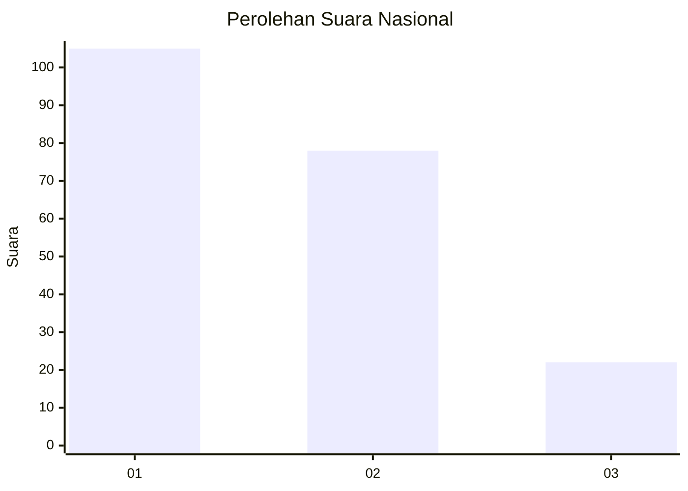
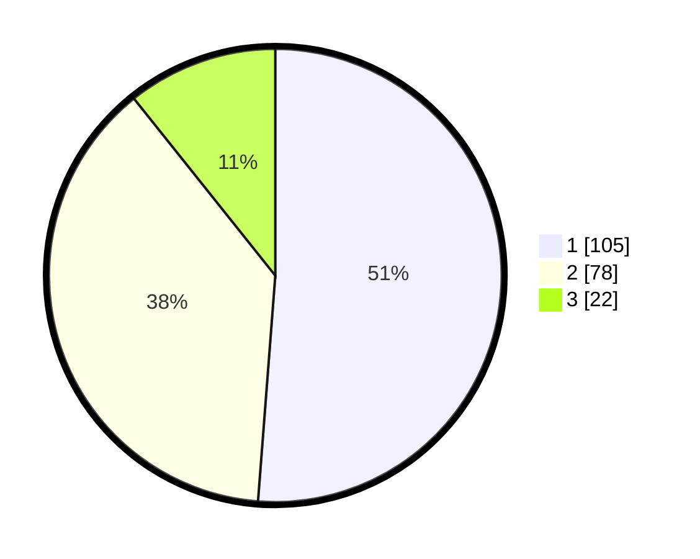

# Hasil

## Grafik

## Tabel

| No.    | Nama Paslon    | Suara | Suara (raw) | Persentase |
|:------ |:-------------- | -----:| -----------:| ----------:|
| 100025 | ANIES MUHAIMIN | 105   | [105][p-1]  | 51,22      |
| 100026 | PRABOWO GIBRAN | 78    | [78][p-2]   | 38,05      |
| 100027 | GANJAR MAHFUD  | 22    | [22][p-3]   | 10,73      |

[p-1]: https://github.com/gigit-pemilu/pemilu-2024/blob/main/pilpres/hitung-suara/sub/31-dki-jakarta/sub/71-jakarta-pusat/sub/08-johar-baru/sub/1003-galur/sub/044-tps/sub/paslon-1.txt
[p-2]: https://github.com/gigit-pemilu/pemilu-2024/blob/main/pilpres/hitung-suara/sub/31-dki-jakarta/sub/71-jakarta-pusat/sub/08-johar-baru/sub/1003-galur/sub/044-tps/sub/paslon-2.txt
[p-3]: https://github.com/gigit-pemilu/pemilu-2024/blob/main/pilpres/hitung-suara/sub/31-dki-jakarta/sub/71-jakarta-pusat/sub/08-johar-baru/sub/1003-galur/sub/044-tps/sub/paslon-3.txt

## Foto C Plano

https://sirekap-obj-formc.kpu.go.id/1c61/pemilu/ppwp/31/71/08/10/03/3171081003044-20240215-015118--1e2324f4-ea83-4823-b9b1-1045d876da08.jpg

https://sirekap-obj-formc.kpu.go.id/1c61/pemilu/ppwp/31/71/08/10/03/3171081003044-20240215-015225--3aae2b82-85fb-4362-949b-018dfba8ebd9.jpg

https://sirekap-obj-formc.kpu.go.id/1c61/pemilu/ppwp/31/71/08/10/03/3171081003044-20240215-015518--8c545038-6b53-4b99-b84f-4b5d97562f6d.jpg

## Metadata

| Key        | Value               |
| ---------- | ------------------- |
| Time Stamp | 2024-02-15 23:29:50 |

