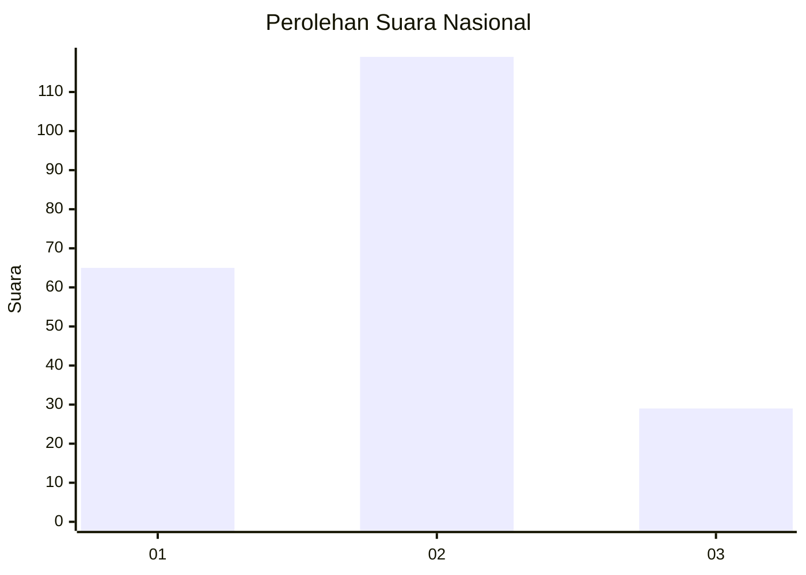
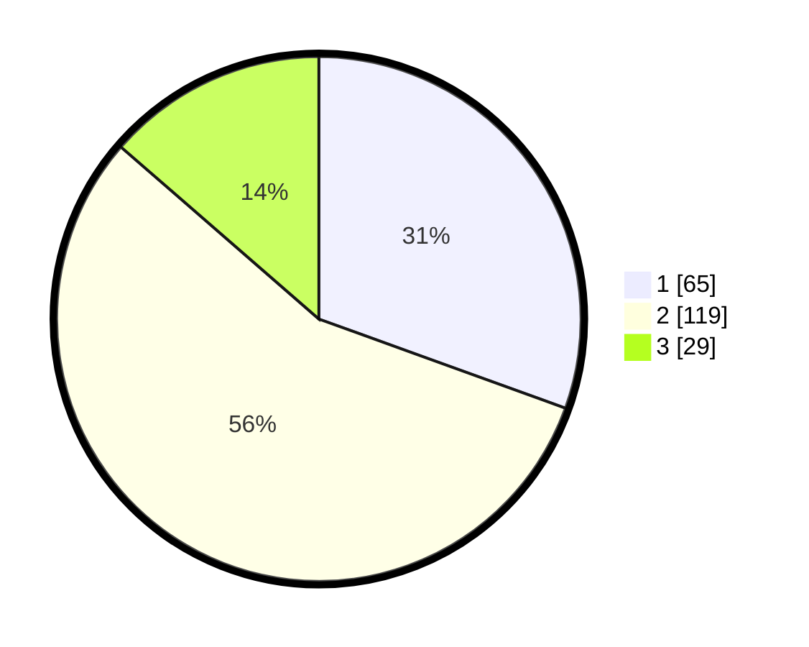

# Hasil

## Grafik

## Tabel

| No.    | Nama Paslon    | Suara | Suara (raw) | Persentase |
|:------ |:-------------- | -----:| -----------:| ----------:|
| 100025 | ANIES MUHAIMIN | 65    | [65][p-1]   | 30,52      |
| 100026 | PRABOWO GIBRAN | 119   | [119][p-2]  | 55,87      |
| 100027 | GANJAR MAHFUD  | 29    | [29][p-3]   | 13,62      |

[p-1]: https://github.com/gigit-pemilu/pemilu-2024/blob/main/pilpres/hitung-suara/sub/31-dki-jakarta/sub/71-jakarta-pusat/sub/08-johar-baru/sub/1004-tanah-tinggi/sub/023-tps/sub/paslon-1.txt
[p-2]: https://github.com/gigit-pemilu/pemilu-2024/blob/main/pilpres/hitung-suara/sub/31-dki-jakarta/sub/71-jakarta-pusat/sub/08-johar-baru/sub/1004-tanah-tinggi/sub/023-tps/sub/paslon-2.txt
[p-3]: https://github.com/gigit-pemilu/pemilu-2024/blob/main/pilpres/hitung-suara/sub/31-dki-jakarta/sub/71-jakarta-pusat/sub/08-johar-baru/sub/1004-tanah-tinggi/sub/023-tps/sub/paslon-3.txt

## Foto C Plano

https://sirekap-obj-formc.kpu.go.id/b4ec/pemilu/ppwp/31/71/08/10/04/3171081004023-20240219-135531--8b66b043-5de1-43ac-9109-90c316baa32f.jpg

https://sirekap-obj-formc.kpu.go.id/b4ec/pemilu/ppwp/31/71/08/10/04/3171081004023-20240216-115308--2c5afdf9-d877-4d3b-af42-6321f3d325c9.jpg

https://sirekap-obj-formc.kpu.go.id/b4ec/pemilu/ppwp/31/71/08/10/04/3171081004023-20240216-120251--91cd4d79-ddd7-4fb8-a6ac-487ed26c1588.jpg

## Metadata

| Key        | Value               |
| ---------- | ------------------- |
| Time Stamp | 2024-02-19 14:00:00 |

