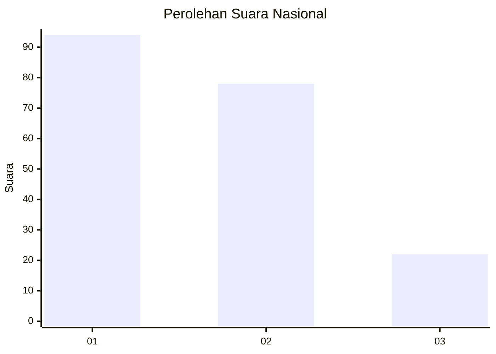
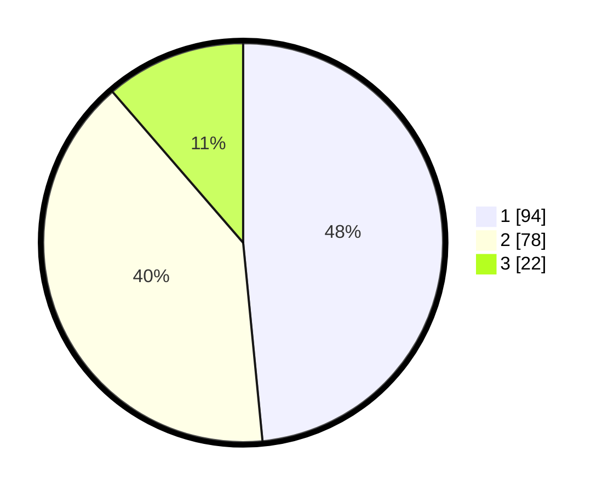

# Hasil

## Grafik

## Tabel

| No.    | Nama Paslon    | Suara | Suara (raw) | Persentase |
|:------ |:-------------- | -----:| -----------:| ----------:|
| 100025 | ANIES MUHAIMIN | 94    | [94][p-1]   | 48,45      |
| 100026 | PRABOWO GIBRAN | 78    | [78][p-2]   | 40,21      |
| 100027 | GANJAR MAHFUD  | 22    | [22][p-3]   | 11,34      |

[p-1]: https://github.com/gigit-pemilu/pemilu-2024/blob/main/pilpres/hitung-suara/sub/31-dki-jakarta/sub/71-jakarta-pusat/sub/08-johar-baru/sub/1004-tanah-tinggi/sub/080-tps/sub/paslon-1.txt
[p-2]: https://github.com/gigit-pemilu/pemilu-2024/blob/main/pilpres/hitung-suara/sub/31-dki-jakarta/sub/71-jakarta-pusat/sub/08-johar-baru/sub/1004-tanah-tinggi/sub/080-tps/sub/paslon-2.txt
[p-3]: https://github.com/gigit-pemilu/pemilu-2024/blob/main/pilpres/hitung-suara/sub/31-dki-jakarta/sub/71-jakarta-pusat/sub/08-johar-baru/sub/1004-tanah-tinggi/sub/080-tps/sub/paslon-3.txt

## Foto C Plano

https://sirekap-obj-formc.kpu.go.id/7fa4/pemilu/ppwp/31/71/08/10/04/3171081004080-20240214-215201--af95d067-c187-4e9b-86e9-aed211372eb7.jpg

https://sirekap-obj-formc.kpu.go.id/7fa4/pemilu/ppwp/31/71/08/10/04/3171081004080-20240214-215244--5d2c30bf-66a2-4678-9c1d-a79059f8e09a.jpg

https://sirekap-obj-formc.kpu.go.id/7fa4/pemilu/ppwp/31/71/08/10/04/3171081004080-20240214-215318--3c0fe964-4dd2-4f4f-a93f-7db5ddceb8b6.jpg

## Metadata

| Key        | Value               |
| ---------- | ------------------- |
| Time Stamp | 2024-02-15 23:29:50 |

