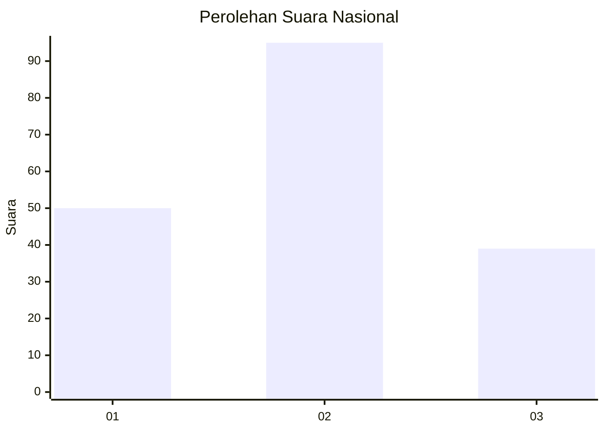
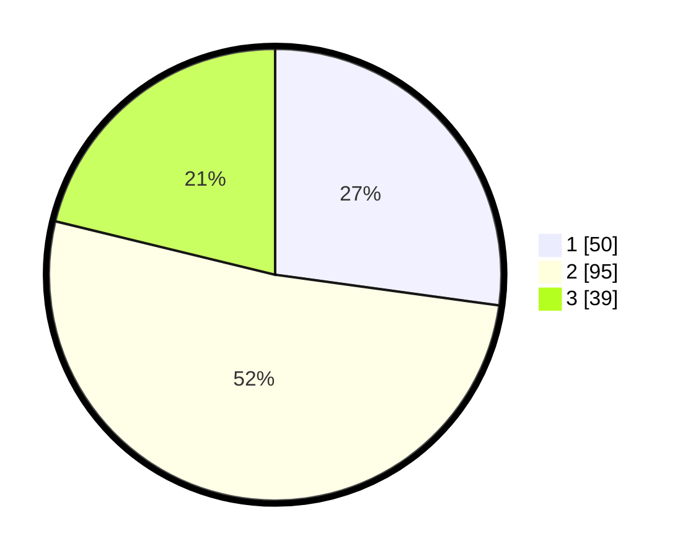

# Hasil

## Grafik

## Tabel

| No.    | Nama Paslon    | Suara | Suara (raw) | Persentase |
|:------ |:-------------- | -----:| -----------:| ----------:|
| 100025 | ANIES MUHAIMIN | 50    | [50][p-1]   | 27,17      |
| 100026 | PRABOWO GIBRAN | 95    | [95][p-2]   | 51,63      |
| 100027 | GANJAR MAHFUD  | 39    | [39][p-3]   | 21,20      |

[p-1]: https://github.com/gigit-pemilu/pemilu-2024/blob/main/pilpres/hitung-suara/sub/31-dki-jakarta/sub/71-jakarta-pusat/sub/08-johar-baru/sub/1004-tanah-tinggi/sub/087-tps/sub/paslon-1.txt
[p-2]: https://github.com/gigit-pemilu/pemilu-2024/blob/main/pilpres/hitung-suara/sub/31-dki-jakarta/sub/71-jakarta-pusat/sub/08-johar-baru/sub/1004-tanah-tinggi/sub/087-tps/sub/paslon-2.txt
[p-3]: https://github.com/gigit-pemilu/pemilu-2024/blob/main/pilpres/hitung-suara/sub/31-dki-jakarta/sub/71-jakarta-pusat/sub/08-johar-baru/sub/1004-tanah-tinggi/sub/087-tps/sub/paslon-3.txt

## Foto C Plano

https://sirekap-obj-formc.kpu.go.id/fe61/pemilu/ppwp/31/71/08/10/04/3171081004087-20240225-150447--eb58a972-fd01-47d4-bec6-44d2bd096b59.jpg

https://sirekap-obj-formc.kpu.go.id/fe61/pemilu/ppwp/31/71/08/10/04/3171081004087-20240225-150540--06872dbe-f00d-4a11-b2fb-c02aa57220aa.jpg

https://sirekap-obj-formc.kpu.go.id/fe61/pemilu/ppwp/31/71/08/10/04/3171081004087-20240225-150329--f33b3da6-ac5d-4ed6-9130-6783b126690f.jpg

## Metadata

| Key        | Value               |
| ---------- | ------------------- |
| Time Stamp | 2024-02-28 10:00:00 |

