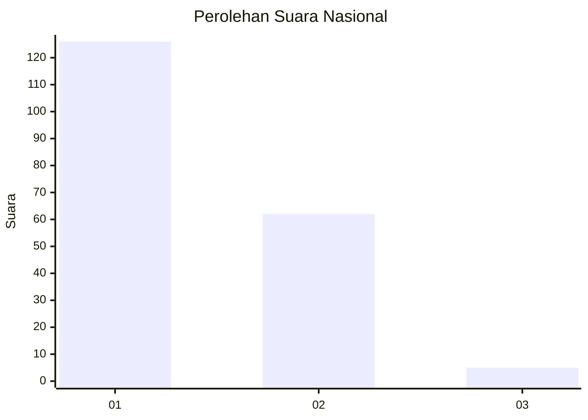
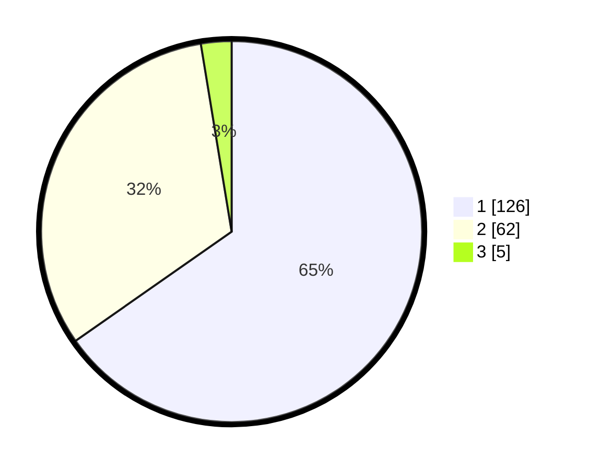

# Hasil

## Grafik

## Tabel

| No.    | Nama Paslon    | Suara | Suara (raw) | Persentase |
|:------ |:-------------- | -----:| -----------:| ----------:|
| 100025 | ANIES MUHAIMIN | 126   | [126][p-1]  | 65,28      |
| 100026 | PRABOWO GIBRAN | 62    | [62][p-2]   | 32,12      |
| 100027 | GANJAR MAHFUD  | 5     | [5][p-3]    | 2,59       |

[p-1]: https://github.com/gigit-pemilu/pemilu-2024/blob/main/pilpres/hitung-suara/sub/31-dki-jakarta/sub/71-jakarta-pusat/sub/08-johar-baru/sub/1004-tanah-tinggi/sub/124-tps/sub/paslon-1.txt
[p-2]: https://github.com/gigit-pemilu/pemilu-2024/blob/main/pilpres/hitung-suara/sub/31-dki-jakarta/sub/71-jakarta-pusat/sub/08-johar-baru/sub/1004-tanah-tinggi/sub/124-tps/sub/paslon-2.txt
[p-3]: https://github.com/gigit-pemilu/pemilu-2024/blob/main/pilpres/hitung-suara/sub/31-dki-jakarta/sub/71-jakarta-pusat/sub/08-johar-baru/sub/1004-tanah-tinggi/sub/124-tps/sub/paslon-3.txt

## Foto C Plano

https://sirekap-obj-formc.kpu.go.id/56a7/pemilu/ppwp/31/71/08/10/04/3171081004124-20240214-205112--9d9ae42c-2306-4118-bfb8-8ccb9c6351a0.jpg

https://sirekap-obj-formc.kpu.go.id/56a7/pemilu/ppwp/31/71/08/10/04/3171081004124-20240214-205316--7b90c4c4-beee-4091-9ae3-5642cbbcf537.jpg

https://sirekap-obj-formc.kpu.go.id/56a7/pemilu/ppwp/31/71/08/10/04/3171081004124-20240215-004955--3d480517-63fc-4fc0-99ab-932d0c867b11.jpg

## Metadata

| Key        | Value               |
| ---------- | ------------------- |
| Time Stamp | 2024-02-17 01:30:00 |

