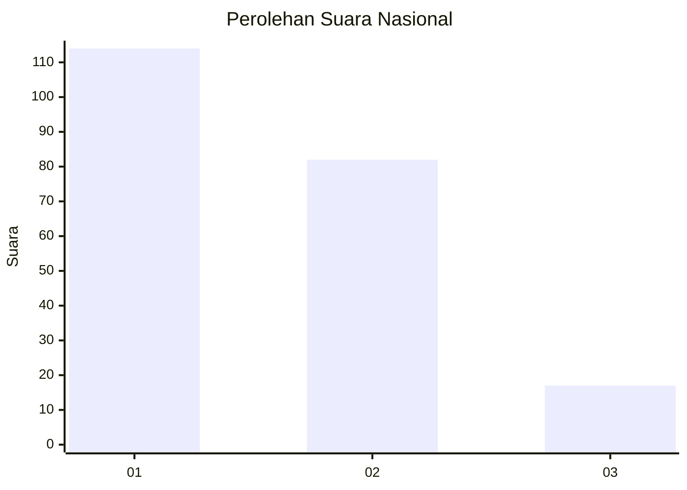
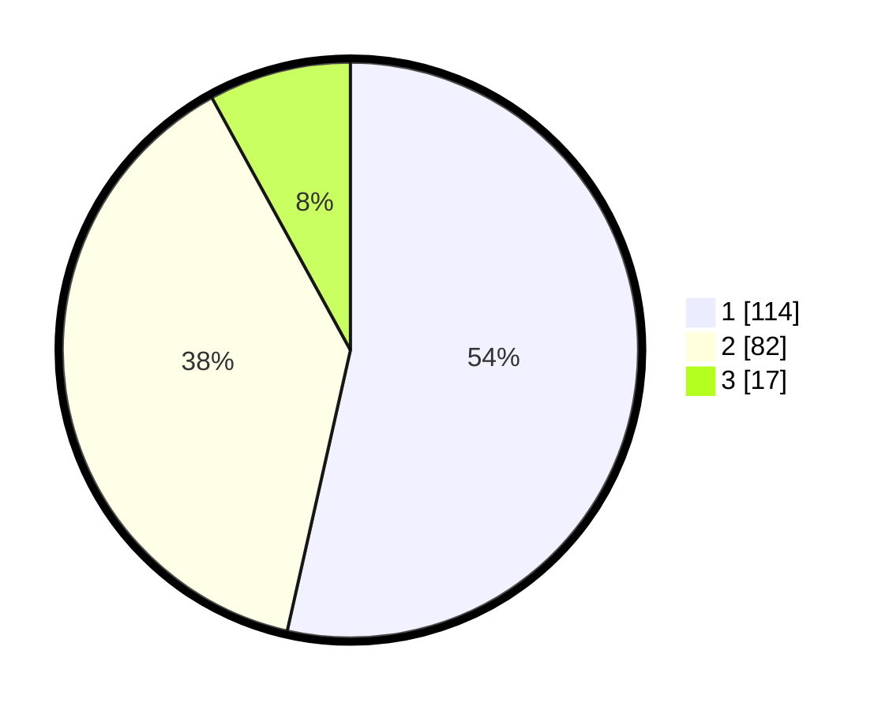

# Hasil

## Grafik

## Tabel

| No.    | Nama Paslon    | Suara | Suara (raw) | Persentase |
|:------ |:-------------- | -----:| -----------:| ----------:|
| 100025 | ANIES MUHAIMIN | 114   | [114][p-1]  | 53,52      |
| 100026 | PRABOWO GIBRAN | 82    | [82][p-2]   | 38,50      |
| 100027 | GANJAR MAHFUD  | 17    | [17][p-3]   | 7,98       |

[p-1]: https://github.com/gigit-pemilu/pemilu-2024/blob/main/pilpres/hitung-suara/sub/31-dki-jakarta/sub/72-jakarta-utara/sub/01-penjaringan/sub/1001-penjaringan/sub/001-tps/sub/paslon-1.txt
[p-2]: https://github.com/gigit-pemilu/pemilu-2024/blob/main/pilpres/hitung-suara/sub/31-dki-jakarta/sub/72-jakarta-utara/sub/01-penjaringan/sub/1001-penjaringan/sub/001-tps/sub/paslon-2.txt
[p-3]: https://github.com/gigit-pemilu/pemilu-2024/blob/main/pilpres/hitung-suara/sub/31-dki-jakarta/sub/72-jakarta-utara/sub/01-penjaringan/sub/1001-penjaringan/sub/001-tps/sub/paslon-3.txt

## Foto C Plano

https://sirekap-obj-formc.kpu.go.id/a158/pemilu/ppwp/31/72/01/10/01/3172011001001-20240217-140650--804c1177-cdc4-40a8-823a-851c313d764a.jpg

https://sirekap-obj-formc.kpu.go.id/a158/pemilu/ppwp/31/72/01/10/01/3172011001001-20240217-140707--99f89b5c-73b5-4eb4-b89b-16c5e59c434f.jpg

https://sirekap-obj-formc.kpu.go.id/a158/pemilu/ppwp/31/72/01/10/01/3172011001001-20240215-145851--4c0891f2-b72a-4118-8085-87930385c440.jpg

## Metadata

| Key        | Value               |
| ---------- | ------------------- |
| Time Stamp | 2024-02-22 10:00:00 |

