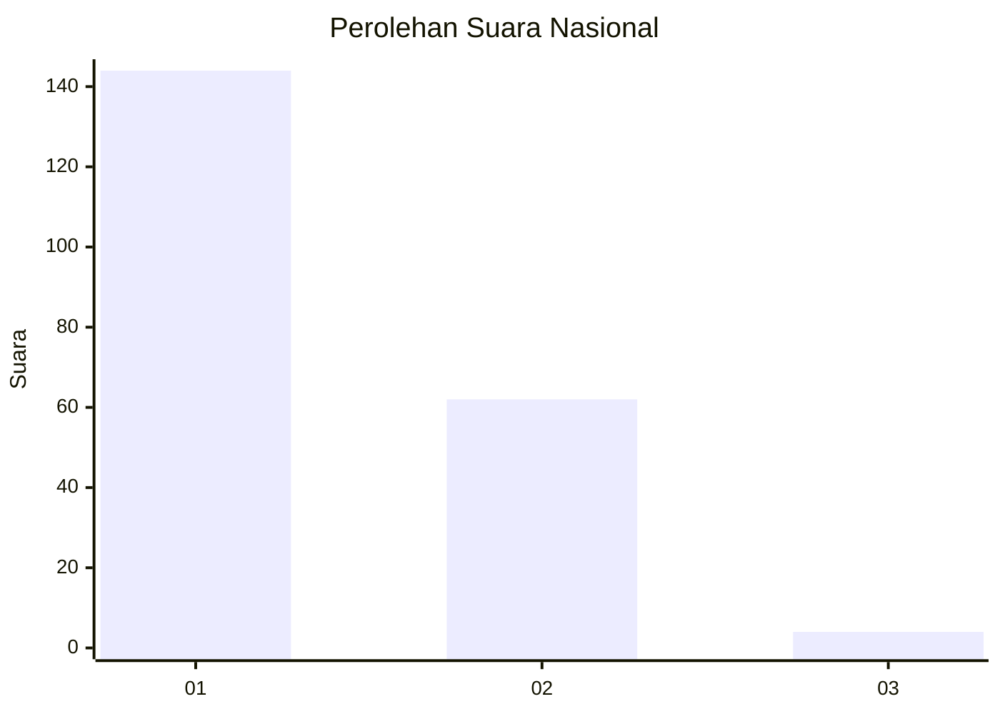
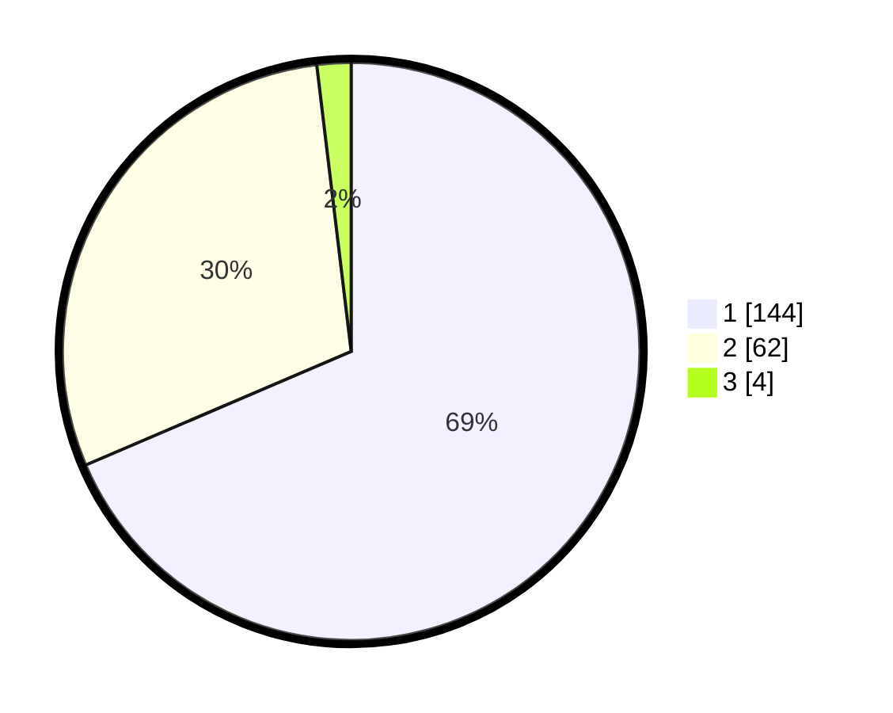

# Hasil

## Grafik

## Tabel

| No. | Nama Paslon    | Suara | Suara (raw) | Persentase |
|:--- |:-------------- | -----:| -----------:| ----------:|
| 1   | ANIES MUHAIMIN | 144   | [144][p-1]  | 68,57      |
| 2   | PRABOWO GIBRAN | 62    | [62][p-2]   | 29,52      |
| 3   | GANJAR MAHFUD  | 4     | [4][p-3]    | 1,90       |

[p-1]: https://github.com/gigit-pemilu/pemilu-2024/blob/main/pilpres/hitung-suara/sub/31-dki-jakarta/sub/72-jakarta-utara/sub/01-penjaringan/sub/1001-penjaringan/sub/002-tps/sub/paslon-1.txt
[p-2]: https://github.com/gigit-pemilu/pemilu-2024/blob/main/pilpres/hitung-suara/sub/31-dki-jakarta/sub/72-jakarta-utara/sub/01-penjaringan/sub/1001-penjaringan/sub/002-tps/sub/paslon-2.txt
[p-3]: https://github.com/gigit-pemilu/pemilu-2024/blob/main/pilpres/hitung-suara/sub/31-dki-jakarta/sub/72-jakarta-utara/sub/01-penjaringan/sub/1001-penjaringan/sub/002-tps/sub/paslon-3.txt

## Foto C Plano

https://sirekap-obj-formc.kpu.go.id/f368/pemilu/ppwp/31/72/01/10/01/3172011001002-20240217-143522--c9b39ad5-9912-45d5-ae29-1627d38aafd2.jpg

https://sirekap-obj-formc.kpu.go.id/f368/pemilu/ppwp/31/72/01/10/01/3172011001002-20240215-004639--f3eb58db-8ad0-4680-b54f-08102c0c3c75.jpg

https://sirekap-obj-formc.kpu.go.id/f368/pemilu/ppwp/31/72/01/10/01/3172011001002-20240217-143702--16341ee1-f8b8-4652-98da-433d564224d4.jpg

## Metadata

| Key        | Value               |
| ---------- | ------------------- |
| Time Stamp | 2024-02-22 11:00:00 |

