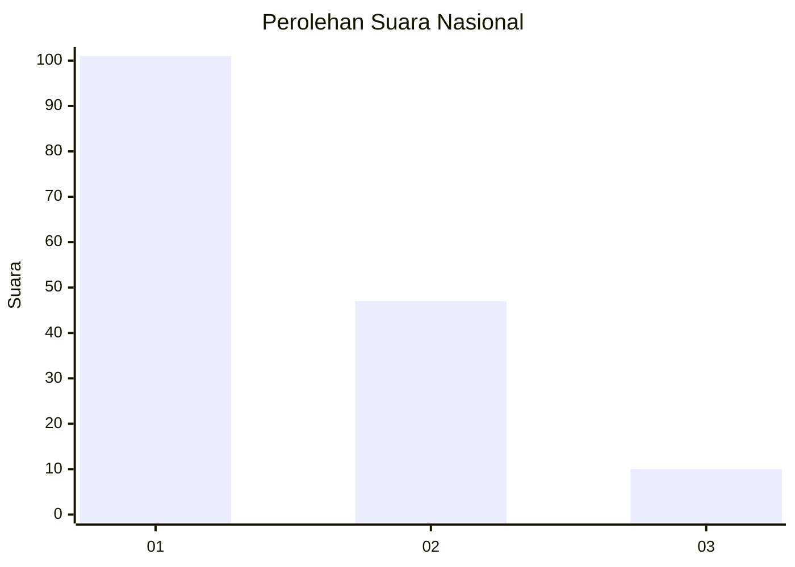
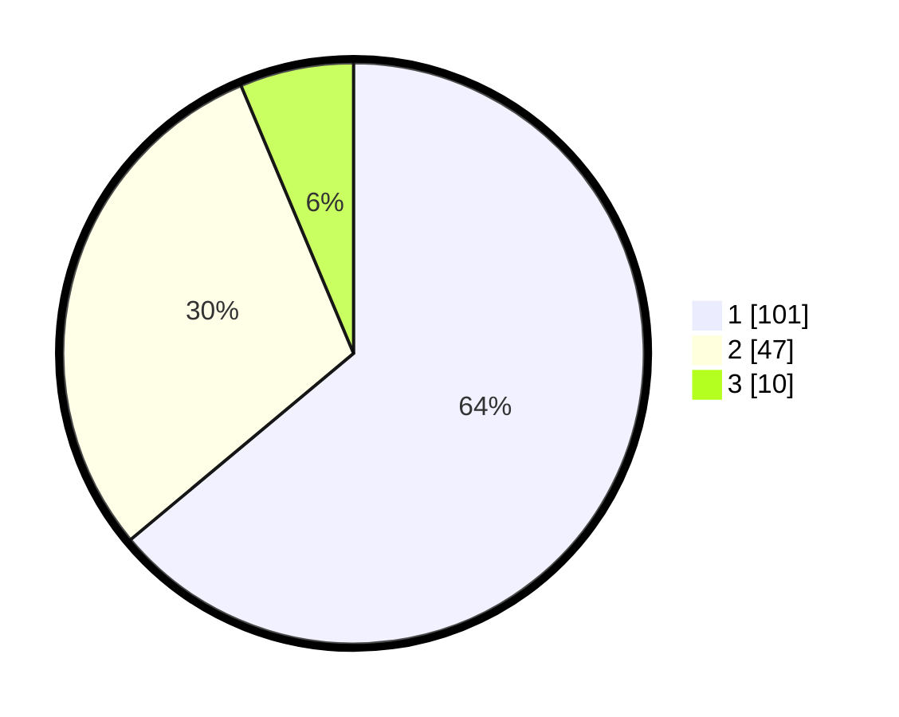

# Hasil

## Grafik

## Tabel

| No.    | Nama Paslon    | Suara | Suara (raw) | Persentase |
|:------ |:-------------- | -----:| -----------:| ----------:|
| 100025 | ANIES MUHAIMIN | 101   | [101][p-1]  | 63,92      |
| 100026 | PRABOWO GIBRAN | 47    | [47][p-2]   | 29,75      |
| 100027 | GANJAR MAHFUD  | 10    | [10][p-3]   | 6,33       |

[p-1]: https://github.com/gigit-pemilu/pemilu-2024/blob/main/pilpres/hitung-suara/sub/31-dki-jakarta/sub/72-jakarta-utara/sub/01-penjaringan/sub/1001-penjaringan/sub/004-tps/sub/paslon-1.txt
[p-2]: https://github.com/gigit-pemilu/pemilu-2024/blob/main/pilpres/hitung-suara/sub/31-dki-jakarta/sub/72-jakarta-utara/sub/01-penjaringan/sub/1001-penjaringan/sub/004-tps/sub/paslon-2.txt
[p-3]: https://github.com/gigit-pemilu/pemilu-2024/blob/main/pilpres/hitung-suara/sub/31-dki-jakarta/sub/72-jakarta-utara/sub/01-penjaringan/sub/1001-penjaringan/sub/004-tps/sub/paslon-3.txt

## Foto C Plano

https://sirekap-obj-formc.kpu.go.id/a87d/pemilu/ppwp/31/72/01/10/01/3172011001004-20240217-161130--5147d497-0cfb-4f87-8d0e-5e23f452eafd.jpg

https://sirekap-obj-formc.kpu.go.id/a87d/pemilu/ppwp/31/72/01/10/01/3172011001004-20240217-161228--1b2e7a8c-ec52-49bf-90fc-68b26e62427a.jpg

https://sirekap-obj-formc.kpu.go.id/a87d/pemilu/ppwp/31/72/01/10/01/3172011001004-20240217-161255--af4b6e53-4758-4f2c-a671-0f98de889a1c.jpg

## Metadata

| Key        | Value               |
| ---------- | ------------------- |
| Time Stamp | 2024-02-20 15:00:00 |

