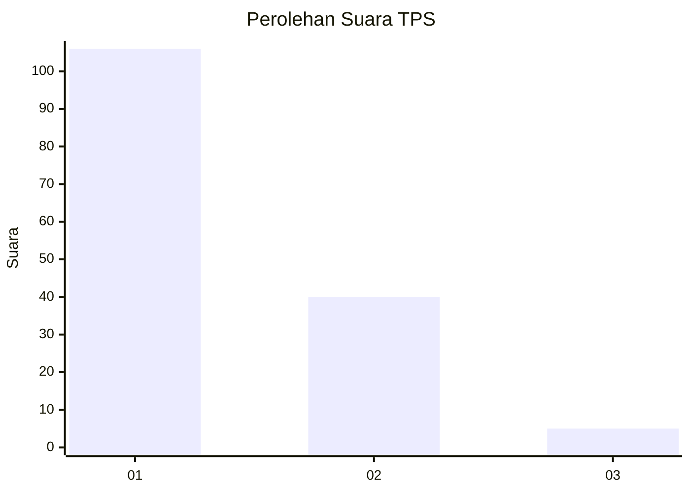
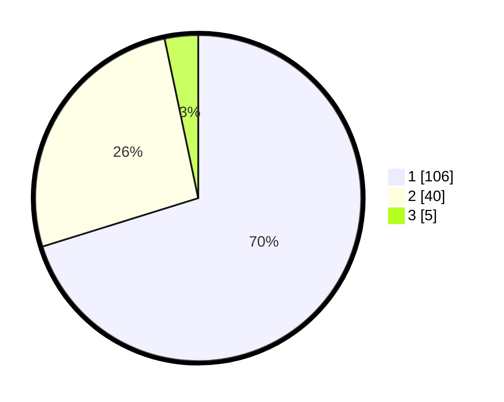

# Hasil

## Grafik

## Tabel

| No. | Nama Paslon    | Suara | Suara (raw) | Persentase |
|:--- |:-------------- | -----:| -----------:| ----------:|
| 1   | ANIES MUHAIMIN | 106   | [106][p-1]  | 70,20      |
| 2   | PRABOWO GIBRAN | 40    | [40][p-2]   | 26,49      |
| 3   | GANJAR MAHFUD  | 5     | [5][p-3]    | 3,31       |

[p-1]: https://github.com/gigit-pemilu/pemilu-2024-31-dki-jakarta/blob/main/pilpres/hitung-suara/sub/31-dki-jakarta/sub/72-jakarta-utara/sub/01-penjaringan/sub/1001-penjaringan/sub/005-tps/sub/paslon-1.txt
[p-2]: https://github.com/gigit-pemilu/pemilu-2024-31-dki-jakarta/blob/main/pilpres/hitung-suara/sub/31-dki-jakarta/sub/72-jakarta-utara/sub/01-penjaringan/sub/1001-penjaringan/sub/005-tps/sub/paslon-2.txt
[p-3]: https://github.com/gigit-pemilu/pemilu-2024-31-dki-jakarta/blob/main/pilpres/hitung-suara/sub/31-dki-jakarta/sub/72-jakarta-utara/sub/01-penjaringan/sub/1001-penjaringan/sub/005-tps/sub/paslon-3.txt

## Foto C Plano

https://sirekap-obj-formc.kpu.go.id/d0e3/pemilu/ppwp/31/72/01/10/01/3172011001005-20240217-163916--659b846d-f0a7-488e-8020-0ac194980c0f.jpg

https://sirekap-obj-formc.kpu.go.id/d0e3/pemilu/ppwp/31/72/01/10/01/3172011001005-20240217-163943--91ceff19-3345-4a08-9db7-bc3d7fc0dae7.jpg

https://sirekap-obj-formc.kpu.go.id/d0e3/pemilu/ppwp/31/72/01/10/01/3172011001005-20240217-164004--c2e51767-7db3-4e59-9e3e-31abb81535ee.jpg

## Metadata

| Key        | Value               |
| ---------- | ------------------- |
| Time Stamp | 2024-02-21 00:00:00 |

