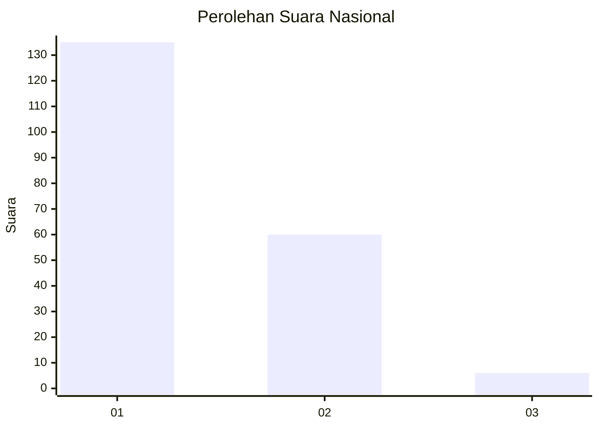
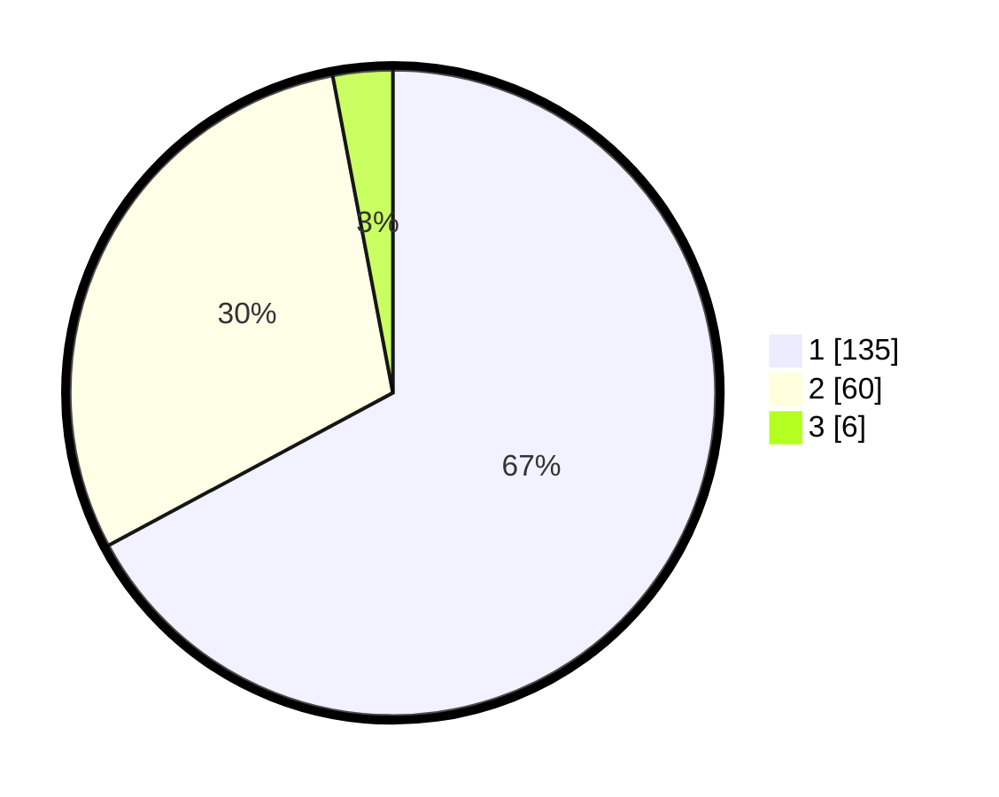

# Hasil

## Grafik

## Tabel

| No.    | Nama Paslon    | Suara | Suara (raw) | Persentase |
|:------ |:-------------- | -----:| -----------:| ----------:|
| 100025 | ANIES MUHAIMIN | 135   | [135][p-1]  | 67,16      |
| 100026 | PRABOWO GIBRAN | 60    | [60][p-2]   | 29,85      |
| 100027 | GANJAR MAHFUD  | 6     | [6][p-3]    | 2,99       |

[p-1]: https://github.com/gigit-pemilu/pemilu-2024/blob/main/pilpres/hitung-suara/sub/31-dki-jakarta/sub/72-jakarta-utara/sub/01-penjaringan/sub/1001-penjaringan/sub/007-tps/sub/paslon-1.txt
[p-2]: https://github.com/gigit-pemilu/pemilu-2024/blob/main/pilpres/hitung-suara/sub/31-dki-jakarta/sub/72-jakarta-utara/sub/01-penjaringan/sub/1001-penjaringan/sub/007-tps/sub/paslon-2.txt
[p-3]: https://github.com/gigit-pemilu/pemilu-2024/blob/main/pilpres/hitung-suara/sub/31-dki-jakarta/sub/72-jakarta-utara/sub/01-penjaringan/sub/1001-penjaringan/sub/007-tps/sub/paslon-3.txt

## Foto C Plano

https://sirekap-obj-formc.kpu.go.id/2053/pemilu/ppwp/31/72/01/10/01/3172011001007-20240217-195933--c4ce4680-7451-4f2a-92a5-8acf9135672d.jpg

https://sirekap-obj-formc.kpu.go.id/2053/pemilu/ppwp/31/72/01/10/01/3172011001007-20240217-200033--8fad2a5f-8eb4-4cc2-9f40-7d0d964ee648.jpg

https://sirekap-obj-formc.kpu.go.id/2053/pemilu/ppwp/31/72/01/10/01/3172011001007-20240217-200307--c862e148-6ee2-4dda-99d4-1ed5313d3a16.jpg

## Metadata

| Key        | Value               |
| ---------- | ------------------- |
| Time Stamp | 2024-02-21 00:00:00 |

