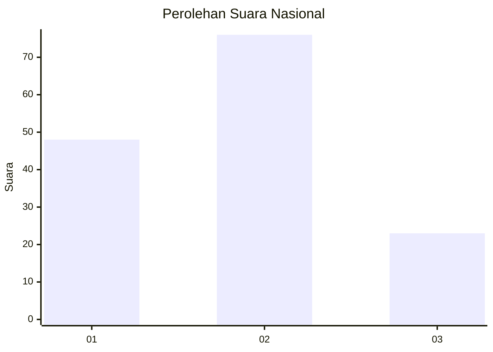
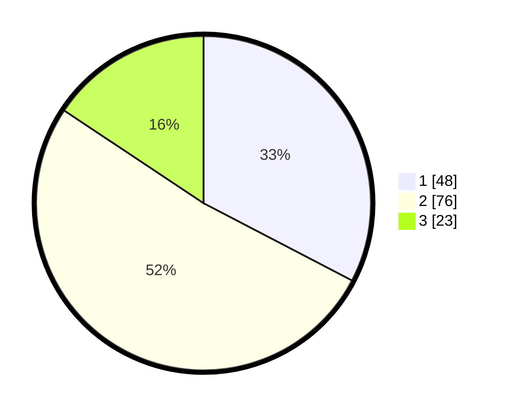

# Hasil

## Grafik

## Tabel

| No.    | Nama Paslon    | Suara | Suara (raw) | Persentase |
|:------ |:-------------- | -----:| -----------:| ----------:|
| 100025 | ANIES MUHAIMIN | 48    | [48][p-1]   | 32,65      |
| 100026 | PRABOWO GIBRAN | 76    | [76][p-2]   | 51,70      |
| 100027 | GANJAR MAHFUD  | 23    | [23][p-3]   | 15,65      |

[p-1]: https://github.com/gigit-pemilu/pemilu-2024/blob/main/pilpres/hitung-suara/sub/31-dki-jakarta/sub/72-jakarta-utara/sub/01-penjaringan/sub/1001-penjaringan/sub/009-tps/sub/paslon-1.txt
[p-2]: https://github.com/gigit-pemilu/pemilu-2024/blob/main/pilpres/hitung-suara/sub/31-dki-jakarta/sub/72-jakarta-utara/sub/01-penjaringan/sub/1001-penjaringan/sub/009-tps/sub/paslon-2.txt
[p-3]: https://github.com/gigit-pemilu/pemilu-2024/blob/main/pilpres/hitung-suara/sub/31-dki-jakarta/sub/72-jakarta-utara/sub/01-penjaringan/sub/1001-penjaringan/sub/009-tps/sub/paslon-3.txt

## Foto C Plano

https://sirekap-obj-formc.kpu.go.id/5dba/pemilu/ppwp/31/72/01/10/01/3172011001009-20240217-212027--47639e3c-7a2b-4f3c-bdfb-c01b79a660ad.jpg

https://sirekap-obj-formc.kpu.go.id/5dba/pemilu/ppwp/31/72/01/10/01/3172011001009-20240217-212053--b950eec3-af81-46a3-b3b9-d3ce8c67fff4.jpg

https://sirekap-obj-formc.kpu.go.id/5dba/pemilu/ppwp/31/72/01/10/01/3172011001009-20240217-212110--75c98fe1-d60b-4219-b2bc-c93760450f67.jpg

## Metadata

| Key        | Value               |
| ---------- | ------------------- |
| Time Stamp | 2024-02-21 00:00:00 |

